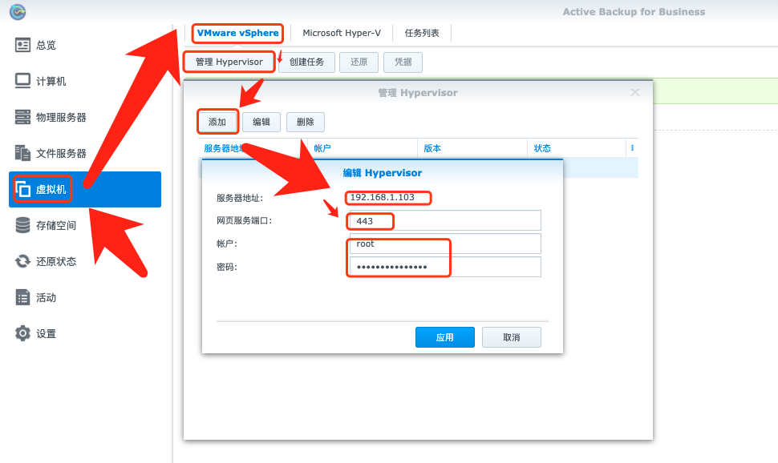
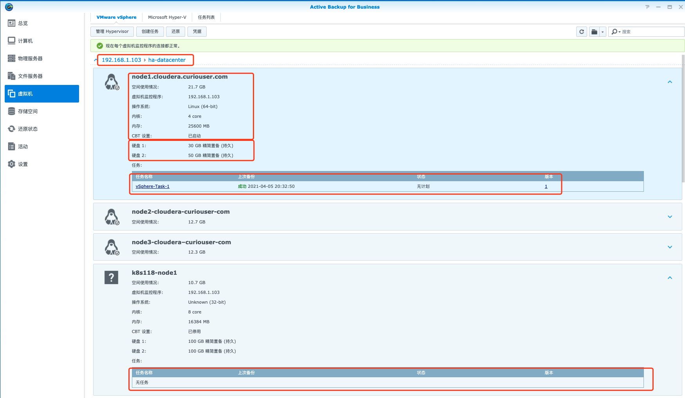
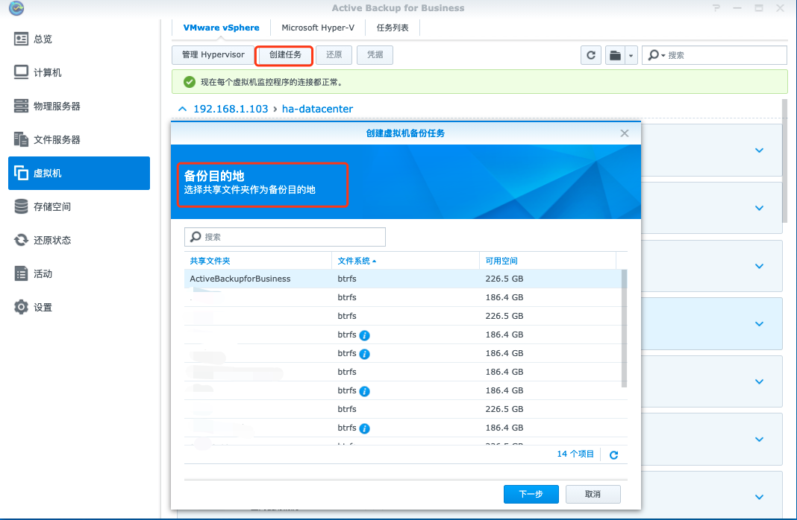
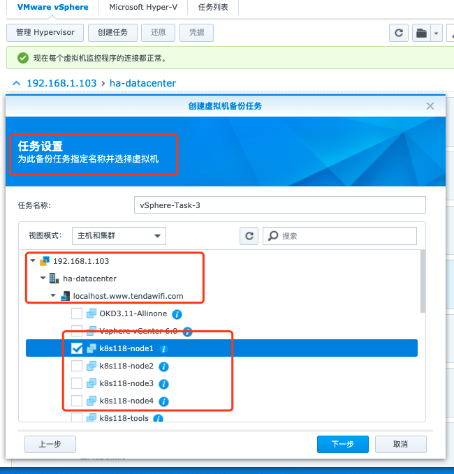
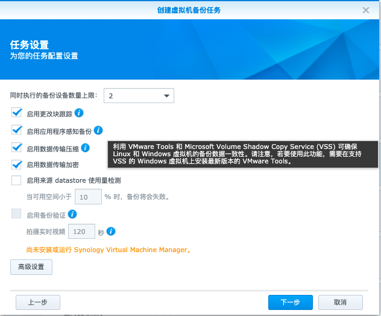
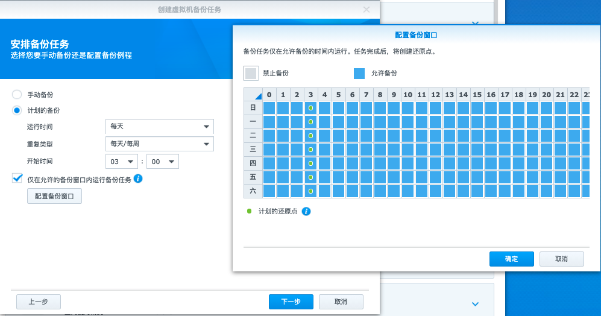
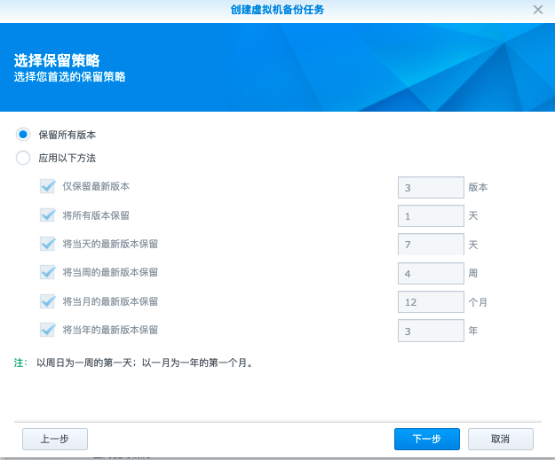
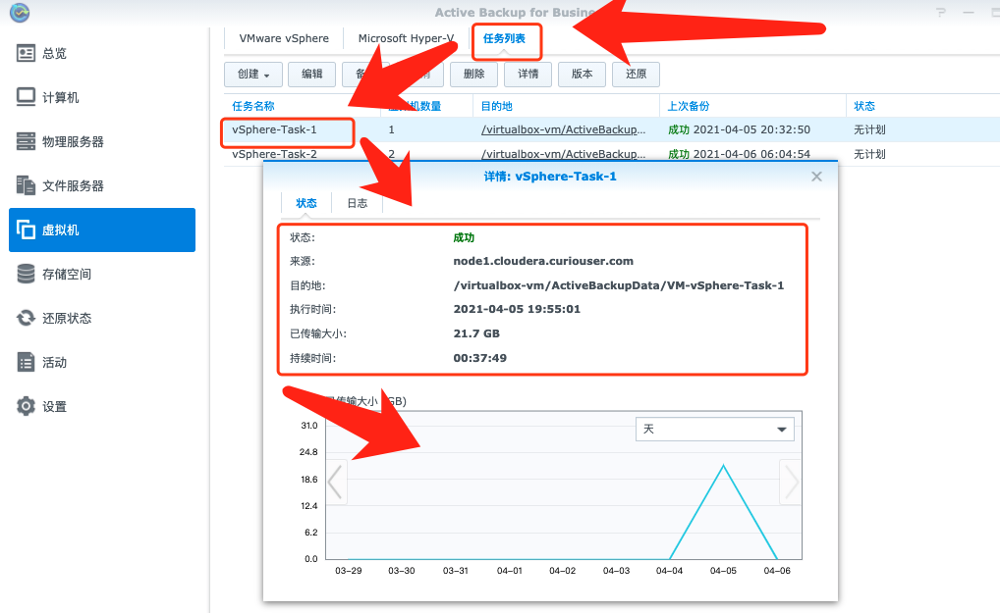
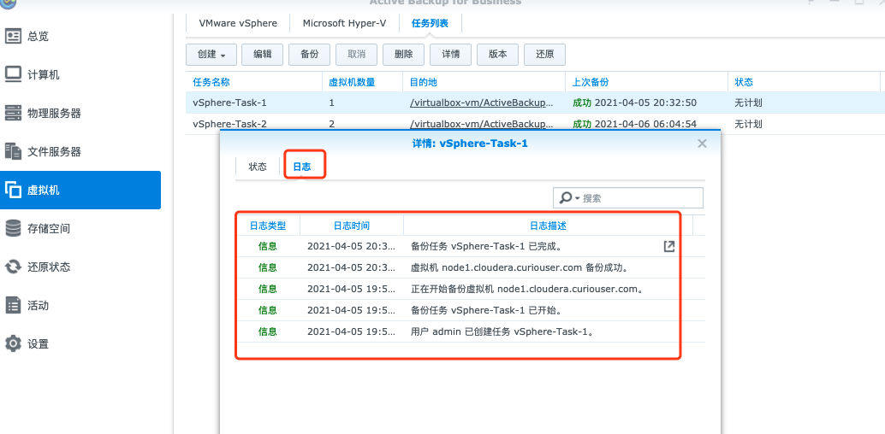
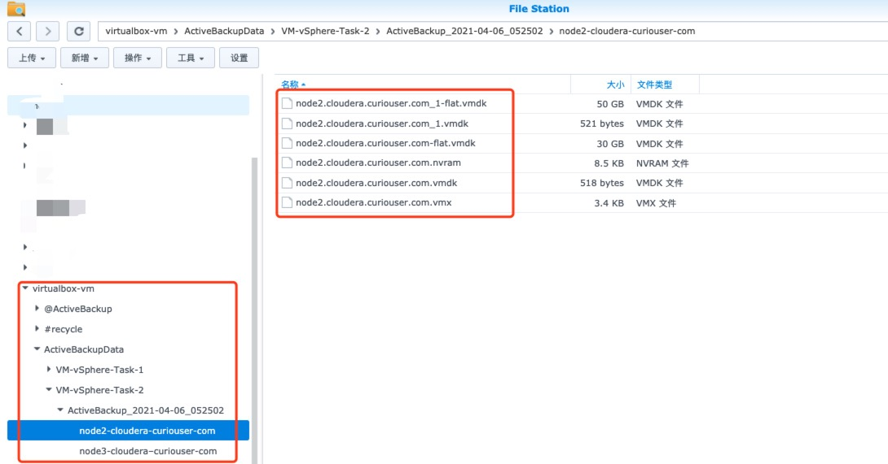

# 群辉ABB(Active Backup for Business)备份恢复vSphere中的VM

# 一、简介

对于vSphere中的虚拟机，除了ovftools导入导出为OVF文件进行备份外，Synology中的Active Backup for Business商业软件（以下简称ABB）也支持更多的备份功能。例如定时备份，版本管理等。


# 二、安装激活ABB

先在Synology的套件中心中搜索`Active Backup for Business`下载安装，过程省略。

## 1、获取产品序列号

在【控制面板】 -->【信息中心】找到【产品序列号】，复制下来。

## 2、登录

浏览器中输入：

```bash
http://群辉主机地址:群辉主机端口/webapi/auth.cgi?api=SYNO.API.Auth&method=Login&version=1&account=用户名&passwd=密码
```

当浏览器出现以下字样，说明登录成功

```bash
{"success":true}
```

## 3、激活

浏览器中输入：

```bash
http://群辉主机地址:群辉主机端口/webapi/entry.cgi?api=SYNO.ActiveBackup.Activation&method=set&version=1&activated=true&serial_number=“产品序列号”
```

当浏览器出现以下字样，说明Active Backup for Business套件激活成功

```bash
{"data":{"actived":true}"success":true}
```

Enjoy Yourself

**参考：**

1. https://www.tenlonstudio.com/7478.html

# 三、ABB配置、备份vSphere VMs

## 1、连接vSphere ESXI



添加连接完成后会显示vSphere ESXI的版本及在线状态，同时会显示其上的所有VM及备份状态



## 2、创建备份VM任务

### ①选择备份到哪个共享文件夹



### ②选择要备份的VM



### ③配置备份任务

- **启用更改块跟踪**：当启用更改块跟踪以便仅传输上次备份时间以来更改的块，能大幅减少传输的数据大小
- **启用应用程序感知备份**：当启用应用程序感知备份时，会利用VMware Tools和Microsoft Shadow Copy Server(VSS)确保Linux和Window虚拟机的备份数据一致性。若要使用此功能，请确保在支持VSS的Windows虚拟机上安装最新版的VMware Tools.
- **启用数据传输压缩**：
- **启用数据传输加密**：



### ④配置备份周期



### ⑤设置备份保留策略



## 3、查看备份任务信息






## 4、备份文件信息


