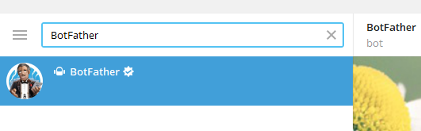
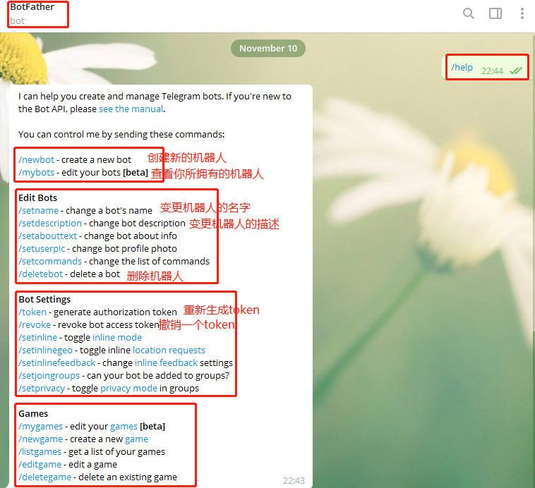
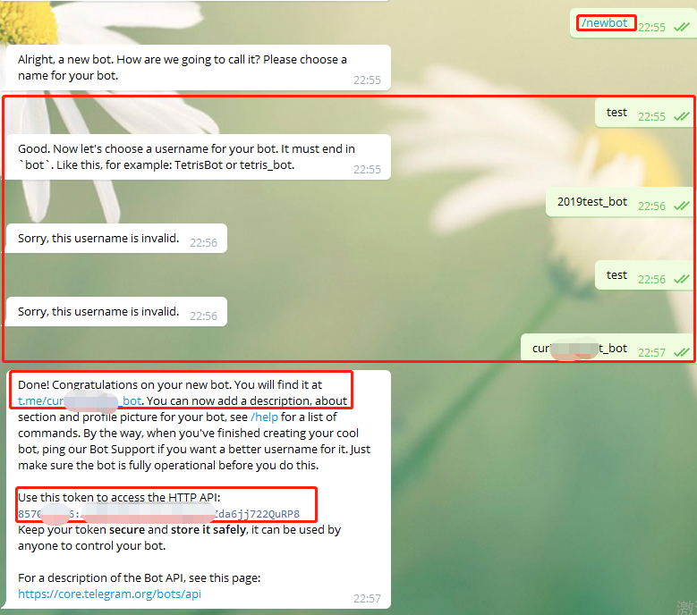
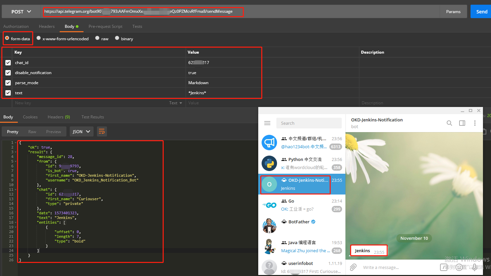

# Telegram Bot机器人

# 一、简介

Telegram Bot是运行在Telegram内部的第三方应用程序，相当于Telegram的一个特殊账户。

用户可以向Telegram Bot发送消息，命令和内联请求等方式与Telegram Bot人进行交互，而Telegram Bot开发者可以通过[Telegram Bot API](https://links.jianshu.com/go?to=https%3A%2F%2Fcore.telegram.org%2Fbots%2Fapi)，用https请求方式来控制**机器人**

# 二、创建

1. 客户端搜索"`Botfather`"

   

2. 查看帮助

   

3. 发送"/newboot"来创建Bot机器人,根据提示一步一步进行.(当设置用户名时)

   

 TOKEN 一定要保护好！以后接口访问都要用到！ 

# 三、API

- Telegram有两种api，一种是bot api，一种是telegram api。bot api是基于http访问，telegram api是基于mtproto访问，访问需要加密，相对要复杂一些。后者也可以实现发送消息等功能 

- 可使用**`PostMan`**或者**`Curl`**等工具发送HTTPS请求调用Bot的API。

- 当时用Curl命令时可使用`"-x"`参数设置代理。例如`“curl -x 127.0.0.1:3128 -sk https://www.google.com”`

# 四、Bot API

[Bot API文档链接](https://core.telegram.org/bots/api)

## 1. Bot API相关信息

Bot API支持`GET`和`POST`方法的HTTPS请求，URL格式为:

 **`"https://api.telegram.org/bot[你的bot机器人Token]/方法名"`**

例如：`https://api.telegram.org/bot123456:ABC-DEF1234ghIkl-zyx57W2v1u123ew11/getMe`

支持一下几种传参方式：

- [URL query string](https://en.wikipedia.org/wiki/Query_string)
- application/x-www-form-urlencoded
- application/json (except for uploading files)
- multipart/form-data (use to upload files)

Bot机器人将返回`JSON`格式的对象，里面会包含返回状态信息

**注意: **

- API方法`大小写敏感`
- 请求格式必须是`UTF-8`编码

## 2. 示例

- 使用PostMan给Bot机器人发送消息

  

- 使用Curl命令给Bot机器人发送消息

  ```bash
  curl -x 梯子IP地址 -sk \
  -X POST \
  https://api.telegram.org/bot90****93:AAF***RfFma8/sendMessage \
  -d 'chat_id=623***17' \
  -d 'parse_mode=Markdown' \
  -d 'text=*Jenkins '$BUILD_NUMBER' *'
  ```

## 3. 支持的消息格式

- **MarkDown风格**

  ```json
  *bold text*
  _italic text_
  [inline URL](http://www.example.com/)
  [inline mention of a user](tg://user?id=123456789)
  `inline fixed-width code`
  ​```block_language
  pre-formatted fixed-width code block
  ​```
  ```

- **HTML风格**

  ```html
  *bold text*
  _italic text_
  [inline URL](http://www.example.com/)
  [inline mention of a user](tg://user?id=123456789)
  `inline fixed-width code`
  ​```block_language
  pre-formatted fixed-width code block
  ​```
  ```

  - 标签不能嵌套
  -  所有不属于标签或HTML实体的' < '、' > '和' & '符号必须替换为相应的HTML实体 ("<"对应"\&lt;"、">"对应"\&gt;"、"\&"对应"\&amp;")
  - 支持所有数字类型的HTML实体
  -  该API目前仅支持以下命名的HTML实体:' < '、' > '、' & '和' " ' 

## 4. 支持的方法

| Bot API方法 | 描述 |
| ---- | ---- |
| getMe |      |
| sendMessage | 发送文本信息,支持Markdown、HTML格式化的文本信息 |
| forwardMessage |      |
| sendPhoto | 发送图片 |
| sendAudio | 发送音频，最大50 MB |
| sendDocument | 发送文档，最大50 MB |
| sendVideo | 发送视频，最大50 MB |
| sendAnimation | 发送动图，最大50 MB(支持无声音的GIF或H.264/MPEG-4 AVC格式动图) |
| sendVoice | 发送录音，最大50 MB |
| sendVideoNote |      |
| sendMediaGroup |      |
| sendLocation | 发送定位 |
| editMessageLiveLocation |      |
| stopMessageLiveLocation |      |
| sendVenue |      |
| sendContact | 发送名片 |
| sendPoll | 发送投票 |
| sendChatAction |      |
| getUserProfilePhotos |      |
| getFile |      |
| kickChatMember |      |
| unbanChatMember |      |
| restrictChatMember |      |
| promoteChatMember |      |
| setChatPermissions |      |
| exportChatInviteLink |      |
| setChatPhoto |      |
| deleteChatPhoto |  |
| setChatTitle | 设置聊天室标题 |
| setChatDescription | 设置聊天室描述 |
| pinChatMessage |      |
| unpinChatMessage |      |
| leaveChat | 离开聊天室 |
| getChat | 查找聊天室 |
| getChatAdministrators | 获取聊天室管理员 |
| getChatMembersCount | 获取聊天室成员个数 |
| getChatMember | 获取聊天室成员 |
| setChatStickerSet |      |
| deleteChatStickerSet |      |
| answerCallbackQuery |      |
| Inline mode methods |      |

  


