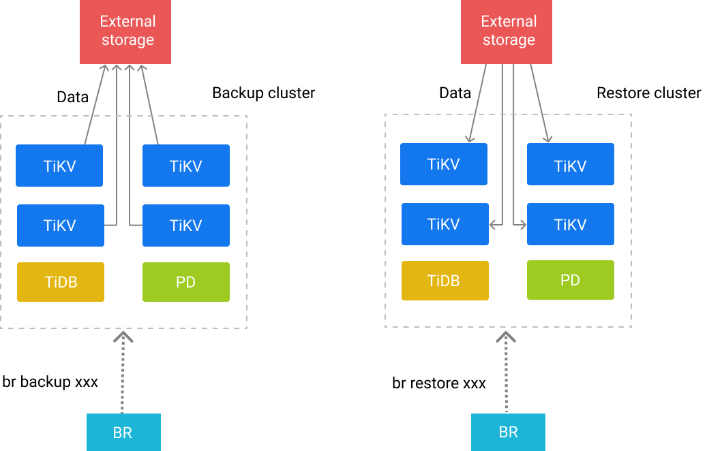

# TiDB 分布式备份恢复命令行工具BR

# 一、BR

## 1、简介

[BR](https://github.com/pingcap/br) 全称为 Backup & Restore，是 TiDB **分布式备份恢复**的命令行工具，主要用于对 TiDB 集群进行数据备份和恢复。

相比 [`dumpling`](https://docs.pingcap.com/zh/tidb/stable/backup-and-restore-using-dumpling-lightning)，BR 更适合**大数据量**的场景。

## 2、BR工作原理

BR 将备份或恢复操作命令下发到各个 TiKV 节点。TiKV 收到命令后执行相应的备份或恢复操作。

在一次备份或恢复中，各个 TiKV 节点都会有一个对应的备份路径，TiKV 备份时产生的备份文件将会保存在该路径下，恢复时也会从该路径读取相应的备份文件。



- 在使用 `local` storage 的时候，备份数据会分散在各个节点的本地文件系统中
- **不建议**在生产环境中备份到本地磁盘，因为在日后恢复的时候，**必须**手动聚集这些数据才能完成恢复工作
- **存储备份数据的文件系统，如果没有S3或其他云服务商提供的云存储，尽量选用在节点本地搭建的，高性能SSD磁盘做的NFS**

## 3、备份文件类型

备份路径下会生成以下两种类型文件：

- **SST 文件**：存储 TiKV 备份下来的数据信息
- **backupmeta文件**：存储本次备份的元信息，包括备份文件数、备份文件的 Key 区间、备份文件大小和备份文件 Hash (sha256) 值
- **backup.lock文件**：用于防止多次备份到同一目录

## 4、SST 文件

SST 文件以 `{storeID}-{regionID}-{regionEpoch}-{keyHash}-{timestamp}-{cf}.sst` 的格式命名。格式名的解释如下：

- **storeID：**TiKV 节点编号
- **regionID：**Region 编号
- **regionEpoch：**Region 版本号
- **keyHash：**Range startKey 的 Hash (sha256) 值，确保唯一性
- **timestamp：**时间戳
- **cf：**RocksDB 的 ColumnFamily（默认为 `default` 或 `write`）

SST 文件、 backupmeta 文件和 backup.lock 文件在同一目录下。文件布局如下：

```bash
.
└── 20220621
    ├── backupmeta
    |—— backup.lock
    ├── {storeID}-{regionID}-{regionEpoch}-{keyHash}-{timestamp}-{cf}.sst
    ├── {storeID}-{regionID}-{regionEpoch}-{keyHash}-{timestamp}-{cf}.sst
    └── {storeID}-{regionID}-{regionEpoch}-{keyHash}-{timestamp}-{cf}.sst
    ...
```

将数据备份到 Amazon S3 或网络盘上时，SST 文件会根据 storeID 划分子目录。布局如下：

```bash
.
└── 20220621
    ├── backupmeta
    |—— backup.lock
    ├── store1
    │   └── {regionID}-{regionEpoch}-{keyHash}-{timestamp}-{cf}.sst
    ├── store2
        └── {regionID}-{regionEpoch}-{keyHash}-{timestamp}-{cf}.sst
    ...
```

## 5、BR支持以下外部存储服务

| 服务                             | Scheme        | 示例                                     |
| :------------------------------- | :------------ | :--------------------------------------- |
| 本地文件系统（分布在各节点上）   | local         | `local:///path/to/dest/`                 |
| Amazon S3 及其他兼容 S3 的服务   | s3            | `s3://bucket-name/prefix/of/dest/`       |
| GCS                              | gcs, gs       | `gcs://bucket-name/prefix/of/dest/`      |
| Azure Blob Storage               | azure, azblob | `azure://container-name/prefix/of/dest/` |
| 不写入任何存储（仅作为基准测试） | noop          | `noop://`                                |

## 6、BR推荐配置

- 推荐 BR 部署在 PD 节点上。
- 推荐使用一块高性能 SSD 网盘，挂载到 BR 节点和所有 TiKV 节点上，网盘推荐万兆网卡，否则带宽有可能成为备份恢复时的性能瓶颈。

## 7、备份性能和影响

TiDB 备份功能对集群性能（事务延迟和 QPS）有一定的影响，但是可以通过调整备份的线程数 [`backup.num-threads`](https://docs.pingcap.com/zh/tidb/stable/tikv-configuration-file#num-threads-1) ，以及增加集群配置，来降低备份对集群性能的影响。

为了更加具体说明备份对集群的影响，这里列举了多次快照备份测试结论来说明影响的范围：

- （使用 5.3 及之前版本）BR 在单 TiKV 存储节点上备份线程数量是节点 CPU 总数量的 75% 的时候，QPS 会下降到备份之前的 30% 左右。
- （使用 5.4 及以后版本）当 BR 在单 TiKV 存储节点上备份的线程数量不大于 `8`、集群总 CPU 利用率不超过 80% 时，BR 备份任务对集群（无论读写负载）影响最大在 20% 左右。
- （使用 5.4 及以后版本）当 BR 在单 TiKV 存储节点上备份的线程数量不大于 `8`、集群总 CPU 利用率不超过 75% 时，BR 备份任务对集群（无论读写负载）影响最大在 10% 左右。
- （使用 5.4 及以后版本）当 BR 在单 TiKV 存储节点上备份的线程数量不大于 `8`、集群总 CPU 利用率不超过 60% 时，BR 备份任务对集群（无论读写负载）几乎没有影响。

通过限制备份的线程数量可以降低备份对集群性能的影响，但是这会影响到备份的性能，以上的多次备份测试结果显示:（单 TiKV 存储节点上）备份速度和备份线程数量呈正比，在线程数量量较少的时候，速度大概是 20M/线程数。例如，单节点 5 个备份线程可达到 100M/s。

# 二、安装及命令参数

## 1、安装br

```bash
br_version=v5.1.0 && \
curl -s -# https://download.pingcap.org/tidb-toolkit-$br_version-linux-amd64.tar.gz | tar zxvf - -C /opt && \
ln -s /opt/tidb-toolkit-$br_version-linux-amd64/ /opt/tidb-toolkit && \
echo -e "export TIDB_TOOLKIT=/opt/tidb-toolkit\nexport PATH=\$PATH:\$TIDB_TOOLKIT/bin" >> /etc/profile && \
source /etc/profile
br --help
```

## 2、br命令简介

BR 由多层命令组成。目前，BR 包含 `backup`、`restore` 和 `version` 三个子命令:

- `br backup` 用于备份 TiDB 集群
- `br restore` 用于恢复 TiDB 集群

以上三个子命令可能还包含这些子命令：

- `full`：可用于备份或恢复全部数据。
- `db`：可用于备份或恢复集群中的指定数据库。
- `table`：可用于备份或恢复集群指定数据库中的单张表。

## 3、br全局参数

```bash
--ca string                       指定 PEM 格式的受信任 CA 的证书文件路径。
--cert string                     指定 PEM 格式的 SSL 证书文件路径。
--check-requirements              Whether start version check before execute command (default true)
--checksum                        Run checksum at end of task (default true)
--gcs.credentials-file string     (experimental) Set the GCS credentials file path
--gcs.endpoint string             (experimental) Set the GCS endpoint URL
--gcs.predefined-acl string       (experimental) Specify the GCS predefined acl for objects
--gcs.storage-class string        (experimental) Specify the GCS storage class for objects
--key string                      指定 PEM 格式的 SSL 证书密钥文件路径。
--log-file string                 Set the log file path. If not set, logs will output to temp file (default "/tmp/br.log.2021-04-20T17.02.38+0800")
--log-format string               设置日志输出格式,默认"text"
-L, --log-level string            设置日志输出级别，默认info
-u, --pd strings                  PD 服务地址，默认：[127.0.0.1:2379]
--ratelimit uint                  每个 TiKV 执行备份任务的速度上限（单位 MiB/s）
--remove-tiflash                  Remove TiFlash replicas before backup or restore, for unsupported versions of TiFlash (default true)
--s3.acl string                   (experimental) Set the S3 canned ACLs, e.g. authenticated-read
--s3.endpoint string              (experimental) Set the S3 endpoint URL, please specify the http or https scheme explicitly
--s3.provider string              (experimental) Set the S3 provider, e.g. aws, alibaba, ceph
--s3.region string                (experimental) Set the S3 region, e.g. us-east-1
--s3.sse string                   Set S3 server-side encryption, e.g. aws:kms
--s3.sse-kms-key-id string        KMS CMK key id to use with S3 server-side encryption.Leave empty to use S3 owned key.
--s3.storage-class string         (experimental) Set the S3 storage class, e.g. STANDARD
-c, --send-credentials-to-tikv    Whether send credentials to tikv (default true)
--status-addr string              BR 向 Prometheus 提供统计数据的监听地址，格式“0.0.0.0:1188”。不指定则为关闭。
-s, --storage string              备份保存的路径, 例如："s3://bucket/path/prefix"
--switch-mode-interval duration   maintain import mode on TiKV during restore (default 5m0s)
```

## 3、br备份命令

```bash
br backup [子命令]

子命令:
  db          备份单个DB
  full        备份所有DB
  raw         (experimental) backup a raw kv range from TiKV cluster
  table       备份单个表

参数：
  --backupts string           快照对应的物理时间点，例如'400036290571534337', '2018-05-11 01:42:23'
  --compression string        sst文件压缩算法，可选: lz4|zstd(默认)|snappy
  --compression-level int32   sst文件压缩级别
  --gcttl int                 the TTL (in seconds) that PD holds for BR's GC safepoint (默认 300s)
  -h, --help                  help for backup
  --lastbackupts uint         (实验功能)the last time backup ts, use for incremental backup, support TSO only
  --timeago duration          The history version of the backup task, e.g. 1m, 1h. Do not exceed GCSafePoint
```

## 4、br恢复命令

```bash
br restore [子命令]

子命令:
  cdclog      (实验功能) restore data from cdc log backup
  db          从备份数据中恢复一个database
  full        恢复所有的表
  raw         (实验功能) restore a raw kv range to TiKV cluster
  table       从备份数据中恢复单个表
```


# 三、备份


## 0、备份前准备

- **TIKV节点和BR命令节点都挂载NFS文件系统**

  ```bash
  mkdir /mnt/tidb-br-backup
  mount -t nfs -o vers=3,nolock,proto=tcp,rsize=1048576,wsize=1048576,hard,timeo=600,retrans=2,noresvport 192.168.1.7:/ /mnt/tidb-br-backup 
  df -mh
  ```

- **BR命令尽量在PD节点执行**

## 1、备份全部集群数据

```bash
br backup full \
    --pd "{PD1节点IP地址}:2379,{PD2节点IP地址}:2379" \
    --storage "local:///mnt/tidb-br-backup" \
    --ratelimit 120 \
    --log-file backupfull.log
```

## 2、备份单个库

```bash
br backup db \
    --pd "${PDIP}:2379" \
    --db test \
    --storage "local:///mnt/tidb-br-backup" \
    --ratelimit 120 \
    --log-file backuptable.log
```

```bash
Detail BR log in /data/tidb-br-database-export/backupdb.log
Database backup <----------------------> 100.00%
Checksum <--------------------> 100.00%
[2021/04/20 21:15:10.704 +08:00] [INFO] [collector.go:60] ["Database backup Success summary: total backup ranges: 1317, total success: 1317, total failed: 0, total take(Database backup time): 7m58.135071495s, total take(real time): 11m30.059039886s, total kv: 2693175024, total size(MB): 397915.67, avg speed(MB/s): 832.22"] ["backup checksum"=3m28.860107739s] ["backup fast checksum"=593.123731ms] ["backup total regions"=7070] [BackupTS=424391166169710594] [Size=42165594435]
```

## 3、备份单个表到NFS中

```bash
br backup table \
    --pd "${PDIP}:2379" \
    --db test \
    --table usertable \
    --storage "local:///mnt/tidb-br-backup" \
    --ratelimit 120 \
    --log-file backuptable.log
```

## 4、过滤表库备份

```bash
br backup full \
    --pd "${PDIP}:2379" \
    --filter 'db*.tbl*' \
    --storage "local:///mnt/tidb-br-backup" \
    --ratelimit 120 \
    --log-file backupfull.log
```

## 5、增量备份

如果想要备份增量，只需要在备份的时候指定**上一次的备份时间戳** `--lastbackupts` 即可。

注意增量备份有以下限制：

- 增量备份需要与前一次全量备份在不同的路径下
- GC safepoint 必须在 `lastbackupts` 之前

```bash
br backup full\
    --pd ${PDIP}:2379 \
    -s local:///mnt/tidb-br-backup \
    --lastbackupts ${LAST_BACKUP_TS}
```

以上命令会备份 `(LAST_BACKUP_TS, current PD timestamp]` 之间的增量数据。

你可以使用 `validate` 指令获取上一次备份的时间戳，示例如下：

```bash
LAST_BACKUP_TS=`br validate decode --field="end-version" -s local:///mnt/tidb-br-backup | tail -n1`
```

## 6、备份全部集群数据到S3 存储

```bash
export AWS_ACCESS_KEY_ID=${AccessKey}
export AWS_SECRET_ACCESS_KEY=${SecretKey}
br backup full \
    --pd "${PDIP}:2379" \
    --storage "s3://${Bucket}/${Folder}" \
    --s3.region "${region}" \
    --send-credentials-to-tikv=true \
    --log-file backuptable.log
```

## 7、检查备份数据的完整性
要检查数据完整性，可以执行 tiup br debug checksum 命令对备份数据计算校验和。

```bash
br debug/validate checksum \
    --storage 'local:///mnt/tidb-br-backup' \
    --log-file checksum.log
```

#  四、恢复

## 1、恢复集群快照备份数据到新集群

```bash
nohup br restore full \
    --pd "${PDIP}:2379" \
    --storage "local:///mnt/tidb-br-backup" \
    --grpc-keepalive-timeout 60s \
    --checksum=false \
    --ratelimit 200 \
    --log-file restorefull.log  1>&2 >br_restore.log &!

# --grpc-keepalive-timeout 60s 设置RPC连接超时时间
# --checksum=false             设置数据恢复后不进行校验
```

## 2、从集群快照备份数据中恢复单个DB

```bash
br restore db \
    --pd "${PDIP}:2379" \
    --storage "local:///mnt/tidb-br-backup" \
    --db "test" \
    --ratelimit 128 \
    --log-file restore-db-from-full.log
```

## 3、集群快照数据恢复命令优化

当恢复集群快照备份数据到集群时，如果遇到大表导入时会经常报`rpc error: code = Unavailable desc = transport is closing`。原因是pd由于grpc问题leader飘走导致br进行不下去。

```bash
br restore full \
    --pd "${PDIP}:2379" \
    --storage "local:///mnt/tidb-br-backup" \
    --grpc-keepalive-timeout 60s \
    --checksum=false \
    --ratelimit 200 \
    --log-file restorefull.log

# --grpc-keepalive-timeout 60s 设置RPC连接超时时间
# --checksum=false             设置数据恢复后不进行校验
```

参考：https://asktug.com/t/topic/153139/17

# 五、问题总结

- **BR 会备份系统表吗？在数据恢复的时候，这些系统表会冲突吗？**

  `在 v5.1.0 之前，BR 备份时会过滤掉系统库 mysql.* 的表数据。自 v5.1.0 起，BR 默认备份集群内的全部数据，包括系统库 mysql.* 中的数据。但由于恢复 mysql.* 中系统表数据的技术实现尚不完善，因此 BR 默认不恢复系统库 mysql 中的表数据。`

- **备份数据有多大，备份会有副本吗？**

  `备份的时候仅仅在每个 Region 的 Leader 处生成该 Region 的备份文件。因此备份的大小等于数据大小，不会有多余的副本数据。所以最终的总大小大约是 TiKV 数据总量除以副本数。但是假如想要从本地恢复数据，因为每个 TiKV 都必须要能访问到所有备份文件，在最终恢复的时候会有等同于恢复时 TiKV 节点数量的副本。`

- **BR backupTS 如何转化成 Unix 时间？**

  `BR backupTS 默认是在备份开始前，从 PD 获取到的最新时间戳。可以使用 pd-ctl tso timestamp 来解析该时间戳，以获得精确值，也可以通过 backupTS >> 18 来快速获取估计值。`
  
- **BR restore恢复时出现`tidb br restore rpc error: code = Unavailable desc = transport is closing`**

  - 既然是pd由于grpc问题leader飘走导致br进行不下去，那就不要使用多台pd，只让一台pd运行即可，避免它因为网络或者cpu相关资源leader飘走，然后为了减少pd资源，先把max-replicas改为1，只1个副本。
  - 优化tikv的配置，主要是server. `grpc-concurrency`相关的，然后把性能测试中要求的写和读buffer也配置好内存大小。 backup. `num-threads`: 2，反正就减少对cpu的占用。留些资源给br。
  - 执行br restore时减少concurrency，然后不进行checksum
  
  参考：https://asktug.com/t/topic/153139/16
  
- 

# 六、其他操作

## 1、将backupmeta文件解码为json格式

在备份完成后，可通过 `tiup br debug decode` 命令将备份的 `backupmeta` 文件解码为 json 格式的可读文件，从而查看快照对应的 TSO 等元信息。

- **解码**

  ```bash
  br debug decode \
      --storage 'local:///mnt/tidb-br-backup' \
      --log-file decode-backupmeta.log
  ```

  解码后的文件存储路径为 `/mnt/tidb-br-backup/backupmeta.json`。然后打开 `backupmeta.json` 文件，搜索 `end_version` 可以查看到快照对应的 TSO。

- **编码**

  ```bash
  br debug encode \
      --storage 'local:///mnt/tidb-br-backup' \
      --log-file encode-backupmeta.log
  ```

  将`local:///mnt/tidb-br-backup`目录下的 `backupmeta.json` 文件编码为 `backupmeta` 文件，编码后的文件名为 `backupmeta_from_json`，存储路径为 `local:///mnt/tidb-br-backup/backupmeta_from_json`。

# 参考

1. https://docs.pingcap.com/zh/tidb/stable/backup-and-restore-tool
1. https://docs.pingcap.com/zh/tidb/stable/backup-and-restore-faq
1. https://github.com/pingcap/tidb/blob/master/br/docs/cn/2019-08-05-new-design-of-backup-restore.md
1. https://ap.tidb.cc/post/20200618-25-br-rc/
1. https://asktug.com/t/topic/153139/17