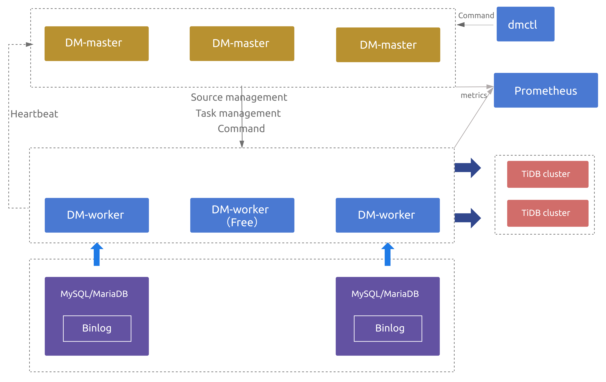

# DM(Data Migration)数据全量及增量同步

# 一、简介

[DM](https://github.com/pingcap/dm) (Data Migration) 是一体化的数据同步任务管理平台，支持从 MySQL 或 MariaDB 到 TiDB 的全量数据迁移和增量数据同步。使用 DM 工具有利于简化错误处理流程，降低运维成本。


- **Block & allow lists**：黑白名单配置，用于过滤或指定只迁移某些数据库或某些表的所有操作。

  [Block & Allow Lists](https://docs.pingcap.com/zh/tidb-data-migration/stable/key-features#block--allow-table-lists) 的过滤规则类似于 MySQL `replication-rules-db/replication-rules-table`

- **Binlog event filter**：用于过滤源数据库中特定表的特定类型操作

  比如过滤掉表 `test`.`sbtest` 的 `INSERT` 操作或者过滤掉库 `test` 下所有表的 `TRUNCATE TABLE` 操作。

- **Table routing**：将源数据库的表迁移到下游指定表的路由功能

  比如将源数据表 `test`.`sbtest1` 的数据同步到 TiDB 的表 `test`.`sbtest2`。它也是分库分表合并迁移所需的一个核心功能。

## 1、DM 架构

DM 主要包括三个组件：DM-master，DM-worker 和 dmctl。



## 2、DM-master

DM-master 负责管理和调度数据同步任务的各项操作。

- 保存 DM 集群的拓扑信息
- 监控 DM-worker 进程的运行状态
- 监控数据同步任务的运行状态
- 提供数据同步任务管理的统一入口
- 协调分库分表场景下各个实例分表的 DDL 同步

## 3、DM-worker

DM-worker 负责执行具体的数据同步任务。

- 注册为一台 MySQL 或 MariaDB 服务器的 slave。
- 读取 MySQL 或 MariaDB 的 binlog event，并将这些 event 持久化保存在本地 (relay log)
- 单个 DM-worker 支持迁移一个 MySQL 或 MariaDB 实例的数据到下游的多个 TiDB 实例
- 多个 DM-Worker 支持迁移多个 MySQL 或 MariaDB 实例的数据到下游的一个 TiDB 实例

### 3.1、DM-worker逻辑处理单元

- **Relay log**：持久化保存从上游 MySQL 或 MariaDB 读取的 binlog，并对 binlog replication 处理单元提供读取 binlog event 的功能。其原理和功能与 MySQL relay log 类似，详见 [MySQL Relay Log](https://dev.mysql.com/doc/refman/5.7/en/replica-logs-relaylog.html)。

- **dump 处理单元**：从上游 MySQL 或 MariaDB 导出全量数据到本地磁盘。

- **load 处理单元**：读取 dump 处理单元导出的数据文件，然后加载到下游 TiDB。

- **Binlog replication/sync 处理单元**：读取上游 MySQL/MariaDB 的 binlog event 或 relay log 处理单元的 binlog event，将这些 event 转化为 SQL 语句，再将这些 SQL 语句应用到下游 TiDB。

### 3.2、DM-worker所需权限

- **上游数据库 (MySQL/MariaDB) 用户权限**

| 权限                 | 作用域 |
| :------------------- | :----- |
| `SELECT`             | Tables |
| `RELOAD`             | Global |
| `REPLICATION SLAVE`  | Global |
| `REPLICATION CLIENT` | Global |

```sql
GRANT RELOAD,REPLICATION SLAVE, REPLICATION CLIENT ON *.* TO 'your_user'@'your_wildcard_of_host'
GRANT SELECT ON db1.* TO 'your_user'@'your_wildcard_of_host';
```

- **下游数据库 (TiDB) 用户权限**

| 权限     | 作用域            |
| :------- | :---------------- |
| `SELECT` | Tables            |
| `INSERT` | Tables            |
| `UPDATE` | Tables            |
| `DELETE` | Tables            |
| `CREATE` | Databases，tables |
| `DROP`   | Databases，tables |
| `ALTER`  | Tables            |
| `INDEX`  | Tables            |

```sql
GRANT SELECT,INSERT,UPDATE,DELETE,CREATE,DROP,ALTER,INDEX  ON db.table TO 'your_user'@'your_wildcard_of_host';
```

- **处理单元所需的最小权限**

| 处理单元           | 最小上游 (MySQL/MariaDB) 权限                                | 最小下游 (TiDB) 权限                                         | 最小系统权限  |
| :----------------- | :----------------------------------------------------------- | :----------------------------------------------------------- | :------------ |
| Relay log          | `REPLICATION SLAVE` (读取 binlog）<br/> `REPLICATION CLIENT` <br/>(`show master status`, `show slave status`) | 无                                                           | 本地读/写磁盘 |
| Dump               | `SELECT` `RELOAD`<br/>（获取读锁将表数据刷到磁盘，<br/>进行一些操作后，再释放读锁对表进行解锁） | 无                                                           | 本地写磁盘    |
| Load               | 无                                                           | `SELECT`（查询 checkpoint 历史）<br> `CREATE`（创建数据库或表）<br/> `DELETE`（删除 checkpoint）<br/> `INSERT`（插入 dump 数据） | 读/写本地文件 |
| Binlog replication | `REPLICATION SLAVE`（读 binlog） <br/>`REPLICATION CLIENT` (`show master status`, <br/>`show slave status`) | `SELECT`（显示索引和列）<br/> `INSERT` (DML) <br/>`UPDATE` (DML)<br/> `DELETE` (DML)<br/> `CREATE`（创建数据库或表）<br/> `DROP`（删除数据库或表）<br/> `ALTER`（修改表）<br/> `INDEX`（创建或删除索引） | 本地读/写磁盘 |

## 4、DM高可用

- **当部署多个 DM-master 节点时**
  - 所有 DM-master 节点将使用内部嵌入的 etcd 组成集群。
  - DM-master 集群用于存储集群节点信息、任务配置等元数据，
  - 通过 etcd 选举出 leader 节点。该 leader 节点用于提供集群管理、数据迁移任务管理相关的各类服务。
  - 若可用的 DM-master 节点数超过部署节点的半数，即可正常提供服务。

- **当部署的 DM-worker 节点数超过上游 MySQL/MariaDB 节点数时**
  - 超出上游节点数的相关 DM-worker 节点默认将处于空闲状态。
  - 若某个 DM-worker 节点下线或与 DM-master leader 发生网络隔离，DM-master 能自动将与原 DM-worker 节点相关的数据迁移任务调度到其他空闲的 DM-worker 节点上（若原 DM-worker 节点为网络隔离状态，则其会自动停止相关的数据迁移任务）；
  - 若无空闲的 DM-worker 节点可供调度，则原 DM-worker 相关的数据迁移任务将暂时挂起，直到有空闲 DM-worker 节点后自动恢复。

> **注意：**
>
> 当数据迁移任务处于全量导出或导入阶段时，该迁移任务暂不支持高可用，主要原因为：
>
> - 对于全量导出，MySQL 暂不支持指定从特定快照点导出，也就是说数据迁移任务被重新调度或重启后，无法继续从前一次中断时刻继续导出。
> - 对于全量导入，DM-worker 暂不支持跨节点读取全量导出数据，也就是说数据迁移任务被调度到的新 DM-worker 节点无法读取调度发生前原 DM-worker 节点上的全量导出数据。

## 5、dmctl

dmctl 是用来控制 DM 集群的命令行工具。具体用法参考第六章节。

- 创建、更新或删除数据同步任务
- 查看数据同步任务状态
- 处理数据同步任务错误
- 校验数据同步任务配置的正确性

## 6、DM使用限制

- **数据库版本**
  - **MySQL 版本 > 5.5**
    - 如果上游 MySQL/MariaDB servers 间构成主从复制结构，则需要 `MySQL 版本> 5.7.1` 或者 `MariaDB 版本>=10.1.3`
  - **MariaDB 版本 >= 10.1.2**
- **DDL 语法兼容性**
  - 目前，TiDB 部分兼容 MySQL 支持的 DDL 语句。因为 DM 使用 TiDB parser 来解析处理 DDL 语句，所以目前仅支持 TiDB parser 支持的 DDL 语法。详见 [TiDB DDL 语法支持](https://pingcap.com/docs-cn/dev/reference/mysql-compatibility/#ddl)。
  - DM 遇到不兼容的 DDL 语句时会报错。要解决此报错，需要使用 dmctl 手动处理，要么跳过该 DDL 语句，要么用指定的 DDL 语句来替换它。详见[如何处理不兼容的 DDL 语句](https://docs.pingcap.com/zh/tidb-data-migration/stable/faq#如何处理不兼容的-ddl-语句)。
- **分库分表**
  - 如果业务分库分表之间存在数据冲突，可以参考[自增主键冲突处理](https://docs.pingcap.com/zh/tidb-data-migration/stable/shard-merge-best-practices#自增主键冲突处理)来解决；否则不推荐使用 DM 进行迁移，如果进行迁移则有冲突的数据会相互覆盖造成数据丢失。
  - 分库分表 DDL 同步限制，参见[悲观模式下分库分表合并迁移使用限制](https://docs.pingcap.com/zh/tidb-data-migration/stable/feature-shard-merge-pessimistic#使用限制)以及[乐观模式下分库分表合并迁移使用限制](https://docs.pingcap.com/zh/tidb-data-migration/stable/feature-shard-merge-optimistic#使用限制)。
- **同步的 MySQL 实例变更**
  - 当 DM-worker 通过虚拟 IP（VIP）连接到 MySQL 且要切换 VIP 指向的 MySQL 实例时，DM 内部不同的 connection 可能会同时连接到切换前后不同的 MySQL 实例，造成 DM 拉取的 binlog 与从上游获取到的其他状态不一致，从而导致难以预期的异常行为甚至数据损坏。如需切换 VIP 指向的 MySQL 实例，请参考[虚拟 IP 环境下的上游主从切换](https://docs.pingcap.com/zh/tidb-data-migration/stable/usage-scenario-master-slave-switch#虚拟-ip-环境下切换-dm-worker-与-mysql-实例的连接)对 DM 手动执行变更。

## 7、DM组件的端口

- 各 DM-master 节点间的 `peer_port`（默认为 `8291`）可互相连通。
- 各 DM-master 节点可连通所有 DM-worker 节点的 `port`（默认为 `8262`）。
- 各 DM-worker 节点可连通所有 DM-master 节点的 `port`（默认为 `8261`）。
- TiUP 节点可连通所有 DM-master 节点的 `port`（默认为 `8261`）。
- TiUP 节点可连通所有 DM-worker 节点的 `port`（默认为 `8262`）。

# 二、TiUP部署DM

## 1、部署TiUP

在root用户下

```bash
curl --proto '=https' --tlsv1.2 -sSf https://tiup-mirrors.pingcap.com/install.sh | sh
echo "export PATH=\$PATH:/root/.tiup/bin" >> /etc/profile
source /etc/profile

# TiUP下载安装好的路径：~/.tiup/bin/tiup
# 配置信息: ~/.tiup/bin/7b8e153f2e2d0928.root.json
# 镜像信息配置到了: https://tiup-mirrors.pingcap.com
```

## 2、TiUP安装DM

```bash
# 先升级tiup自身，验证tiup是否为最新版本
tiup update --self
# 先查看当前版本的tiup支持安装的DM版本
tiup list dm --verbose
# 安装最新版本的DM
tiup install dm:v1.4.2
```

## 3、配置DM主机拓扑配置

### ①创建部署DM的主机拓扑模板配置文件

```bash
mkdir tiup-dm
tiup dm template > tiup-dm/topology.yaml
```

### ②编写修改DM主机拓扑配置

更多配置模板参数参考：https://github.com/pingcap/tiup/blob/master/embed/templates/examples/dm/topology.example.yaml

```yaml
---
global:
  user: "tidb"
  ssh_port: 22
  # arch: "amd64"
server_configs:
  master:
    log-level: info
    # rpc-timeout: "30s"
    # rpc-rate-limit: 10.0
    # rpc-rate-burst: 40
  worker:
    log-level: info
master_servers:
  - host: 192.168.1.6
    deploy_dir: "/data/tiup-dm/dm-master"
    data_dir: "/data/tiup-dm/dm-master/data"
    log_dir: "/data/tiup-dm/dm-master/log"
worker_servers:
  - host: 192.168.1.6
    deploy_dir: "/data/tiup-dm/dm-worker"
    log_dir: "/data/tiup-dm/dm-worker/log"
    config:
      log-level: info
monitoring_servers:
  - host: 192.168.1.6
    deploy_dir: "/data/tiup-dm/dm-prometheus"
    data_dir: "/data/tiup-dm/dm-prometheus/data"
    log_dir: "/data/tiup-dm/dm-prometheus/log"
grafana_servers:
  - host: 192.168.1.6
    deploy_dir: "/data/tiup-dm/dm-grafana"
alertmanager_servers:
  - host: 192.168.1.6
    deploy_dir: "/data/tiup-dm/dm-alertmanager"
    data_dir: "/data/tiup-dm/dm-alertmanager/data"
    log_dir: "/data/tiup-dm/dm-alertmanager/logs"    
```

### ③配置root用户SSH免密登录

```bash
cat /root/.ssh/id_rsa.pub >> /root/.ssh/authorized_keys
```

### ④创建修改目录权限

```bash
mkdir -p /data/tiup-dm/{dm-master/{data,logs},dm-worker/{data,logs},dm-prometheus/{data,logs},dm-grafana,dm-alertmanager/{data,logs}} && \
useradd tidb && \
chown -R tidb:tidb /data/tiup-dm && \
tree -L 3 /data/tiup-dm
```

### ⑤执行安装部署dm

```bash
tiup dm deploy <dm集群名字> <dm集群版本> <dm集群主机拓扑配置文件路径> --user root -i /root/.ssh/id_rsa

# dm集群版本使用tiup list dm-master查看支持安装的DM版本
```

### ⑥启动DM集群

```bash
tiup dm start dm集群名字
```

### ⑦访问验证DM集群服务

```bash
# 查看集群列表
tiup dm list
# 检查集群状态
tiup dm display dm集群名字
```

- **访问Grafana**：http://192.168.1.6:3000/login （默认用户名密码为：admin / admin）
- **访问Prometheus**：http://192.168.1.6:9090/graph
- **访问Metric信息**：http://192.168.1.6:8262/metrics (Metrics数据使用dm-master自带暴露的)

### ⑧查看tiup操作日志

```bash
tiup dm audit [audit-id] [flags]

# 在不使用 [audit-id] 参数时，该命令会显示执行的命令列表
```

## 4、TiUP扩容DM节点

①新建 scale.yaml 文件，添加新增的 woker 节点信息：

```yaml
---
worker_servers:
  - host: 新节点IP地址
# 需要新建一个拓扑文件，文件中只写入扩容节点的描述信息，不要包含已存在的节点。其他更多配置项（如：部署目录等）请参考 [TiUP 配置参数模版](https://github.com/pingcap/tiup/blob/master/embed/templates/examples/dm/topology.example.yaml)。
```

②执行扩容操作。TiUP DM 根据 scale.yaml 文件中声明的端口、目录等信息在集群中添加相应的节点：

```shell
tiup dm scale-out prod-cluster scale.yaml
```

执行完成之后可以通过 `tiup dm display prod-cluster` 命令检查扩容后的集群状态。

## 5、TiUP缩容DM节点

缩容即下线服务，最终会将指定的节点从集群中移除，并删除遗留的相关数据文件。缩容操作进行时，内部对 DM-master、DM-worker 组件的操作流程为：

​	①停止组件进程

​	②调用 DM-master 删除 member 的 API

​	③清除节点的相关数据文件

缩容命令的基本用法：

```bash
tiup dm scale-in <集群名字> -N <node-id>
# 节点 ID 可以使用 `tiup dm display` 命令获取。
```

## 6、滚动升级

滚动升级过程中尽量保证对前端业务透明、无感知，其中对不同节点有不同的操作。

```bash
tiup dm upgrade 集群名字 dm新版本号
```

## 7、更新配置

如果想要动态更新组件的配置，TiUP DM 组件为每个集群保存了一份当前的配置，如果想要编辑这份配置，则执行 `tiup dm edit-config <cluster-name>` 命令。例如：

```bash
tiup dm edit-config prod-cluster
```

然后 TiUP DM 组件会使用 vi 打开配置文件供编辑（如果你想要使用其他编辑器，请使用 `EDITOR` 环境变量自定义编辑器，例如 `export EDITOR=nano`），编辑完之后保存即可。此时的配置并没有应用到集群，如果想要让它生效，还需要执行：

```bash
tiup dm reload prod-cluster
```

该操作会将配置发送到目标机器，滚动重启集群，使配置生效。

## 8、更新组件

常规的升级集群可以使用 `upgrade` 命令，但是在某些场景下（例如 Debug)，可能需要用一个临时的包替换正在运行的组件，此时可以用 `patch` 命令：

```bash
tiup dm patch <集群名字> < hotfix文件路径 > [参数]

参数:
  -h, --help                   help for patch
  -N, --node  string           以IP地址的形式指定更新组件的节点，例如：172.16.4.5:8261
      --overwrite              Use this package in the future scale-out operations
  -R, --role strings           以集群角色指定更新组件的节点
      --transfer-timeout int   Timeout in seconds when transferring dm-master leaders (default 300)

全局参数:
      --native-ssh         Use the native SSH client installed on local system instead of the build-in one.
      --ssh-timeout int    Timeout in seconds to connect host via SSH, ignored for operations that don't need an SSH connection. (default 5)
      --wait-timeout int   Timeout in seconds to wait for an operation to complete, ignored for operations that don't fit. (default 60)
  -y, --yes                Skip all confirmations and assumes 'yes'
```

## 9、在集群节点机器上执行命令

`exec` 命令可以很方便地到集群的机器上执行命令，使用方式如下：

```bash
tiup dm exec <cluster-name> [flags]

Flags:
      --command string   the command run on cluster host (default "ls")
  -h, --help             help for exec
  -N, --node strings     Only exec on host with specified nodes
  -R, --role strings     Only exec on host with specified roles
      --sudo             use root permissions (default false)
```

# 三、部署DM Portal

DM Portal是一个方便用户图形化配置DM任务的Web页面。

```bash
curl -s -# https://download.pingcap.org/dm-portal-latest-linux-amd64.tar.gz | tar zxvf - -C /opt/ && \
ln -s /opt/dm-portal-latest-linux-amd64 /opt/dm-portal && \
echo -e "export DM_PORTAL_HOME=/opt/dm-portal\nexport PATH=\$PATH:\$DM_PORTAL_HOME/bin" >> /etc/profile && \
source /etc/profile && \
mkdir -p /root/dm-portal/task-conf && \
nohup /opt/dm-portal/bin/dm-portal --port=8280 -task-file-path=/root/dm-portal/task-conf > /root/dm-portal/dm-portal.log 2>&1 &
```

访问：[http://DM_Portal服务器地址:8280]()，在Web页面上就可图形化配置DM同步任务。配置文件可通过浏览器直接下载，也可以在`/root/tiup-dm-1.4.2/dm-portal/task-conf`路径下找到。

更多信息参考文档：https://docs.pingcap.com/zh/tidb-data-migration/v1.0/dm-portal

# 四、管理上游数据源配置

## 1、加密数据库密码

在 DM 相关配置文件中，推荐使用经 dmctl 加密后的密码。对于同一个原始密码，每次加密后密码不同。

```bash
tiup dmctl --encrypt 密码
```

## 2、创建配置文件

```yaml
source-id: "mysql-192-201"
# DM-worker 是否使用全局事务标识符 (GTID) 拉取 binlog。使用前提是在上游 MySQL 已开启 GTID 模式。
enable-gtid: false
from:
  host: "上游数据源的IP地址"
  user: "上游数据源的用户名"
  password: "上游数据源用户的密码"
  port: 上游数据源的端口
```

## 3、数据源操作

```bash
tiup dmctl --master-addr 192.168.1.6:8261 operate-source 操作动作 上游数据源配置文件路径(可传递多个文件路径)
```

**操作动作如下：**

- `create`：创建一个或多个上游的数据库源。创建多个数据源失败时，会尝试回滚到执行命令之前的状态
- `update`：更新一个上游的数据库源
- `stop`：停止一个或多个上游的数据库源。停止多个数据源失败时，可能有部分数据源已成功停止
- `show`：显示已添加的数据源以及对应的 DM-worker

# 五、同步任务配置

[DM任务完整配置参考](https://docs.pingcap.com/zh/tidb-data-migration/stable/task-configuration-file-full/#%E5%AE%8C%E6%95%B4%E9%85%8D%E7%BD%AE%E6%96%87%E4%BB%B6%E7%A4%BA%E4%BE%8B)

## 1、配置文件基础结构

### ①配置信息及类型

- 配置文件总共分为两个部分：`全局配置`和`实例配置`，其中`全局配置`又分为`任务基本信息配置`和`实例配置`，

- 配置顺序如下：
  - 编辑[全局配置](https://docs.pingcap.com/zh/tidb-data-migration/stable/task-configuration-file-full#全局配置)。
  - 根据全局配置编辑[实例配置](https://docs.pingcap.com/zh/tidb-data-migration/stable/task-configuration-file-full#实例配置)。

### ②同步任务模式：task-mode

 - 描述：任务模式，可以通过任务模式来指定需要执行的数据迁移工作。
 - 值为字符串(`full`，`incremental` 或 `all`）)
   - `full`：只全量备份上游数据库，然后将数据全量导入到下游数据库。
   - `incremental`：只通过 binlog 把上游数据库的增量修改复制到下游数据库, 可以设置实例配置的 `meta` 配置项来指定增量复制开始的位置。
   - `all`：`full` + `incremental`。先全量备份上游数据库，将数据全量导入到下游数据库，然后从全量数据备份时导出的位置信息 (binlog position) 开始通过 binlog 增量复制数据到下游数据库。


## 2、功能配置集

全局配置主要包含下列功能配置集：

| 配置项             | 说明                                                         |
| :----------------- | :----------------------------------------------------------- |
| `routes`           | 上游和下游表之间的路由 table routing 规则集。如果上游与下游的库名、表名一致，则不需要配置该项。使用场景及示例配置参见 [Table Routing](https://docs.pingcap.com/zh/tidb-data-migration/stable/key-features#table-routing) |
| `filters`          | 上游数据库实例匹配的表的 binlog event filter 规则集。如果不需要对 binlog 进行过滤，则不需要配置该项。使用场景及示例配置参见 [Binlog Event Filter](https://docs.pingcap.com/zh/tidb-data-migration/stable/key-features#binlog-event-filter) |
| `block-allow-list` | 该上游数据库实例匹配的表的 block & allow lists 过滤规则集。建议通过该项指定需要迁移的库和表，否则会迁移所有的库和表。使用场景及示例配置参见 [Block & Allow Lists](https://docs.pingcap.com/zh/tidb-data-migration/stable/key-features#block--allow-table-lists) |
| `mydumpers`        | dump 处理单元的运行配置参数。如果默认配置可以满足需求，则不需要配置该项，也可以只使用 `mydumper-thread` 对 `thread` 配置项单独进行配置。 |
| `loaders`          | load 处理单元的运行配置参数。如果默认配置可以满足需求，则不需要配置该项，也可以只使用 `loader-thread` 对 `pool-size` 配置项单独进行配置。 |
| `syncers`          | sync 处理单元的运行配置参数。如果默认配置可以满足需求，则不需要配置该项，也可以只使用 `syncer-thread` 对 `worker-count` 配置项单独进行配置。 |

各个功能配置集的参数及解释参见[完整配置文件示例](https://docs.pingcap.com/zh/tidb-data-migration/stable/task-configuration-file-full#完整配置文件示例)中的注释说明。

## 3、同步任务进度元信息

创建的同步任务会将元信息保存在下游TIDB的dm_meta库中的`"任务名_load_checkpoint"`、`"任务名_sync_checkpoint"`表中。

- **任务名_load_checkpoint**：保存了load单元从上游数据库dump数据到SQL文件的元信息。
- **任务名_sync_checkpoint**：保存了sync单元已从SQL文件同步数据到下游数据库的元信息。


## 4、配置文件说明

```yaml
---
# ----------- 全局配置 -----------
# ********* 基本信息配置 *********

# 任务名称，需要全局唯一
name: test          

# 任务模式，可设为 "full" - "只进行全量数据迁移"、"incremental" - "Binlog 实时同步"、"all" - "全量 + Binlog 迁移"
task-mode: all                  

# 如果为分库分表合并任务则需要配置该项。默认使用悲观协调模式 "pessimistic"，在深入了解乐观协调模式的原理和使用限制后，也可以设置为乐观协调模式 "optimistic"
shard-mode: "pessimistic"  

# 下游储存 `meta` 信息的数据库
meta-schema: "dm_meta"          

# 时区
timezone: "Asia/Shanghai"  

# schema/table 是否大小写敏感
case-sensitive: false           

# 目前仅支持 "gh-ost" 、"pt"
online-ddl-scheme: "gh-ost"     

# 不关闭任何检查项。可选的检查项有 "all"、"dump_privilege"、"replication_privilege"、"version"、"binlog_enable"、"binlog_format"、"binlog_row_image"、"table_schema"、"schema_of_shard_tables"、"auto_increment_ID"
ignore-checking-items: []       

# 是否清理 dump 阶段产生的文件，包括 metadata 文件、建库建表 SQL 文件以及数据导入 SQL 文件
clean-dump-file: true           

# 下游数据库实例配置
target-database:                
  host: "192.168.0.1"
  port: 4000
  user: "root"
  # 推荐使用经 dmctl 加密后的密码
  password: "/Q7B9DizNLLTTfiZHv9WoEAKamfpIUs="  
  # 设置 DM 内部连接 TiDB 服务器时，TiDB 客户端的 "max_allowed_packet" 限制（即接受的最大数据包限制），单位为字节，默认 67108864 (64 MB)
  max-allowed-packet: 67108864                  
# 该配置项从 DM v2.0.0 版本起弃用，DM 会自动获取连接 TiDB 的 "max_allowed_packet"

  # 设置 TiDB 的 session 变量，在 v1.0.6 版本引入。更多变量及解释参见 `https://docs.pingcap.com/zh/tidb/stable/system-variables`
  session:                                      
    # 从 DM v2.0.0 版本起，如果配置文件中没有出现该项，DM 会自动从下游 TiDB 中获得适合用于 "sql_mode" 的值。手动配置该项具有更高优先级
    sql_mode: "ANSI_QUOTES,NO_ZERO_IN_DATE,NO_ZERO_DATE" 
    # 从 DM v2.0.0 版本起，如果配置文件中没有出现该项，DM 会自动从下游 TiDB 中获得适合用于 "tidb_skip_utf8_check" 的值。手动配置该项具有更高优先级
    tidb_skip_utf8_check: 1                              
    tidb_constraint_check_in_place: 0
  # 下游 TiDB TLS 相关配置
  security:                       
    ssl-ca: "/path/to/ca.pem"
    ssl-cert: "/path/to/cert.pem"
    ssl-key: "/path/to/key.pem"

# ******** 功能配置集 **********
#

# 上游和下游表之间的路由 table routing 规则集
routes:                           
  # 配置名称
  route-rule-1:                   
    # 库名匹配规则，支持通配符 "*" 和 "?"
    schema-pattern: "test_*"      
    # 表名匹配规则，支持通配符 "*" 和 "?"
    table-pattern: "t_*"          
    # 目标库名称
    target-schema: "test"         
    # 目标表名称
    target-table: "t"             
  route-rule-2:
    schema-pattern: "test_*"
    target-schema: "test"

# 上游数据库实例匹配的表的 binlog event filter 规则集
filters:                                        
  # 配置名称
  filter-rule-1:                                
    # 库名匹配规则，支持通配符 "*" 和 "?"
    schema-pattern: "test_*"                    
    # 表名匹配规则，支持通配符 "*" 和 "?"
    table-pattern: "t_*"                        
    # 匹配哪些 event 类型
    events: ["truncate table", "drop table"]    
    # 对与符合匹配规则的 binlog 迁移（Do）还是忽略(Ignore)
    action: Ignore                              
  filter-rule-2:
    schema-pattern: "test_*"
    events: ["all dml"]
    action: Do

# 定义数据源迁移表的过滤规则，可以定义多个规则。如果 DM 版本 <= v2.0.0-beta.2 则使用 black-white-list
block-allow-list:                    
  # 规则名称
  bw-rule-1:                         
    # 迁移哪些库
    do-dbs: ["~^test.*", "user"]     
    # 忽略哪些库
    ignore-dbs: ["mysql", "account"] 
    # 迁移哪些表
    do-tables:                       
    - db-name: "~^test.*"
      tbl-name: "~^t.*"
    - db-name: "user"
      tbl-name: "information"
  # 规则名称
  bw-rule-2:                         
    # 忽略哪些表
    ignore-tables:                   
    - db-name: "user"
      tbl-name: "log"

# dump 处理单元的运行配置参数
mydumpers:                           
  # 配置名称
  global:                            
    # dump 处理单元从上游数据库实例导出数据的线程数量，默认值为 4
    threads: 4                       
    # dump 处理单元生成的数据文件大小，默认值为 64，单位为 MB
    chunk-filesize: 64               
    # dump 处理单元的其他参数，不需要在 extra-args 中配置 table-list，DM 会自动生成
    extra-args: "--consistency none" 

# load 处理单元的运行配置参数
loaders:                             
  # 配置名称
  global:                            
    # load 处理单元并发执行 dump 处理单元的 SQL 文件的线程数量，默认值为 16，当有多个实例同时向 TiDB 迁移数据时可根据负载情况适当调小该值
    pool-size: 16                    
    # dump 处理单元输出 SQL 文件的目录，同时也是 load 处理单元读取文件的目录。该配置项的默认值为 "./dumped_data"。同实例对应的不同任务必须配置不同的目录
    dir: "./dumped_data"             

# sync 处理单元的运行配置参数
syncers:                             
  # 配置名称
  global:                            
    # sync 并发迁移 binlog event 的线程数量，默认值为 16，当有多个实例同时向 TiDB 迁移数据时可根据负载情况适当调小该值
    worker-count: 16                 
    # sync 迁移到下游数据库的一个事务批次 SQL 语句数，默认值为 100
    batch: 100                       
    # 若 `session` 中设置 `sql-mode: "ANSI_QUOTES"`，则需开启此项
    enable-ansi-quotes: true         
    # 设置为 true，则将来自上游的 `INSERT` 改写为 `REPLACE`，将 `UPDATE` 改写为 `DELETE` 与 `REPLACE`，保证在表结构中存在主键或唯一索引的条件下迁移数据时可以重复导入 DML。在启动或恢复增量复制任务的前 5 分钟内 TiDB DM 会自动启动 safe mode
    safe-mode: false   
   
# ----------- 实例配置 -----------
mysql-instances:
  -
    # 对应 source.toml 中的 `source-id`
    source-id: "mysql-replica-01"           
    # `task-mode` 为 `incremental` 且下游数据库的 `checkpoint` 不存在时 binlog 迁移开始的位置; 如果 checkpoint 存在，则以 `checkpoint` 为准
    meta:                                   
      binlog-name: binlog.000001
      binlog-pos: 4
      # 对于 source 中指定了 `enable-gtid: true` 的增量任务，需要指定该值
      binlog-gtid: "03fc0263-28c7-11e7-a653-6c0b84d59f30:1-7041423,05474d3c-28c7-11e7-8352-203db246dd3d:1-170"  

    # 该上游数据库实例匹配的表到下游数据库的 table routing 规则名称
    route-rules: ["route-rule-1", "route-rule-2"]  
    # 该上游数据库实例匹配的表的 binlog event filter 规则名称
    filter-rules: ["filter-rule-1"]                
    # 该上游数据库实例匹配的表的 block-allow-list 过滤规则名称，如果 DM 版本 <= v2.0.0-beta.2 则使用 black-white-list
    block-allow-list:  "bw-rule-1"                 

    # mydumpers 配置的名称
    mydumper-config-name: "global"          
    # loaders 配置的名称
    loader-config-name: "global"            
    # syncers 配置的名称
    syncer-config-name: "global"            

  -
    # 对应 source.toml 中的 `source-id`
    source-id: "mysql-replica-02"  
    # dump 处理单元用于导出数据的线程数量，等同于 mydumpers 配置中的 `threads`，当同时指定它们时 `mydumper-thread` 优先级更高
    mydumper-thread: 4             
    # load 处理单元用于导入数据的线程数量，等同于 loaders 配置中的 `pool-size`，当同时指定它们时 `loader-thread` 优先级更高。当有多个实例同时向 TiDB 迁移数据时可根据负载情况适当调小该值
    loader-thread: 16              
    # sync 处理单元用于复制增量数据的线程数量，等同于 syncers 配置中的 `worker-count`，当同时指定它们时 `syncer-thread` 优先级更高。当有多个实例同时向 TiDB 迁移数据时可根据负载情况适当调小该值
    syncer-thread: 16
```

## 5、实例配置文件

```bash
name: sync-test-mysql-to-tidb
task-mode: all
is-sharding: false
target-database:
  host: 192.168.1.8
  port: 4000
  user: root
  password: *****参考第四章节第一节加密数据库密码******
  session:
    sql_mode: ""
    tidb_skip_utf8_check: 1
    tidb_constraint_check_in_place: 0
    foreign_key_checks: OFF
mysql-instances:
- source-id: mysql-192-1-6
  meta:
    binlog-name: mysql-bin.0000001
    binlog-pos: 4
  filter-rules: []
  route-rules:
  - replica-1
  black-white-list: replica-1.bw_list
  mydumper-config-name: replica-1.dump
routes:
  replica-1:
    schema-pattern: test_db
    target-schema: stg_db

filters: {}
black-white-list:
  replica-1.bw_list:
    do-tables: []
    do-dbs: ["test_db"]
    ignore-tables:
    - db-name: "~.*"
      tbl-name: "test_1"
    - db-name: "~.*"
      tbl-name: "test_2"
    ignore-dbs: []
mydumpers:
  replica-1.dump:
    mydumper-path: bin/mydumper
    threads: 4
    chunk-filesize: 64
    skip-tz-utc: true
```

# 六、dmctl集群与任务控制

> **注意：**
>
> 对于用 TiUP 部署的 DM 集群，推荐直接使用 [`tiup dmctl` 命令](https://docs.pingcap.com/zh/tidb-data-migration/stable/dmctl-introduction/maintain-dm-using-tiup.md#集群控制工具-dmctl)。

dmctl 是用来运维 DM 集群的命令行工具，支持交互模式和命令模式。

## 1、dmctl 

```bash
tiup dmctl [global options] command [command options] [arguments...]

特殊命令:
  --encrypt Encrypts plaintext to ciphertext.
  --decrypt Decrypts ciphertext to plaintext.

全局命令参数:
  --V Prints version and exit.
  --config Path to config file.
  --master-addr Master API server address.
  --rpc-timeout RPC timeout, default is 10m.
  --ssl-ca Path of file that contains list of trusted SSL CAs for connection.
  --ssl-cert Path of file that contains X509 certificate in PEM format for connection.
  --ssl-key Path of file that contains X509 key in PEM format for connection.
```

- **交互模式**：与 DM-master 进行交互
  - 命令格式： `tiup dmctl:[dmctl版本] --master-addr dm-master节点ip地址:8261`
  - 交互模式下不具有 bash 的特性，比如不需要通过引号传递字符串参数而应当直接传递。
- **命令模式**：执行命令时只需要在 dmctl 命令后紧接着执行任务操作，任务操作同交互模式的参数一致。
  - 命令格式：`tiup dmctl -master-addr dm-master节点ip地址:8261 dmctl的命令`
  - 一条 dmctl 命令只能跟一个任务操作
  - 任务操作只能放在 dmctl 命令的最后

## 2、dmctl命令选项参数

```bash
Available Commands:
  check-task      检查任务配置文件.
  get-config      获取任务的<task | master | worker | source上游数据源>信息
  handle-error    `skip`/`replace`/`revert` the current error event or a specific binlog position (binlog-pos) event.
  help            Gets help about any command.
  list-member     列出DM Member信息.
  offline-member  Offlines member which has been closed.
  operate-leader  `evict`/`cancel-evict` the leader.
  operate-schema  `get`/`set`/`remove` the schema for an upstream table.
  operate-source  `create`/`update`/`stop`/`show` 管理上游数据源MySQL/MariaDB配置
  pause-relay     暂停DM-worker的relay逻辑处理单元.
  pause-task      暂停在跑的任务.
  purge-relay     DM 支持自动清理 relay log，但同时 DM 也支持使用 purge-relay 命令手动清理 relay log。
  query-status    查询任务状态
  resume-relay    恢复DM-worker的relay逻辑处理单元.
  resume-task     恢复处于暂停状态的任务
  show-ddl-locks  显示无法解决的DDL锁
  start-relay     Starts workers pulling relay log for a source.
  start-task      启动配置文件中配置的任务
  stop-relay      Stops workers pulling relay log for a source.
  stop-task       暂停任务
  transfer-source 改变上游数据源MySQL/MariaDB与 DM-worker 的绑定关系。
  unlock-ddl-lock 强制解开DDL锁

Flags:
  -h, --help             help for dmctl
  -s, --source strings   MySQL Source ID
```

## 3、dmctl常用命令

### ①检查任务配置文件

```bash
# 交互模式下
check-task 任务配置文件路径（最好是绝对路径）
```

### ②启动同步任务

```bash
# 交互模式下
start-task [-s source ...] [--remove-meta] 任务配置文件路径（最好是绝对路径）[flags]
参数:
  --remove-meta 是否删除任务的元数据
```

### ③查询同步任务状态

```bash
# 交互模式下
query-status [-s source ...] [任务名 | 任务配置文件路径] [--more] [flags]

参数:
  --more   whether to print the detailed task information
全局参数:
  -s, --source strings   MySQL Source ID.
```

### ④暂停任务

```bash
# 交互模式下
pause-task [-s source ...] <task-name | task-file> [flags]

全局参数:
  -s, --source strings   MySQL Source ID.
```

### ⑤恢复任务

```bash
# 交互模式下
resume-task [-s source ...] <任务名 | 任务配置文件路径> [flags]

全局参数:
  -s, --source strings   MySQL Source ID.
```

### ⑥删除任务

```bash
# 交互模式下
stop-task [-s source ...] <任务名 | 任务配置文件路径> [flags]
全局参数:
  -s, --source strings   MySQL Source ID.
```

## 4、跳过或替代执行异常的SQL

文档：https://docs.pingcap.com/zh/tidb-data-migration/stable/handle-failed-ddl-statements

新的DM跳过异常SQL使用的是`handle-error`命令，不再使用`sql-skip`。也不再支持以SQL语句的方式跳过。

①先查出任务错误或异常SQL所处的binlog位置

```bash
query-status 任务名
```

②使用`handle-error`跳过，替换，恢复异常的SQL

```bash
# 交互模式下
handle-error <任务名 | 任务配置文件> [-s source ...] [-b binlog-pos] <skip/replace/revert> [替代的SQL语句1;替代的SQL语句2;] [flags]

参数:
  -b, --binlog-pos string   .pos格式："mysql-bin|000001.000003:3270"
全局参数:
  -s, --source strings   MySQL Source ID.
```

③跳过出错的SQL

```bash
handle-error 任务名 skip
```

# 七、DM监控

- 使用TiUP部署DM组件时可以部署prometheus生态的监控组件。

- DM的Metrics信息是由dm-master进行暴露的。

- 如果已部署的有Grafana，想复用，可不部署Grafana，只需部署Prometheus即可。Grafana添加数据源，然后导入JSON格式的Dashboard定义文件（[见附件](../assets/dm-grafana-dashboard.json)）即可。

## 可监控的指标

### 1、Overview

overview 下包含运行当前选定 task 的所有 DM-worker/master instance/source 的部分监控指标。当前默认告警规则只针对于单个 DM-worker/master instance/source。

| metric 名称                               | 说明                                                         | 告警说明 | 告警级别 |
| :---------------------------------------- | :----------------------------------------------------------- | :------- | :------- |
| task state                                | 迁移子任务的状态                                             | N/A      | N/A      |
| storage capacity                          | relay log 占有的磁盘的总容量                                 | N/A      | N/A      |
| storage remain                            | relay log 占有的磁盘的剩余可用容量                           | N/A      | N/A      |
| binlog file gap between master and relay  | relay 与上游 master 相比落后的 binlog file 个数              | N/A      | N/A      |
| load progress                             | load unit 导入过程的进度百分比，值变化范围为：0% - 100%      | N/A      | N/A      |
| binlog file gap between master and syncer | 与上游 master 相比 binlog replication unit 落后的 binlog file 个数 | N/A      | N/A      |
| shard lock resolving                      | 当前子任务是否正在等待 shard DDL 迁移，大于 0 表示正在等待迁移 | N/A      | N/A      |

### 2、Operate error

| metric 名称              | 说明                     | 告警说明 | 告警级别 |
| :----------------------- | :----------------------- | :------- | :------- |
| before any operate error | 在进行操作之前出错的次数 | N/A      | N/A      |
| source bound error       | 数据源绑定操作出错次数   | N/A      | N/A      |
| start error              | 子任务启动的出错次数     | N/A      | N/A      |
| pause error              | 子任务暂停的出错次数     | N/A      | N/A      |
| resume error             | 子任务恢复的出错次数     | N/A      | N/A      |
| auto-resume error        | 子任务自动恢复的出错次数 | N/A      | N/A      |
| update error             | 子任务更新的出错次数     | N/A      | N/A      |
| stop error               | 子任务停止的出错次数     | N/A      | N/A      |

### 3、HA 高可用

| metric 名称                                             | 说明                                            | 告警说明                              | 告警级别 |
| :------------------------------------------------------ | :---------------------------------------------- | :------------------------------------ | :------- |
| number of dm-masters start leader components per minute | 每分钟内 DM-master 尝试启用 leader 相关组件次数 | N/A                                   | N/A      |
| number of workers in different state                    | 不同状态下有多少个 DM-worker                    | 存在离线的 DM-worker 超过一小时       | critical |
| workers' state                                          | DM-worker 的状态                                | N/A                                   | N/A      |
| number of worker event error                            | 不同类型的 DM-worker 错误出现次数               | N/A                                   | N/A      |
| shard ddl error per minute                              | 每分钟内不同类型的 shard DDL 错误次数           | 发生 shard DDL 错误                   | critical |
| number of pending shard ddl                             | 未完成的 shard DDL 数目                         | 存在未完成的 shard DDL 数目超过一小时 | critical |

### 4、Task 状态

| metric 名称 | 说明             | 告警说明                                 | 告警级别 |
| :---------- | :--------------- | :--------------------------------------- | :------- |
| task state  | 迁移子任务的状态 | 当子任务状态处于 `Paused` 超过 20 分钟时 | critical |


| Task任务Metric信息状态 | 状态含义     |
| ---------------------- | ------------ |
| 0                      | invalidStage |
| 1                      | New          |
| 2                      | Running      |
| 3                      | Paused       |
| 4                      | Stopped      |
| 5                      | Stopped      |

### 5、Dump/Load unit

下面 metrics 仅在 `task-mode` 为 `full` 或者 `all` 模式下会有值。

| metric 名称                   | 说明                                                         | 告警说明 | 告警级别 |
| :---------------------------- | :----------------------------------------------------------- | :------- | :------- |
| load progress                 | load unit 导入过程的进度百分比，值变化范围为：0% - 100%      | N/A      | N/A      |
| data file size                | load unit 导入的全量数据中数据文件（内含 `INSERT INTO` 语句）的总大小 | N/A      | N/A      |
| dump process exits with error | dump unit 在 DM-worker 内部遇到错误并且退出了                | 立即告警 | critical |
| load process exits with error | load unit 在 DM-worker 内部遇到错误并且退出了                | 立即告警 | critical |
| table count                   | load unit 导入的全量数据中 table 的数量总和                  | N/A      | N/A      |
| data file count               | load unit 导入的全量数据中数据文件（内含 `INSERT INTO` 语句）的数量总和 | N/A      | N/A      |
| transaction execution latency | load unit 在执行事务的时延，单位：秒                         | N/A      | N/A      |
| statement execution latency   | load unit 执行语句的耗时，单位：秒                           | N/A      | N/A      |

### 6、Binlog replication

下面 metrics 仅在 `task-mode` 为 `incremental` 或者 `all` 模式下会有值。

| metric 名称                               | 说明                                                         | 告警说明                                                    | 告警级别 |
| :---------------------------------------- | :----------------------------------------------------------- | :---------------------------------------------------------- | :------- |
| remaining time to sync                    | 预计 Syncer 还需要多少分钟可以和 master 完全同步，单位：分钟 | N/A                                                         | N/A      |
| replicate lag                             | master 到 Syncer 的 binlog 复制延迟时间，单位：秒            | N/A                                                         | N/A      |
| process exist with error                  | binlog replication unit 在 DM-worker 内部遇到错误并且退出了  | 立即告警                                                    | critical |
| binlog file gap between master and syncer | 与上游 master 相比落后的 binlog file 个数                    | 落后 binlog file 个数超过 1 个（不含 1 个）且持续 10 分钟时 | critical |
| binlog file gap between relay and syncer  | 与 relay 相比落后的 binlog file 个数                         | 落后 binlog file 个数超过 1 个（不含 1 个）且持续 10 分钟时 | critical |
| binlog event QPS                          | 单位时间内接收到的 binlog event 数量 (不包含需要跳过的 event) | N/A                                                         | N/A      |
| skipped binlog event QPS                  | 单位时间内接收到的需要跳过的 binlog event 数量               | N/A                                                         | N/A      |
| read binlog event duration                | binlog replication unit 从 relay log 或上游 MySQL 读取 binlog 的耗时，单位：秒 | N/A                                                         | N/A      |
| transform binlog event duration           | binlog replication unit 解析 binlog 并将 binlog 转换成 SQL 语句的耗时，单位：秒 | N/A                                                         | N/A      |
| dispatch binlog event duration            | binlog replication unit 调度一条 binlog event 的耗时，单位：秒 | N/A                                                         | N/A      |
| transaction execution latency             | binlog replication unit 执行事务到下游的耗时，单位：秒       | N/A                                                         | N/A      |
| binlog event size                         | binlog replication unit 从 relay log 或上游 MySQL 读取的单条 binlog event 的大小 | N/A                                                         | N/A      |
| DML queue remain length                   | 剩余 DML job 队列的长度                                      | N/A                                                         | N/A      |
| total sqls jobs                           | 单位时间内新增的 job 数量                                    | N/A                                                         | N/A      |
| finished sqls jobs                        | 单位时间内完成的 job 数量                                    | N/A                                                         | N/A      |
| statement execution latency               | binlog replication unit 执行语句到下游的耗时，单位：秒       | N/A                                                         | N/A      |
| add job duration                          | binlog replication unit 增加一条 job 到队列的耗时，单位：秒  | N/A                                                         | N/A      |
| DML conflict detect duration              | binlog replication unit 检测 DML 间冲突的耗时，单位：秒      | N/A                                                         | N/A      |
| skipped event duration                    | binlog replication unit 跳过 binlog event 的耗时，单位：秒   | N/A                                                         | N/A      |
| unsynced tables                           | 当前子任务内还未收到 shard DDL 的分表数量                    | N/A                                                         | N/A      |
| shard lock resolving                      | 当前子任务是否正在等待 shard DDL 迁移，大于 0 表示正在等待迁移 | N/A                                                         | N/A      |

### 7、Relay log

| metric 名称                              | 说明                                                         | 告警说明                                                    | 告警级别  |
| :--------------------------------------- | :----------------------------------------------------------- | :---------------------------------------------------------- | :-------- |
| storage capacity                         | relay log 占有的磁盘的总容量                                 | N/A                                                         | N/A       |
| storage remain                           | relay log 占有的磁盘的剩余可用容量                           | 小于 10G 的时候需要告警                                     | critical  |
| process exits with error                 | relay log 在 DM-worker 内部遇到错误并且退出了                | 立即告警                                                    | critical  |
| relay log data corruption                | relay log 文件损坏的个数                                     | 立即告警                                                    | emergency |
| fail to read binlog from master          | relay 从上游的 MySQL 读取 binlog 时遇到的错误数              | 立即告警                                                    | critical  |
| fail to write relay log                  | relay 写 binlog 到磁盘时遇到的错误数                         | 立即告警                                                    | critical  |
| binlog file index                        | relay log 最大的文件序列号。如 value = 1 表示 relay-log.000001 | N/A                                                         | N/A       |
| binlog file gap between master and relay | relay 与上游 master 相比落后的 binlog file 个数              | 落后 binlog file 个数超过 1 个（不含 1 个）且持续 10 分钟时 | critical  |
| binlog pos                               | relay log 最新文件的写入 offset                              | N/A                                                         | N/A       |
| read binlog event duration               | relay log 从上游的 MySQL 读取 binlog 的时延，单位：秒        | N/A                                                         | N/A       |
| write relay log duration                 | relay log 每次写 binlog 到磁盘的时延，单位：秒               | N/A                                                         | N/A       |
| binlog event size                        | relay log 写到磁盘的单条 binlog 的大小                       | N/A                                                         | N/A       |

### 8、Instance

在 Grafana dashboard 中，instance 的默认名称为 `DM-instance`。

### 9、Relay log

| metric 名称                              | 说明                                                         | 告警说明                                                    | 告警级别  |
| :--------------------------------------- | :----------------------------------------------------------- | :---------------------------------------------------------- | :-------- |
| storage capacity                         | relay log 占有的磁盘的总容量                                 | N/A                                                         | N/A       |
| storage remain                           | relay log 占有的磁盘的剩余可用容量                           | 小于 10G 的时候需要告警                                     | critical  |
| process exits with error                 | relay log 在 DM-worker 内部遇到错误并且退出了                | 立即告警                                                    | critical  |
| relay log data corruption                | relay log 文件损坏的个数                                     | 立即告警                                                    | emergency |
| fail to read binlog from master          | relay 从上游的 MySQL 读取 binlog 时遇到的错误数              | 立即告警                                                    | critical  |
| fail to write relay log                  | relay 写 binlog 到磁盘时遇到的错误数                         | 立即告警                                                    | critical  |
| binlog file index                        | relay log 最大的文件序列号。如 value = 1 表示 relay-log.000001 | N/A                                                         | N/A       |
| binlog file gap between master and relay | relay 与上游 master 相比落后的 binlog file 个数              | 落后 binlog file 个数超过 1 个（不含 1 个）且持续 10 分钟时 | critical  |
| binlog pos                               | relay log 最新文件的写入 offset                              | N/A                                                         | N/A       |
| read binlog duration                     | relay log 从上游的 MySQL 读取 binlog 的时延，单位：秒        | N/A                                                         | N/A       |
| write relay log duration                 | relay log 每次写 binlog 到磁盘的时延，单位：秒               | N/A                                                         | N/A       |
| binlog size                              | relay log 写到磁盘的单条 binlog 的大小                       | N/A                                                         | N/A       |

### 10、task

| metric 名称                               | 说明                                                         | 告警说明                               | 告警级别 |
| :---------------------------------------- | :----------------------------------------------------------- | :------------------------------------- | :------- |
| task state                                | 迁移子任务的状态                                             | 当子任务状态处于 paused 超过 10 分钟时 | critical |
| load progress                             | load unit 导入过程的进度百分比，值变化范围为：0% - 100%      | N/A                                    | N/A      |
| binlog file gap between master and syncer | 与上游 master 相比 binlog replication unit 落后的 binlog file 个数 | N/A                                    | N/A      |
| shard lock resolving                      | 当前子任务是否正在等待 shard DDL 迁移，大于 0 表示正在等待迁移 | N/A                                    | N/A      |

# 八、DM任务问题汇总

## 1、上游MySQL的DDL语句不支持同步执行到TiDB


## 2、上游MySQL的DML语句不支持同步执行到TiDB

### ①上游表字段个数与下游字段个数不一致，后续DML无法执行，Binlog无法跳过、handle error skip不生效。

#### **问题报错**

```json
{
  "subTaskStatus": [
    {
      "name": "sync-rds-mysql-to-tidb",
      "stage": "Paused",
      "unit": "Sync",
      "result": {
        "isCanceled": false,
        "errors": [
          {
            "ErrCode": 36027,
            "ErrClass": "sync-unit",
            "ErrScope": "internal",
            "ErrLevel": "high",
            "Message": "startLocation: [position: (, 0), gtid-set: ], endLocation: [position: (mysql-bin.004795, 157971799), gtid-set: ]: gen update sqls failed, schema: test, table: test: Column count doesn't match value count: 4 (columns) vs 9 (values)",
            "RawCause": "",
            "Workaround": ""
          }
        ],
        "detail": null
      },
      "unresolvedDDLLockID": "",
      "sync": {
        "totalEvents": "7388167961",
        "totalTps": "1400",
        "recentTps": "23",
        "masterBinlog": "(mysql-bin.004796, 70368975)",
        "masterBinlogGtid": "",
        "syncerBinlog": "(mysql-bin.004795, 157971328)",
        "syncerBinlogGtid": "",
        "blockingDDLs": [],
        "unresolvedGroups": [],
        "synced": false,
        "binlogType": "remote"
      }
    }
  ]
}
```

#### 问题处理

```bash
handle-error sync-rds-mysql-to-tidb skip 无法自动跳过错误

handle-error sync-rds-mysql-to-tidb -b mysql-bin.004795:157971328 skip 无法跳过指定position
```

#### 解决方案

```bash
# 1. 显示表的创建语句与下游表的字段个数不一致
operate-schema get -s 上游数据源名 任务名 -d 库名 -t 表名

# 2. 创建sql文件，填写报错表的创建语句（正确字段个数表的创建语句）。执行下面命令
operate-schema set -s 上游数据源名 任务名 -d 库名 -t 表名 sql文件 
# SQL文件路径相对于tiup安装目录路径，例如放在~/.tiup下

# 3. 暂停任务后重启任务即可跳过position
pause-task 任务名
resume-task 任务名
```

参考：

- https://github.com/pingcap/dm/issues/2285

- https://issuehint.com/issue/pingcap/dm/2285

## 3、上游MySQL表中有外键造成无法同步

## 4、上游MySQL表中日期数据值包含“00”造成无法同步


# 参考

0. https://github.com/pingcap/tidb/issues/6072
1. https://docs.pingcap.com/zh/tidb-data-migration/stable/key-features#%E8%BF%87%E6%BB%A4%E8%A7%84%E5%88%99
2. https://docs.pingcap.com/zh/tidb-data-migration/stable/dmctl-introduction
3. https://docs.pingcap.com/zh/tidb-data-migration/stable/migrate-data-using-dm#%E7%AC%AC-8-%E6%AD%A5%E7%9B%91%E6%8E%A7%E4%BB%BB%E5%8A%A1%E4%B8%8E%E6%9F%A5%E7%9C%8B%E6%97%A5%E5%BF%97
4. https://docs.pingcap.com/zh/tidb-data-migration/stable/task-configuration-file-full
5. https://docs.pingcap.com/zh/tidb-data-migration/stable/task-configuration-guide#%E9%85%8D%E7%BD%AE%E9%9C%80%E8%A6%81%E8%BF%81%E7%A7%BB%E7%9A%84%E8%A1%A8
6. https://docs.pingcap.com/zh/tidb-data-migration/stable/maintain-dm-using-tiup#%E9%9B%86%E7%BE%A4%E6%8E%A7%E5%88%B6%E5%B7%A5%E5%85%B7-dmctl
7. https://docs.pingcap.com/zh/tidb-data-migration/stable/tune-configuration
8. https://docs.pingcap.com/zh/tidb-data-migration/v1.0/skip-or-replace-abnormal-sql-statements
9. https://asktug.com/t/topic/63887
10. https://github.com/google/re2/wiki/Syntax
11. https://docs.pingcap.com/zh/tidb-data-migration/stable/faq
12. https://docs.pingcap.com/zh/tidb-data-migration/stable/query-status
13. https://docs.pingcap.com/zh/tidb-data-migration/stable/task-configuration-guide#%E9%85%8D%E7%BD%AE%E9%9C%80%E8%A6%81%E6%95%B0%E6%8D%AE%E6%BA%90%E8%A1%A8%E5%88%B0%E7%9B%AE%E6%A0%87-tidb-%E8%A1%A8%E7%9A%84%E6%98%A0%E5%B0%84
14. https://docs.pingcap.com/zh/tidb-data-migration/stable/task-configuration-file-full#%E5%AE%8C%E6%95%B4%E9%85%8D%E7%BD%AE%E6%96%87%E4%BB%B6%E7%A4%BA%E4%BE%8B
15. https://docs.pingcap.com/zh/tidb-data-migration/stable/usage-scenario-simple-migration#%E8%BF%81%E7%A7%BB%E6%96%B9%E6%A1%88
16. https://asktug.com/t/topic/33397/4
17. https://docs.pingcap.com/tidb/stable/data-type-date-and-time
18. https://asktug.com/t/topic/33397

