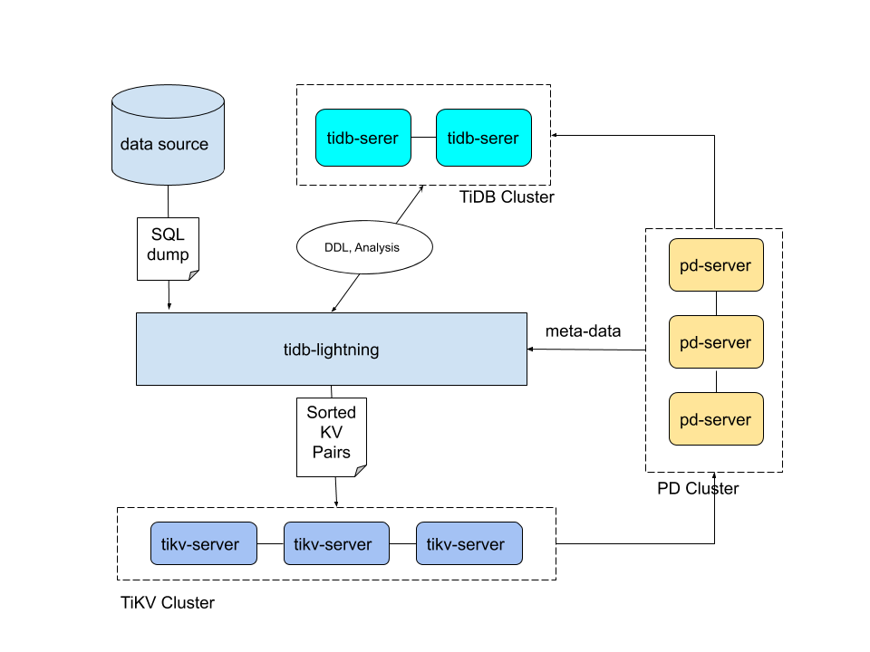

# 使用tidb-lightning导入数据到TIDB

# 一、简介

TiDB Lightning 是一个将**全量数据高速导入**到 TiDB 集群的工具

TiDB Lightning 有以下两个主要的使用场景：

- 大量新数据的快速导入
- 全量备份数据的恢复

目前，TiDB Lightning 支持：

- 导入 [Dumpling](https://docs.pingcap.com/zh/tidb/stable/dumpling-overview)、CSV 或 [Amazon Aurora Parquet](https://docs.pingcap.com/zh/tidb/stable/migrate-from-aurora-using-lightning) 输出格式的数据源。
- 从本地盘或 [Amazon S3 云盘](https://docs.pingcap.com/zh/tidb/stable/backup-and-restore-storages)读取数据。

# 二、工作原理



1. 在导数据之前，`tidb-lightning` 会自动将 TiKV 集群切换为“导入模式” (import mode)，优化写入效率并停止自动压缩。

2. `tidb-lightning` 会在目标数据库建立架构和表，并获取其元数据。

3. 每张表都会被分割为多个连续的**区块**，这样来自大表 (200 GB+) 的数据就可以用增量方式并行导入。

4. `tidb-lightning` 会为每一个区块准备一个“引擎文件 (engine file)”来处理键值对。`tidb-lightning` 会并发读取 SQL dump，将数据源转换成与 TiDB 相同编码的键值对，然后将这些键值对排序写入本地临时存储文件中。

5. 当一个引擎文件数据写入完毕时，`tidb-lightning` 便开始对目标 TiKV 集群数据进行分裂和调度，然后导入数据到 TiKV 集群。

   引擎文件包含两种：**数据引擎**与**索引引擎**，各自又对应两种键值对：行数据和次级索引。通常行数据在数据源里是完全有序的，而次级索引是无序的。因此，数据引擎文件在对应区块写入完成后会被立即上传，而所有的索引引擎文件只有在整张表所有区块编码完成后才会执行导入。

6. 整张表相关联的所有引擎文件完成导入后，`tidb-lightning` 会对比本地数据源及下游集群的校验和 (checksum)，确保导入的数据无损，然后让 TiDB 分析 (`ANALYZE`) 这些新增的数据，以优化日后的操作。同时，`tidb-lightning` 调整 `AUTO_INCREMENT` 值防止之后新增数据时发生冲突。

   表的自增 ID 是通过行数的**上界**估计值得到的，与表的数据文件总大小成正比。因此，最后的自增 ID 通常比实际行数大得多。这属于正常现象，因为在 TiDB 中自增 ID [不一定是连续分配的](https://docs.pingcap.com/zh/tidb/stable/mysql-compatibility#自增-id)。

7. 在所有步骤完毕后，`tidb-lightning` 自动将 TiKV 切换回“普通模式” (normal mode)，此后 TiDB 集群可以正常对外提供服务。

如果需要导入的目标集群是 v3.x 或以下的版本，需要使用 Importer-backend 来完成数据的导入。在这个模式下，`tidb-lightning` 需要将解析的键值对通过 gRPC 发送给 `tikv-importer` 并由 `tikv-importer` 完成数据的导入； TiDB Lightning 还支持使用 TiDB-backend 作为后端导入数据。TiDB-backend 使用和 Loader 类似，`tidb-lightning` 将数据转换为 `INSERT` 语句，然后直接在目标集群上执行这些语句。

使用Dumpling或Mydumper导出的数据为SQL文件。SQL文件分为三类：

- DB名-schema-cre1ate.sql：DB的schema创建语句文件
- DB名.表名-schema.sql：表的schema创建语句文件
- DB名.表名.sql：表的数据插入语句文件


# 三、注意

## 1、基础注意事项

- TiDB Lightning 运行后，TiDB 集群将无法正常对外提供服务。

- 若 `tidb-lightning` 崩溃，集群会留在“导入模式”。若忘记转回“普通模式”，集群会产生大量未压缩的文件，继而消耗 CPU 并导致延迟。此时，需要使用 `tidb-lightning-ctl` 手动将集群转回“普通模式”：

  ```bash
  bin/tidb-lightning-ctl --switch-mode=normal
  ```

## 2、Lightning 需要下游 TiDB用户有如下权限：

| 权限   | 作用域            |
| ------ | ----------------- |
| SELECT | Tables            |
| INSERT | Tables            |
| UPDATE | Tables            |
| DELETE | Tables            |
| CREATE | Databases, tables |
| DROP   | Databases, tables |
| ALTER  | Tables            |

如果配置项 `checksum = true`，则 TiDB Lightning 需要有下游 TiDB admin 用户权限。

## 3、导入后端模式

TiDB Lightning 的[后端 ](https://docs.pingcap.com/zh/tidb/stable/tidb-lightning-glossary#backend)(用于接受 TiDB Lightning 解析结果)  决定 `tidb-lightning` 组件将如何把将数据导入到目标集群中。目前，TiDB Lightning 支持以下后端：

- **Importer-backend**（默认）：`tidb-lightning` 先将 SQL 或 CSV 数据编码成键值对，由 `tikv-importer` 对写入的键值对进行排序，然后把这些键值对 Ingest 到 TiKV 节点中。
- **Local-backend**：`tidb-lightning` 先将数据编码成键值对并排序存储在本地临时目录，然后将这些键值对以 SST 文件的形式上传到各个 TiKV 节点，然后由 TiKV 将这些 SST 文件 Ingest 到集群中。和 `Importer-backend` 原理相同，不过不依赖额外的 `tikv-importer` 组件。
- **TiDB-backend**：`tidb-lightning` 先将数据编码成 `INSERT` 语句，然后直接在 TiDB 节点上运行这些 SQL 语句进行数据导入。

| 后端                | Local-backend     | Importer-backend  | TiDB-backend     |
| :------------------ | :---------------- | :---------------- | :--------------- |
| 速度                | 快 (~500 GB/小时) | 快 (~400 GB/小时) | 慢 (~50 GB/小时) |
| 资源使用率          | 高                | 高                | 低               |
| 占用网络带宽        | 高                | 中                | 低               |
| 导入时是否满足 ACID | 否                | 否                | 是               |
| 目标表              | 必须为空          | 必须为空          | 可以不为空       |
| 额外组件            | 无                | `tikv-importer`   | 无               |
| 支持 TiDB 集群版本  | >= v4.0.0         | 全部              | 全部             |

- 如果导入的目标集群为 v4.0 或以上版本，请优先考虑使用 Local-backend 模式。Local-backend 部署更简单并且性能也较其他两个模式更高
- 如果目标集群为 v3.x 或以下，则建议使用 Importer-backend 模式
- 如果需要导入的集群为生产环境线上集群，或需要导入的表中已包含有数据，则最好使用 TiDB-backend 模式

# 四、安装、命令参数及配置文件详解

## 1、下载安装

### 二进制

```bash
version=v4.0.5 && \
curl -# https://download.pingcap.org/tidb-toolkit-$version-linux-amd64.tar.gz | tar -zxC /opt && \
ln -s /opt/tidb-toolkit-$version-linux-amd64 /opt/tidb-toolkit-$version && \
echo -e "export TIDB_TOOLKIT_HOME=/opt/tidb-toolkit-$version\nexport PATH=\$PATH:\$TIDB_TOOLKIT_HOME/bin" >> /etc/profile && \
source /etc/profile && \ 
tidb-lightning -V
```

### Docker

```bash
docker pull pingcap/tidb-lightning:v5.0.1

docker run -it -v 本地导出SQL文件路径:/data pingcap/tidb-lightning:v5.0.1 sh
# tidb-lightning命令执行路径在根目录下,具体的导入任务可以在容器中执行
```


## 2、tidb-lightning参数

- 命令行参数生效优先级高于配置文件中的

| 参数                                                         | 描述                                                         | 对应配置项                     |
| :----------------------------------------------------------- | :----------------------------------------------------------- | :----------------------------- |
| --config *file*                                              | 从 *file* 读取全局设置。如果没有指定则使用默认设置。         |                                |
| -V                                                           | 输出程序的版本                                               |                                |
| -d *directory*                                               | 读取数据的本地目录或[外部存储 URL](https://docs.pingcap.com/zh/tidb/stable/backup-and-restore-storages) | `mydumper.data-source-dir`     |
| -L *level*                                                   | 日志的等级： debug、info、warn、error 或 fatal (默认为 info) | `lightning.log-level`          |
| -f *rule*                                                    | [表库过滤的规则](https://docs.pingcap.com/zh/tidb/stable/table-filter) (可多次指定) | `mydumper.filter`              |
| --backend [*backend*](https://docs.pingcap.com/zh/tidb/stable/tidb-lightning-backends) | 选择后端的模式：`importer`、`local` 或 `tidb`                | `tikv-importer.backend`        |
| --log-file *file*                                            | 日志文件路径（默认是 `/tmp` 中的临时文件）                   | `lightning.log-file`           |
| --status-addr *ip:port*                                      | TiDB Lightning 服务器的监听地址                              | `lightning.status-port`        |
| --importer *host:port*                                       | TiKV Importer 的地址                                         | `tikv-importer.addr`           |
| --pd-urls *host:port*                                        | PD endpoint 的地址                                           | `tidb.pd-addr`                 |
| --tidb-host *host*                                           | TiDB Server 的 host                                          | `tidb.host`                    |
| --tidb-port *port*                                           | TiDB Server 的端口（默认为 4000）                            | `tidb.port`                    |
| --tidb-status *port*                                         | TiDB Server 的状态端口的（默认为 10080）                     | `tidb.status-port`             |
| --tidb-user *user*                                           | 连接到 TiDB 的用户名                                         | `tidb.user`                    |
| --tidb-password *password*                                   | 连接到 TiDB 的密码                                           | `tidb.password`                |
| --no-schema                                                  | 忽略表结构文件，直接从 TiDB 中获取表结构信息                 | `mydumper.no-schema`           |
| --enable-checkpoint *bool*                                   | 是否启用断点 (默认值为 true)                                 | `checkpoint.enable`            |
| --analyze *bool*                                             | 导入后分析表信息 (默认值为 true)                             | `post-restore.analyze`         |
| --checksum *bool*                                            | 导入后比较校验和 (默认值为 true)                             | `post-restore.checksum`        |
| --check-requirements *bool*                                  | 开始之前检查集群版本兼容性（默认值为 true）                  | `lightning.check-requirements` |
| --ca *file*                                                  | TLS 连接的 CA 证书路径                                       | `security.ca-path`             |
| --cert *file*                                                | TLS 连接的证书路径                                           | `security.cert-path`           |
| --key *file*                                                 | TLS 连接的私钥路径                                           | `security.key-path`            |
| --server-mode                                                | 在服务器模式下启动 TiDB Lightning                            | `lightning.server-mode`        |

## 3、tidb-lightning-ctl参数

- *tablename* 必须是``db`.`tbl`` 中的限定表名（包括反引号）或关键词 `all`

- 所有 `tidb-lightning` 的参数也适用于 `tidb-lightning-ctl`

| 参数                                   | 描述                                                 |
| :------------------------------------- | :--------------------------------------------------- |
| --compact                              | 执行 full compact                                    |
| --switch-mode *mode*                   | 将每个 TiKV Store 切换到指定模式（normal 或 import） |
| --fetch-mode                           | 打印每个 TiKV Store 的当前模式                       |
| --import-engine *uuid*                 | 将 TiKV Importer 上关闭的引擎文件导入到 TiKV 集群    |
| --cleanup-engine *uuid*                | 删除 TiKV Importer 上的引擎文件                      |
| --checkpoint-dump *folder*             | 将当前的断点以 CSV 格式存储到文件夹中                |
| --checkpoint-error-destroy *tablename* | 删除断点，如果报错则删除该表                         |
| --checkpoint-error-ignore *tablename*  | 忽略指定表中断点的报错                               |
| --checkpoint-remove *tablename*        | 无条件删除表的断点                                   |

## 4、tikv-importer参数

| 参数                      | 描述                                                | 对应配置项              |
| :------------------------ | :-------------------------------------------------- | :---------------------- |
| -C, --config *file*       | 从 *file* 读取配置。如果没有指定，则使用默认设置    |                         |
| -V, --version             | 输出程序的版本                                      |                         |
| -A, --addr *ip:port*      | TiKV Importer 服务器的监听地址                      | `server.addr`           |
| --status-server *ip:port* | 状态服务器的监听地址                                | `status-server-address` |
| --import-dir *dir*        | 引擎文件的存储目录                                  | `import.import-dir`     |
| --log-level *level*       | 日志的等级： trace、debug、info、warn、error 或 off | `log-level`             |
| --log-file *file*         | 日志文件路径                                        | `log-file`              |

## 5、任务配置文件参数详解

```ini
[lightning]
# 启动之前检查集群是否满足最低需求。
# check-requirements = true

# 引擎文件的最大并行数。每张表被切分成一个用于存储索引的“索引引擎”和若干存储行数据的“数据引擎”。这两项设置控制两种引擎文件的最大并发数，会影响 tikv-importer 的内存和磁盘用量，两项数值之和不能超过 tikv-importer 的 max-open-engines 的设定。
index-concurrency = 2
table-concurrency = 6

# 数据的并发数。默认与逻辑 CPU 的数量相同。混合部署的情况下可以将其大小配置为逻辑 CPU 数的 75%，以限制 CPU 的使用。
# region-concurrency =

# I/O 最大并发数。I/O 并发量太高时，会因硬盘内部缓存频繁被刷新。而增加 I/O 等待时间，导致缓存未命中和读取速度降低。对于不同的存储介质，此参数可能需要调整以达到最佳效率。
io-concurrency = 5

[security]
# 指定集群中用于 TLS 连接的证书和密钥。CA 的公钥证书。如果留空，则禁用 TLS。
# ca-path = "/path/to/ca.pem"

# 此服务的公钥证书。
# cert-path = "/path/to/lightning.pem"

# 该服务的密钥。
# key-path = "/path/to/lightning.key"

[checkpoint]
# 是否启用断点续传。导入数据时，TiDB Lightning 会记录当前表导入的进度。所以即使 Lightning 或其他组件异常退出，在重启时也可以避免重复再导入已完成的数据。
enable = true

# 存储断点的数据库名称。
schema = "tidb_lightning_checkpoint"

# 存储断点的方式。
#  - file：存放在本地文件系统。
#  - mysql：存放在兼容 MySQL 的数据库服务器。
driver = "file"

# dsn 是数据源名称 (data source name)，表示断点的存放位置。
# 若 driver = "file"，则 dsn 为断点信息存放的文件路径。若不设置该路径，则默认存储路径为“/tmp/CHECKPOINT_SCHEMA.pb”。
# 若 driver = "mysql"，则 dsn 为“用户:密码@tcp(地址:端口)/”格式的 URL。若不设置该 URL，则默认会使用 [tidb] 部分指定的 TiDB 服务器来存储断点。

# 为减少目标 TiDB 集群的压力，建议指定另一台兼容 MySQL 的数据库服务器来存储断点。
# dsn = "/tmp/tidb_lightning_checkpoint.pb"

# 所有数据导入成功后是否保留断点。设置为 false 时为删除断点。保留断点有利于进行调试，但会泄漏关于数据源的元数据。
# keep-after-success = false

[tikv-importer]
# 选择后端：“importer” 或 “local” 或 “tidb”
# backend = "importer"
# 当后端是 “importer” 时，tikv-importer 的监听地址（需改为实际地址）。
addr = "172.16.31.10:8287"
# 当后端是 “tidb” 时，插入重复数据时执行的操作。
# - replace：新数据替代已有数据
# - ignore：保留已有数据，忽略新数据
# - error：中止导入并报错
# on-duplicate = "replace"

# 当后端是 “local” 时，控制生成 SST 文件的大小，最好跟 TiKV 里面的 Region 大小保持一致，默认是 96 MB。
# region-split-size = 100_663_296

# 当后端是 “local” 时，一次请求中发送的 KV 数量。
# send-kv-pairs = 32768

# 当后端是 “local” 时，本地进行 KV 排序的路径。如果磁盘性能较低（如使用机械盘），建议设置成与 `data-source-dir` 不同的磁盘，这样可有效提升导入性能。
# sorted-kv-dir = ""

# 当后端是 “local” 时，TiKV 写入 KV 数据的并发度。当 TiDB Lightning 和 TiKV 直接网络传输速度超过万兆的时候，可以适当增加这个值。
# range-concurrency = 16

[mydumper]
# 设置文件读取的区块大小，确保该值比数据源的最长字符串长。
read-block-size = 65536 # Byte (默认为 64 KB)

# （源数据文件）单个导入区块大小的最小值。
# Lightning 根据该值将一张大表分割为多个数据引擎文件。
# batch-size = 107_374_182_400 # Byte (默认为 100 GB)

# 引擎文件需按顺序导入。由于并行处理，多个数据引擎几乎在同时被导入，
# 这样形成的处理队列会造成资源浪费。因此，为了合理分配资源，Lightning
# 稍微增大了前几个区块的大小。该参数也决定了比例系数，即在完全并发下
# “导入”和“写入”过程的持续时间比。这个值可以通过计算 1 GB 大小的
# 单张表的（导入时长/写入时长）得到。在日志文件中可以看到精确的时间。
# 如果“导入”更快，区块大小的差异就会更小；比值为 0 时则说明区块大小一致。
# 取值范围为（0 <= batch-import-ratio < 1）。
batch-import-ratio = 0.75

# mydumper 本地源数据目录。
data-source-dir = "/data/my_database"
# 如果 no-schema = true，那么 TiDB Lightning 假设目标 TiDB 集群上
# 已有表结构，并且不会执行 `CREATE TABLE` 语句。
no-schema = false
# 指定包含 `CREATE TABLE` 语句的表结构文件的字符集。只支持下列选项：
#  - utf8mb4：表结构文件必须使用 UTF-8 编码，否则 Lightning 会报错。
#  - gb18030：表结构文件必须使用 GB-18030 编码，否则 Lightning 会报错。
#  - auto：自动判断文件编码是 UTF-8 还是 GB-18030，两者皆非则会报错（默认）。
#  - binary：不尝试转换编码。
# 注意：**数据** 文件始终解析为 binary 文件。
character-set = "auto"

# “严格”格式的导入数据可加快处理速度。
# strict-format = true 要求：
# 在 CSV 文件的所有记录中，每条数据记录的值不可包含字符换行符（U+000A 和 U+000D，即 \r 和 \n）
# 甚至被引号包裹的字符换行符都不可包含，即换行符只可用来分隔行。
# 导入数据源为严格格式时，TiDB Lightning 会快速定位大文件的分割位置进行并行处理。
# 但是如果输入数据为非严格格式，可能会将一条完整的数据分割成两部分，导致结果出错。
# 为保证数据安全而非追求处理速度，默认值为 false。
strict-format = false

# 如果 strict-format = true，TiDB Lightning 会将 CSV 大文件分割为多个文件块进行并行处理。max-region-size 是分割后每个文件块的最大大小。
# max-region-size = 268_435_456 # Byte（默认是 256 MB）

# 只导入与该通配符规则相匹配的表。详情见相应章节。
filter = ['*.*']

# 配置 CSV 文件的解析方式。
[mydumper.csv]
# 字段分隔符，应为单个 ASCII 字符。
separator = ','
# 引用定界符，可为单个 ASCII 字符或空字符串。
delimiter = '"'
# CSV 文件是否包含表头。
# 如果 header = true，将跳过首行。
# CSV 文件是否包含 NULL。
# 如果 not-null = true，CSV 所有列都不能解析为 NULL。
not-null = false
# 如果 not-null = false（即 CSV 可以包含 NULL），
# 为以下值的字段将会被解析为 NULL。
null = '\N'
# 是否对字段内“\“进行转义
backslash-escape = true
# 如果有行以分隔符结尾，删除尾部分隔符。
trim-last-separator = false

[tidb]
# 目标集群的信息。tidb-server 的地址，填一个即可。
host = "172.16.31.1"
port = 4000
user = "root"
password = ""
# 表结构信息从 TiDB 的“status-port”获取。
status-port = 10080
# pd-server 的地址，填一个即可。
pd-addr = "172.16.31.4:2379"
# tidb-lightning 引用了 TiDB 库，并生成产生一些日志。
# 设置 TiDB 库的日志等级。
log-level = "error"

# 设置 TiDB 会话变量，提升 Checksum 和 Analyze 的速度。
# 各参数定义可参阅”控制 Analyze 并发度“文档
build-stats-concurrency = 20
distsql-scan-concurrency = 100
index-serial-scan-concurrency = 20
checksum-table-concurrency = 16

# 解析和执行 SQL 语句的默认 SQL 模式。
sql-mode = "ONLY_FULL_GROUP_BY,NO_ENGINE_SUBSTITUTION"
# `max-allowed-packet` 设置数据库连接允许的最大数据包大小，
# 对应于系统参数中的 `max_allowed_packet`。 如果设置为 0，
# 会使用下游数据库 global 级别的 `max_allowed_packet`。
max-allowed-packet = 67_108_864

# SQL 连接是否使用 TLS。可选值为：
#  * ""            - 如果填充了 [tidb.security] 部分，则强制使用 TLS（与 "cluster" 情况相同），否则与 "false" 情况相同
#  * "false"       - 禁用 TLS
#  * "cluster"     - 强制使用 TLS 并使用 [tidb.security] 部分中指定的 CA 验证服务器的证书
#  * "skip-verify" - 强制使用 TLS，但不验证服务器的证书（不安全！）
#  * "preferred"   - 与 "skip-verify" 相同，但是如果服务器不支持 TLS，则会退回到未加密的连接
# tls = ""
# 指定证书和密钥用于 TLS 连接 MySQL。
# 默认为 [security] 部分的副本。
# [tidb.security]
# CA 的公钥证书。设置为空字符串可禁用 SQL 的 TLS。
# ca-path = "/path/to/ca.pem"
# 该服务的公钥证书。默认为 `security.cert-path` 的副本
# cert-path = "/path/to/lightning.pem"
# 此服务的私钥。默认为 `security.key-path` 的副本
# key-path = "/path/to/lightning.key"

# 数据导入完成后，tidb-lightning 可以自动执行 Checksum、Compact 和 Analyze 操作。
# 在生产环境中，建议这将些参数都设为 true。
# 执行的顺序为：Checksum -> Compact -> Analyze。
[post-restore]
# 如果设置为 true，会对所有表逐个执行 `ADMIN CHECKSUM TABLE <table>` 操作
# 来验证数据的完整性。
checksum = true
# 如果设置为 true，会在导入每张表后执行一次 level-1 Compact。
# 默认值为 false。
level-1-compact = false
# 如果设置为 true，会在导入过程结束时对整个 TiKV 集群执行一次 full Compact。
# 默认值为 false。
compact = false
# 如果设置为 true，会对所有表逐个执行 `ANALYZE TABLE <table>` 操作。
analyze = true

# 设置周期性后台操作。
# 支持的单位：h（时）、m（分）、s（秒）。
[cron]
# Lightning 自动刷新导入模式状态的持续时间，该值应小于 TiKV 对应的设定值。
switch-mode = "5m"
# 在日志中打印导入进度的持续时间。
log-progress = "5m"
```

# 五、Web 界面

TiDB Lightning 支持在网页上查看导入进度或执行一些简单任务管理。启用服务器模式的方式有如下几种：

1. 在启动 `tidb-lightning` 时加上命令行参数 `--server-mode`。

   ```sh
   nohup tidb-lightning --server-mode --status-addr :8289 >> tidb-lightning-server.log 2>&1 &
   ```

2. 在配置文件中设置 `lightning.server-mode`。

   ```toml
   [lightning]
   server-mode = true
   status-addr = ':8289'
   ```

TiDB Lightning 启动后，可以访问 `http://127.0.0.1:8289` 来管理程序

服务器模式下，TiDB Lightning 不会立即开始运行，而是通过用户在 web 页面提交（多个） TOML 格式的**任务**文件来导入数据。

# 六、断点续传

大量的数据导入一般耗时数小时至数天，长时间运行的进程会有一定机率发生非正常中断。如果每次重启都从头开始，就会浪费掉之前已成功导入的数据。为此，TiDB Lightning 提供了“断点续传”的功能，即使 `tidb-lightning` 崩溃，在重启时仍然接着之前的进度继续工作。

文档：https://docs.pingcap.com/zh/tidb/stable/tidb-lightning-checkpoints

## 1、断点续传的启用与配置

```ini
[checkpoint]
# 启用断点续传。
# 导入时，TiDB Lightning 会记录当前进度。
# 若 TiDB Lightning 或其他组件异常退出，在重启时可以避免重复再导入已完成的数据。
enable = true

# 存储断点的方式
#  - file：存放在本地文件系统（要求 v2.1.1 或以上）
#  - mysql：存放在任何兼容 MySQL 5.7 或以上的数据库中，包括 MariaDB 和 TiDB
driver = "file"

# 存储断点的架构名称（数据库名称）仅在 driver = "mysql" 时生效
# schema = "tidb_lightning_checkpoint"

# 断点的存放位置
#     若 driver = "file"，此参数为断点信息存放的文件路径。如果不设置该参数则默认为 `/tmp/CHECKPOINT_SCHEMA.pb`
#     若 driver = "mysql"，此参数为数据库连接参数 (DSN)，格式为“用户:密码@tcp(地址:端口)/”。
#        默认会重用 [tidb] 设置目标数据库来存储断点。为避免加重目标集群的压力，建议另外使用一个兼容 MySQL 的数据库服务器。
# dsn = "/tmp/tidb_lightning_checkpoint.pb"

# 导入成功后是否保留断点。默认为删除。保留断点可用于调试，但有可能泄漏数据源的元数据。
# keep-after-success = false
```

## 2、断点续传的控制

若 `tidb-lightning` 因不可恢复的错误而退出（例如数据出错），重启时不会使用断点，而是直接报错离开。为保证已导入的数据安全，这些错误必须先解决掉才能继续。使用 `tidb-lightning-ctl` 工具可以标示已经恢复。

### ①从头开始整个导入过程

```bash
tidb-lightning-ctl --checkpoint-error-destroy=['`schema`.`table`' | all ]
```

- 该命令会让失败的表从头开始整个导入过程。选项中的架构和表名必须以反引号 (```) 包裹，而且区分大小写。
- 如果导入 ``schema`.`table`` 这个表曾经出错，这条命令会：
  1. 从目标数据库移除 (DROP) 这个表，清除已导入的数据。
  2. 将断点重设到“未开始”的状态。
- 如果 ``schema`.`table`` 没有出错，则无操作。
- 传入 `all` 会对所有表进行上述操作，这是最方便、安全但保守的断点错误解决方法。

### ②忽略出错状态接着带导入

```shell
tidb-lightning-ctl --checkpoint-error-ignore='`schema`.`table`' &&
tidb-lightning-ctl --checkpoint-error-ignore=all
```

如果导入 ``schema`.`table`` 这个表曾经出错，这条命令会清除出错状态，如同没事发生过一样。传入 "all" 会对所有表进行上述操作。

> **注意：**
>
> 除非确定错误可以忽略，否则不要使用这个选项。如果错误是真实的话，可能会导致数据不完全。启用校验和 (CHECKSUM) 可以防止数据出错被忽略。

### ③无论是否有出错，把断点清除

```shell
tidb-lightning-ctl --checkpoint-remove='`schema`.`table`' &&
tidb-lightning-ctl --checkpoint-remove=all
```

### ④将所有断点备份到传入的文件夹

该参数主要用于技术支持。此选项仅于 `driver = "mysql"` 时有效。

```shell
tidb-lightning-ctl --checkpoint-dump=output/directory
```

# 七、实例

## 1、编写配置文件

>  Test.toml

```ini
[mydumper]
# 数据源目录
data-source-dir = "/data/tidb-dumpling-export"

[tikv-importer]
backend = "tidb"

[tidb]
host = "192.168.1.2"
port = 4000
user = "root"
password = "*****"
```

## 2、启动任务

- 在lightning的Web界面中提交任务配置文件

- 在命令行中运行任务配置文件

  ```bash
  nohup tidb-lightning \
    -L info \
    --log-file /root/tidb-lightning-import-task.log \
    -config /root/Test.toml \
    > /root/tidb-lightning-import-task-nohup.log 2>&1 &
  ```

导入完毕后，TiDB Lightning 会自动退出。若导入成功，日志的最后一行会显示 `tidb lightning exit`