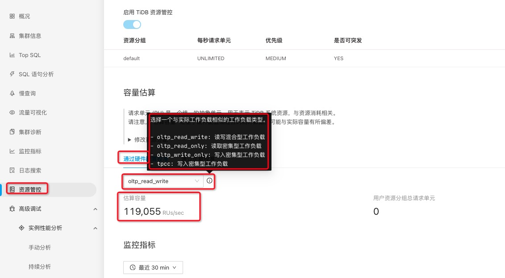
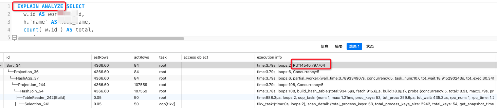

# TiDB 资源限制隔离

# 一、简介

TiDB 资源管控特性提供了两层资源管理能力，包括在<font color=red>**TiDB 层的流控能力**</font>和<font color=red>**TiKV 层的优先级调度**</font>的能力。两个能力可以单独或者同时开启，详情请参见[参数组合效果表](https://docs.pingcap.com/zh/tidb/dev/tidb-resource-control#相关参数)。将用户绑定到某个资源组后，<font color=red>**TiDB 层会根据用户所绑定资源组设定的配额对用户的读写请求做流控**</font>，<font color=red>**TiKV 层会根据配额映射的优先级来对请求做调度**</font>。通过流控和调度这两层控制，可以实现应用的资源隔离，满足服务质量 (QoS) 要求。

- **TiDB 流控**：TiDB 流控使用`令牌桶算法` 做流控。如果桶内令牌数不够，而且资源组没有指定 BURSTABLE 特性，属于该资源组的请求会等待令牌桶回填令牌并重试，重试可能会超时失败。
- **TiKV 调度**：你可以为资源组设置绝对优先级 (PRIORITY)，不同的资源按照 PRIORITY 的设置进行调度，PRIORITY 高的任务会被优先调度。如果没有设置绝对优先级 (PRIORITY)，TiKV 会将资源组的 RU_PER_SEC 取值映射成各自资源组读写请求的优先级，并基于各自的优先级在存储层使用优先级队列调度处理请求。

## RU 简介

Request Unit (RU) 是 TiDB 对 CPU、IO 等系统资源的统一抽象的计量单位，用于表示对数据库的单个请求消耗的资源量。请求消耗的 RU 数量取决于多种因素，例如操作类型或正在检索或修改的数据量。目前，RU 包含以下资源的统计信息：

| 资源类型 | RU 消耗                               |
| :------- | :------------------------------------ |
| Read     | 2 storage read batches 消耗 1 RU      |
|          | 8 storage read requests 消耗 1 RU     |
|          | 64 KiB read request payload 消耗 1 RU |
| Write    | 1 storage write batch 消耗 1 RU       |
|          | 1 storage write request 消耗 1 RU     |
|          | 1 KiB write request payload 消耗 1 RU |
| SQL CPU  | 3 ms 消耗 1 RU                        |

## 预估集群容量



# 二、操作

## 1、开起资源限制

资源管控特性引入了如下系统变量或参数：

- TiDB：通过配置全局变量 `tidb_enable_resource_control` 控制是否打开资源组流控。
- TiKV：通过配置参数 `resource-control.enabled` 控制是否使用基于资源组配额的请求调度。
- TiFlash：通过配置全局变量 `tidb_enable_resource_control` 和 TiFlash 配置项 `enable_resource_control`（v7.4.0 开始引入）控制是否开启 TiFlash 资源管控。

从 v7.0.0 开始，`tidb_enable_resource_control` 和 `resource-control.enabled` 开关都被默认打开。这两个参数的组合效果见下表：

| `esource-control.enabled`         | `tidb_enable_resource_control`= ON | `tidb_enable_resource_control`= OFF |
| :-------------------------------- | :--------------------------------- | :---------------------------------- |
| `resource-control.enabled`= true  | 流控和调度（推荐组合）             | 无效配置                            |
| `resource-control.enabled`= false | 仅流控（不推荐）                   | 特性被关闭                          |

从 v7.4.0 开始，TiFlash 配置项 `enable_resource_control` 默认打开，与 `tidb_enable_resource_control` 一起控制 TiFlash 资源管控功能。只有二者都启用时，TiFlash 资源管控功能才能进行流控以及优先级调度。同时，在开启 `enable_resource_control` 时，TiFlash 会使用 Pipeline Model 执行模型。

## 2、估算 SQL 消耗的 RU

你可以通过 [`EXPLAIN ANALYZE`](https://docs.pingcap.com/zh/tidb/dev/sql-statement-explain-analyze#ru-request-unit-消耗) 语句获取到 SQL 执行时所消耗的 RU。注意 RU 的大小会受缓存的影响（比如[下推计算结果缓存](https://docs.pingcap.com/zh/tidb/dev/coprocessor-cache)），多次执行同一条 SQL 所消耗的 RU 可能会有不同。因此这个 RU 值并不代表每次执行的精确值，但可以作为估算的参考。

```sql
EXPLAIN ANALYZE .....SQL.....
```



## 3、创建资源组

### ①创建语句

```sql
create resource group if not exists rg1 
  ru_per_sec = 200 
  priority = high 
  QUERY_LIMIT=(EXEC_ELAPSED='100ms', ACTION=KILL, WATCH=EXACT DURATION='10m');
```

### ②参数详解

| 参数              | 含义                                                         | 举例                                                         |
| :---------------- | :----------------------------------------------------------- | :----------------------------------------------------------- |
| **`RU_PER_SEC`**  | 每秒 RU 填充的速度                                           | `RU_PER_SEC = 500` 表示此资源组每秒回填 500 个 RU。          |
| **`PRIORITY`**    | 任务在 TiKV 上处理的绝对优先级                               | `PRIORITY = HIGH` 表示优先级高。若未指定，则默认为 `MEDIUM`。 |
| **`BURSTABLE`**   | 允许对应的资源组超出配额后使用空余的系统资源。               |                                                              |
| **`QUERY_LIMIT`** | 当查询执行满足该条件时，识别该查询为 Runaway Query 并进行相应的控制 | `QUERY_LIMIT=(EXEC_ELAPSED='60s', ACTION=KILL, WATCH=EXACT DURATION='10m')` 表示当执行时间超过 60 秒后识别为 Runaway Query，对该查询执行终止操作，并在 10 分钟内对同样的 SQL 直接执行终止操作。`QUERY_LIMIT=()` 或 `QUERY_LIMIT=NULL` 则表示不进行 Runaway 控制。具体参数介绍详见[管理资源消耗超出预期的查询 (Runaway Queries)](https://docs.pingcap.com/zh/tidb/dev/tidb-resource-control#管理资源消耗超出预期的查询-runaway-queries)。 ｜ |

#### ③注意

- TiDB 在创建资源组时不会检查容量。只要系统有足够的空闲资源，TiDB 就会满足每个资源组的用量设置。当系统资源超过限制时，TiDB 会优先满足高优先级 (PRIORITY) 资源组的请求。如果同一优先级的请求无法全部满足，TiDB 会根据用量 (RU_PER_SEC) 的大小按比例分配。

## 4、QUERY_LIMIT管理资源消耗超出预期的查询

针对已触发Runaway Queries条件的 SQL，设置指定时间的自动操作。

- 自 v7.2.0 起，TiDB 资源管控引入了对 Runaway Queries 的管理。你可以针对某个资源组设置条件来识别 Runaway Queries，并自动发起应对操作，防止集群资源完全被 Runaway Queries 占用而影响其他正常查询。你可以在 [`CREATE RESOURCE GROUP`](https://docs.pingcap.com/zh/tidb/dev/sql-statement-create-resource-group) 或者 [`ALTER RESOURCE GROUP`](https://docs.pingcap.com/zh/tidb/dev/sql-statement-alter-resource-group) 中配置 `QUERY_LIMIT` 字段，通过规则识别来管理资源组的 Runaway Queries。
- 自 v7.3.0 起，TiDB 资源管控引入了手动管理 Runaway Queries 监控列表的功能，将给定的 SQL 或者 Digest 添加到隔离监控列表，从而实现快速隔离 Runaway Queries。执行语句 [`QUERY WATCH`](https://docs.pingcap.com/zh/tidb/dev/sql-statement-query-watch)，手动管理资源组中的 Runaway Queries 监控列表。

### ①**`QUERY_LIMIT`** 参数详解

- 支持的条件设置：
  - `EXEC_ELAPSED`: 当查询执行的时间超限时，识别为 Runaway Query。

- 支持的应对操作 (`ACTION`)：

  - `DRYRUN`：对执行 Query 不做任何操作，仅记录识别的 Runaway Query。主要用于观测设置条件是否合理。

  - `COOLDOWN`：将查询的执行优先级降到最低，查询仍旧会以低优先级继续执行，不占用其他操作的资源。

  - `KILL`：识别到的查询将被自动终止，报错 `Query execution was interrupted, identified as runaway query`。

- `WATCH` 当某一个查询被识别为 Runaway Query 之后，会提取这个查询的匹配特征（由 `WATCH` 后的匹配方式参数决定）。在接下来`DURATION` 定义的一段时间里，这个 Runaway Query 的匹配特征会被加入到监控列表，TiDB 实例会将查询和监控列表进行匹配，匹配到的查询直接标记为 Runaway Query，而不再等待其被条件识别，并按照当前应对操作进行隔离。有三种匹配方式：

  - `EXACT` 表示完全相同的 SQL 才会被快速识别

  - `SIMILAR` 表示会忽略字面值 (Literal)，通过 SQL Digest 匹配所有模式 (Pattern) 相同的 SQL

  - `PLAN` 表示通过 Plan Digest 匹配所有模式 (Pattern) 相同的 SQL

- `WATCH` 中的 `DURATION` 选项，用于表示此识别项的持续时间，默认为无限长。

### ②查询Runaway Queries历史记录

`mysql.tidb_runaway_queries` 表中包含了过去 7 天内所有识别到的 Runaway Queries 的历史记录

```sql
SELECT * FROM mysql.tidb_runaway_queries LIMIT 1;
```

`match_type` 为该 Runaway Query 的来源，其值如下：

- `identify` 表示命中条件。
- `watch` 表示被快速识别机制命中。

## 5、管理资源组

### ①查看资源组

```sql
SELECT * FROM information_schema.resource_groups WHERE NAME ='rg1';
```

### ②删除资源组

```sql
DROP RESOURCE GROUP IF EXISTS rg1;
```

### ③修改资源组

```sql
ALTER RESOURCE GROUP rg1
  RU_PER_SEC = 200
  PRIORITY = LOW
  QUERY_LIMIT = (EXEC_ELAPSED='1s' ACTION=COOLDOWN WATCH=EXACT DURATION '30s');
```

修改 `rg1` 资源组，取消 Runaway Queries 检查。

```sql
ALTER RESOURCE GROUP rg1 QUERY_LIMIT=NULL;
```

## 6、资源组绑定

### ①绑定用户到资源组

```sql
ALTER USER 'usr2'@'%' RESOURCE GROUP rg1;
```

查看当前用户绑定的资源组

```sql
SELECT USER, JSON_EXTRACT(User_attributes, "$.resource_group") FROM mysql.user WHERE user = "usr2";
```

解除用户与资源组的绑定（只需将其重新绑定到 default 资源组即可）

```sql
ALTER USER 'usr2'@'%' RESOURCE GROUP `default`;
```

注意： 没有指定任何资源组的用户，将被放入系统预定义的 default 资源组，而 default 资源组默认拥有无限用量。当所有用户都属于 default 资源组时，资源分配方式与关闭资源管控时相同。

### ②绑定会话到资源组

将当前的会话绑定至资源组 rg1

```sql
SET RESOURCE GROUP rg1;
```

### ③绑定SQL到资源组

通过在 SQL 语句中添加 `RESOURCE_GROUP(resource_group_name) Hint`，可以将该语句绑定到指定的资源组。此 Hint 支持 `SELECT、INSERT、UPDATE、DELETE` 四种语句。

```sql
SELECT /*+ RESOURCE_GROUP(rg1) */ * FROM t limit 10;
```

# 三、针对 Metabase进行资源限制隔离

方案：限制指定用户执行超过 60s的 SQL 进行kill，或者降低优先级处理 ，对于触发限制的相同SQL 在 15 分钟内自动进行之前的处理操作，限制其频繁操作。

- 新建metabase使用的 TIDB用户，绑定该用户到特定的资源组。资源组规则设置：判断执行时间超过 60s的SQL

  ```sql
  create resource group if not exists rg1 
    ru_per_sec = 20000 
    priority = MEDIUM 
    QUERY_LIMIT=(EXEC_ELAPSED='60s', ACTION=COOLDOWN, WATCH=SIMILAR DURATION='5m');
  ```
