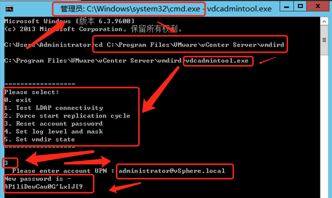

# vSphere vCenter Server

# 一、简介

- vSphere Client虽然可以管理ESXI，但只能实现一些如创建虚拟机的简单的功能，而vsphere的高级功能都无法实现。更重要的是多台ESXI无法进行统一管理，为了解决这个问题，vsphere开发了一个非常重要的组件vCenter Server

- **vCenter Server**是安装在 Window 或 Linux 服务器里，用于管理一个或者多个ESXi服务器的工具。（可以安装在 ESXi 服务器的虚拟机里）

- **vCenter Server Appliance**：简称VCSA，是预配置的 Linux 虚拟机，针对在 Linux 上运行vCenter Server 及关联服务进行了优化，从6.0开始其实体形态是个.iso文件，需要在windows桌面上打开，通过配置过程将其安装到ESXi主机上。

# 二、安装部署

vCenter ISO镜像下载地址：https://my.vmware.com/cn/web/vmware/details?downloadGroup=VC60U3H&productId=491

官方文档：https://docs.vmware.com/cn/VMware-vSphere/6.7/com.vmware.vcenter.install.doc/GUID-11468F6F-0D8C-41B1-82C9-29284630A4FF.html

安装部署参考

1. https://blog.51cto.com/3701740/2326475
2. https://blog.csdn.net/weixin_44907813/article/details/99185102
3. https://blog.51cto.com/14227204/2418905

# 三、其他

## 1、找回vCenter 默认用户密码

在以管理员权限打开的CMD中切换至C:\Program Files\VMware\vCenter Server\vmdird目录下进入后执行vdcadmintool.exe。

提示让你输入 UPN：就是输入你创建时的登录用户名，一般默认为administrator@vSphere.local
输入后回车会给你一个 New password 