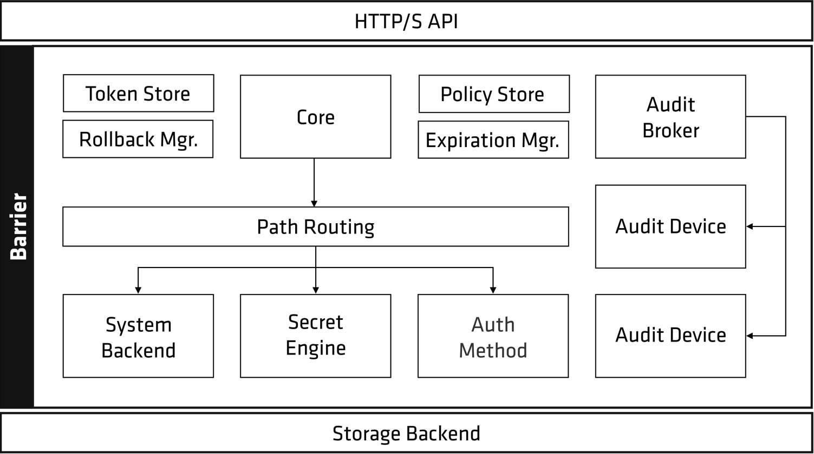
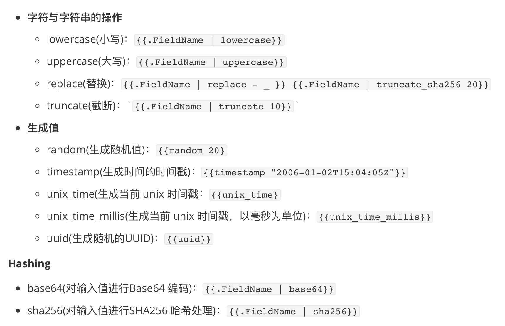
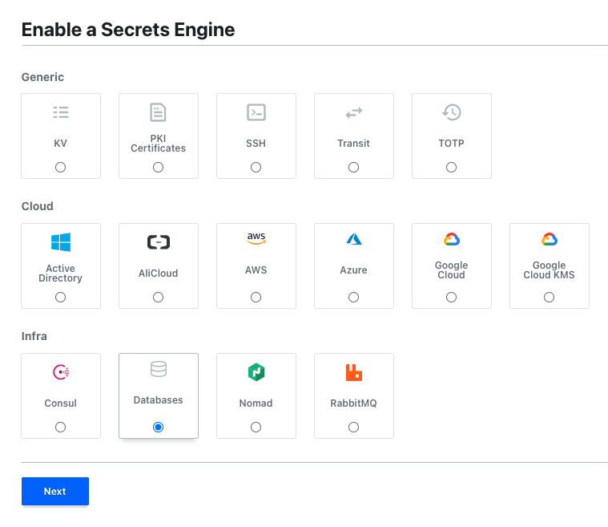
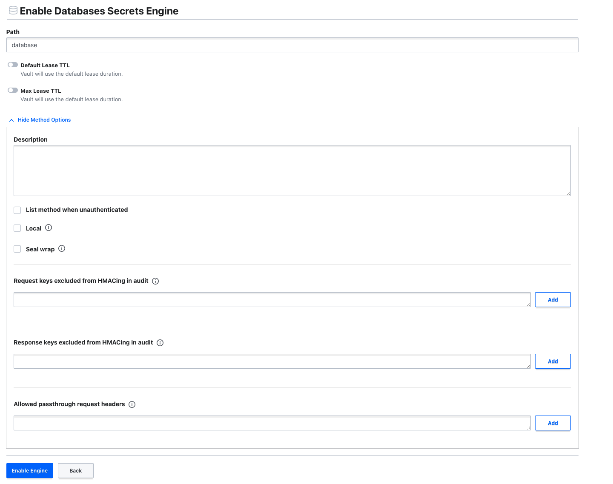
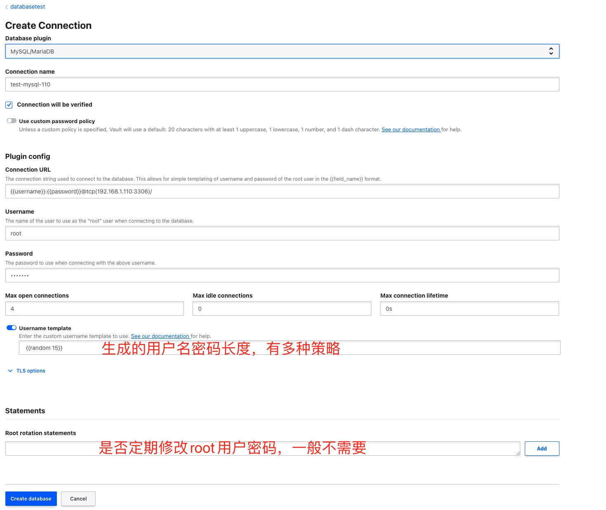
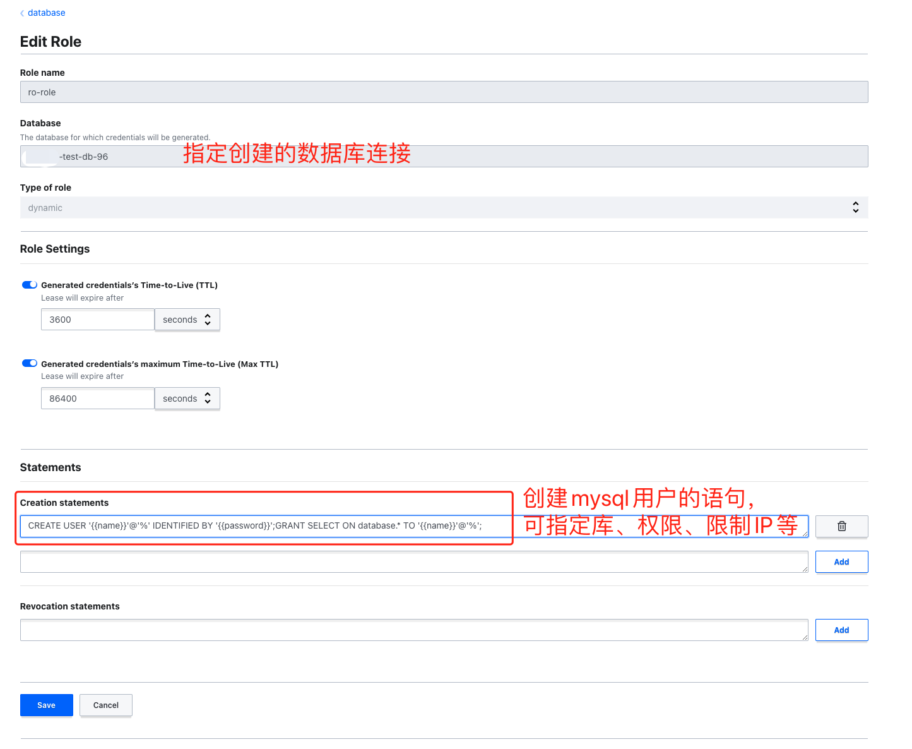

# Vault

# 一、简介

## 文档

Docker镜像：https://hub.docker.com/search?q=vault&type=image

中文文档：https://lonegunmanb.github.io/essential-vault/

## 服务架构



- 后端存储（Storage Backend）：后端存储负责将密文数据存储到可靠的持久存储上。Vault 并不假设后端存储上的数据不会被盗取，而只是假设该存储是持久、可靠的。Vault 只会向后端存储写入加密过的数据。后端存储应在 Vault 服务启动前被妥善配置。
- 屏障(Barrier)：屏障是由加密算法所组成的钢筋混凝土防护工事。所有在 Vault 服务与后端存储之间流动的数据都会经过屏障处理。屏障确保了 Vault 写入后端存储的一切数据都是加密的，而从后端存储读取的数据都会经由屏障解密交由 Vault 服务使用。由于屏障的存在，Vault 服务启动后，必须进行“解封”（Unseal）处理，获得与后端存储数据相应的主密钥（Master Key）后才能正常工作。
- 机密引擎（Secret Engine）：机密引擎负责管理各种机密数据。比如“KV“引擎，就是一种简单的保存静态机密数据的机密引擎。某些机密引擎可提供被查询时动态创建机密的动态机密功能，这使得 Vault 可以提供细颗粒度权限配置的一次一密的临时机密。例如为运维与开发配置不同的策略，并对应不同的 AWS 权限，相关人员每次读取相关机密时，由 Vault 动态创建一组拥有有限有效期和预设 AWS 权限的 Access Key 和 Secret Key，并确保在有效期过后由 Vault 在 AWS 上自动删除该Key。
- 审计设备（Audit Device）：审计设备负责管理审计日志。进出 Vault 的每一个请求和响应都会被记录在预设的审计设备上。该部件为 Vault 与多种不同的审计日志存储的集成提供了一种简单的方式。
- 身份验证方法（Auth Method）：身份验证方法被用来认证连接到 Vault 服务的用户或是应用程序的身份信息。一旦验证通过，身份验证组件会返回一组当前身份适用的策略信息。Vault 接受一个通过认证的用户，并返回一个可供将来使用的客户端令牌。举个例子，使用 `userpass` 认证方式，用户通过提供用户名与密码来进行认证。如果使用 `github` 认证方式，用户通过 Github 令牌来通过 Vault 的认证。
- 客户端令牌（Client Token）：一个客户端令牌（又称“Vault Token“）类似于网站的会话 Cookie。一旦用户通过认证，Vault 返回一个客户端令牌。该令牌可以被 Vault 用来识别客户端身份并使用相应的访问控制权限约束客户端权限。该令牌通过 HTTP Header 传递。
- 机密（Secret）：机密指的是所有由 Vault 返回的包含机密信息或者密码学原材料（Cryptographic Material）的信息。并不是所有由 Vault 返回的信息都是机密，例如系统配置、服务状态信息、策略配置等就不属于机密范畴。机密都有对应的租约（Lease），这代表客户端不可以假设机密可以无限期地被使用。Vault 会在租约到期后吊销相关机密，Vault 管理员也可以在租约到期之前人工吊销机密。Vault 服务与客户端之间的这种契约是至关重要的，它允许实现全自动的机密凭据和策略的改变。
- 服务器（Server）：Vault 依赖于一个长期运行服务实例的服务器。Vault 服务器对外提供了一组 API 用以与客户端互动，以及管理与各种机密引擎的互动，访问控制权限体系的执行，以及机密租约管理和吊销。服务器的架构设计解除了客户端与机密信息、权限策略的耦合，使得管理员可以轻松实现对审计日志的中央化管控。


**Vault 不信任后端存储，所以只会向后端存储写入加密后的密文数据。当 Vault 服务启动时，必须配置一个后端存储，使得 Vault 重启后仍然可以读取到数据。HTTP API 同样也必须在 Vault 服务启动时被启动，才能使得客户端可以与 Vault 服务交互。**

**当 Vault 启动后，Vault 处于“封印（Sealed）”状态。在执行任意操作之前，首先要对 Vault 执行“解封（Unseal）”操作。当 Vault 服务初始化时会生成一个加密密钥，所有写入后端存储的数据都会用该密钥加密。该密钥由一个主密钥（Master Key）保护。默认情况下，Vault 使用 Shamir 算法将主密钥拆分成5份，需要至少 3 份才能重建主密钥**


## **用户名生成模板语法**



# 二、安装部署

## 1、k8s Helm 

```bash
helm repo add hashicorp https://helm.releases.hashicorp.com
helm repo update
```

**StandAlone模式**

`部署过程中，vault处于seal模式，此时pod健康状态是不正常的，需要进入到容器中执行vault operator init生成key和登录Token后，登录UI界面输入key(或执行vault operator unseal key1,vault operator unseal key2,vault operator unseal key3)可将vault服务进行unseal,使其pod健康状态恢复正常`

```bash
helm upgrade --install vault --namespace tools hashicorp/vault \
  --set "injector.enabled=false" \
  --set "ui.enabled=true" \
  --set "server.ingress.enabled=true" \
  --set "server.ingress.hosts[0].host=vault.curiouser.com"
```

**dev模式**

`dev模式部署的话。vault服务是不用进行unseal处理的，可以直接使用`

```bash
helm upgrade --install vault --namespace tools hashicorp/vault \
  --set "injector.enabled=false" \
  --set "ui.enabled=true" \
  --set "server.dev.enabled=true" \
  --set "server.ingress.enabled=true" \
  --set "server.ingress.hosts[0].host=vault.curiouser.com"
```

## 2、包管理器

### Ubuntu/Debian

```bash
# 添加HashiCorp GPG key
curl -fsSL https://apt.releases.hashicorp.com/gpg | sudo apt-key add -

# 添加HashiCorp官方仓库
apt-add-repository "deb [arch=amd64] https://apt.releases.hashicorp.com $(lsb_release -cs) main"

# 更新apt并安装
apt-get update && sudo apt-get install vault
```

### CentOS/RHEL

```bash
yum install -y yum-utils
yum-config-manager --add-repo https://rpm.releases.hashicorp.com/RHEL/hashicorp.repo
yum -y install vault
```

### MacOS

```bash
brew tap hashicorp/tap
brew install hashicorp/tap/vault 
# 升级： brew upgrade hashicorp/tap/vault

# 启动Dev模式
vault server -dev
```


# 三、MySQL账号管理

## 1、创建engine





## 2、创建数据库连接



## 3、创建角色



## 4、生成token

