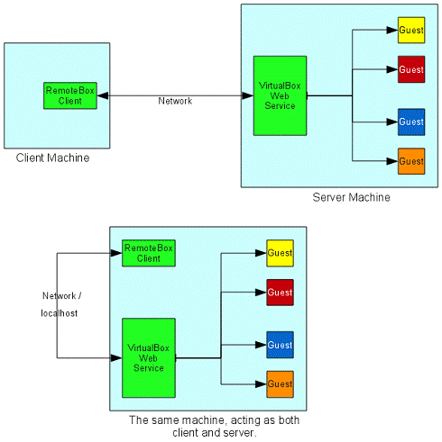
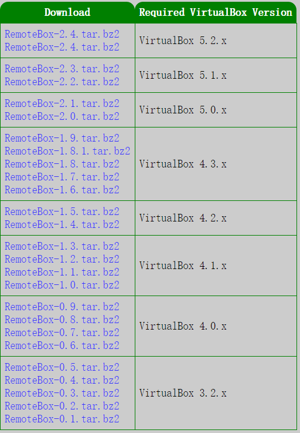
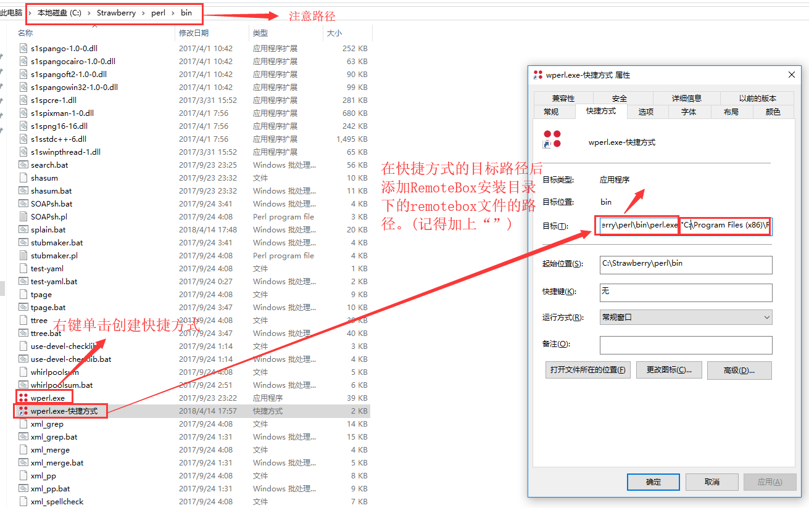
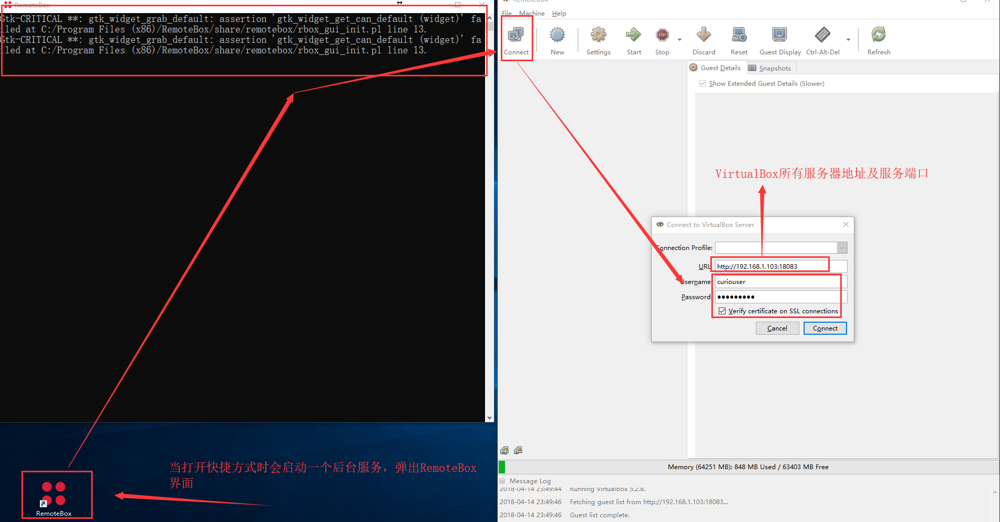

# VirtualBox 虚拟机管理

# 一、简介

VBoxManage是VirtualBox的命令行接口。

# 二、VBoxManage常用操作

## 1、VM的创建

### ①创建虚拟机

```bash
# 创建虚拟机,同时注册
VBoxManage createvm --name VM的名字 --register
```

### ②设置操作系统类型

```bash
VBoxManage modifyvm VM的名字 --ostype Ubuntu_64
```

### ③设置内存大小

```bash
VBoxManage modifyvm VM的名字 --memory 4096
```

### ④设置存储磁盘

```bash
# 创建磁盘
VBoxManage createmedium --filename test_HDD_SYS_10G.vdi --size 10000
VBoxManage createmedium --filename test_HDD_HOME_10G.vdi --size 10000

# 创建存储控制器IDE、SATA
VBoxManage storagectl VM的名字 --name IDE --add ide --controller PIIX4 --bootable on
VBoxManage storagectl VM的名字 --name SATA --add sata --controller IntelAhci --bootable on
 
# 移除存储控制器IDE、SATA
VBoxManage storagectl VM的名字 --name IDE --remove
VBoxManage storagectl VM的名字 --name SATA --remove

# 关联磁盘到虚拟机
VBoxManage storageattach VM的名字 --storagectl SATA --port 0 --device 0 --type hdd --medium test_HDD_SYS_10G.vdi
VBoxManage storageattach VM的名字 --storagectl SATA --port 1 --device 0 --type hdd --medium test_HDD_HOME_10G.vdi
 
# 解除虚拟机挂载的磁盘：
VBoxManage storageattach VM的名字 --storagectl SATA --port 0 --device 0 --type hdd --medium none
VBoxManage storageattach VM的名字 --storagectl SATA --port 1 --device 0 --type hdd --medium none
```

### ⑤挂载ISO文件到IDE设备

```bash
# 挂载操作系统启动安装ISO文件到虚拟机中
VBoxManage storageattach VM的名字 --storagectl IDE --port 0 --device 0 --type dvddrive --medium ubuntu-22.04.3-server-amd64.iso
# # 挂载VirtualBox增强工具安装ISO文件到虚拟机中
VBoxManage storageattach VM的名字 --storagectl IDE --port 1 --device 0 --type dvddrive --medium VBoxGuestAdditions_6.1.22.iso


# 解除IDE设备上的ISO文件挂载关联
VBoxManage storageattach VM的名字 --storagectl IDE --port 0 --device 0 --type dvddrive --medium none
VBoxManage storageattach VM的名字 --storagectl IDE --port 1 --device 0 --type dvddrive --medium none
```

### ⑥设置网络

网络为桥接（nictype和bridgeadapter要根据主机的实际情况选择）

```scss
# 设置网卡1连接在桥接模式下，网卡
VBoxManage modifyvm test --nic1 bridged --nictype1 82545EM --cableconnected1 on --bridgeadapter1 enp5s0f0 

```

## 2、VM的管理

### ①查看VM

```bash
# 查看VirtualBox软件的版本
VBoxManage -v
# 列出所有的VM
VBoxManage list vms
# 列出所有正在运行的VM
VBoxManage list runningvms
# 查看指定VM的详细信息
VBoxManage showvminfo VM的名字
# 列出已创建的硬盘设备
VBoxManage list hdds
# 列出已创建的DVD设备
VBoxManage list dvds
```

### ②启动

```bash
# 启动
VBoxManage startvm VM的名字
VBoxManage startvm VM的UUID

# 无界面启动，只为远程RDP显示，不显示窗口
VBoxManage startvm VM的名字 --type headless
# 显示GUI窗口启动。这是默认值。
VBoxManage startvm VM的名字 --type gui
# 分离式启动，启动虚拟机并显示GUI窗口，其显卡输出可被RDP客户端访问。
VBoxManage startvm VM的名字 --type vrdp
```

### ③关机

```bash
# 正常关机
VBoxManage controlvm VM的名字 acpipowerbutton

# 断电
VBoxManage controlvm VM的名字 poweroff

# 保持状态关闭虚拟机
VBoxManage controlvm VM的名字 savestate

# 放弃已保存的状态
VBoxManage discardstate VM的名字
```

### ④远程桌面

```bash
# 设置远程桌面（可以使用VNC通过5540端口访问虚拟机桌面）
VBoxManage modifyvm VM的名字 --vrdeport 15044 --vrdeaddress ""
# 打开远程桌面
VBoxManage modifyvm VM的名字 --vrde on
# 关闭远程桌面
VBoxManage modifyvm VM的名字 --vrde off
```

### ⑤注销删除

```bash
# 仅注销虚拟机
VBoxManage unregistervm VM的名字

# 删除虚拟机（！会删除所有虚拟硬盘，谨慎操作！）
VBoxManage unregistervm --delete VM的名字
```

## 3、VM的快照管理

### ①查看快照

```bash
VBoxManage snapshot VM的名字 list
VBoxManage snapshot VM的名字 showvminfo snap20121214
```

### ②创建快照

```bash
VBoxManage snapshot VM的名字 take snap20121214
```

### ③删除快照

```bash
VBoxManage snapshot VM的名字 delete snap20121214
```

### ④恢复快照

```bash
# 恢复至当前快照
VBoxManage snapshot VM的名字 restorecurrent
# 恢复至指定快照
VBoxManage snapshot VM的名字 restore snap20121214
```


# 三、其他操作

## 1、修改虚拟磁盘的UUID

- Windows平台下以管理员身份打开CMD

- 路径切换到VirtualBox的安装目录下

- VBoxManage internalcommands sethduuid 虚拟硬盘的路径

## 2、命令行获取VM的IP地址

VM是无界面启动的，不想启动界面登录进去查看IP地址。可使用VirtualBox的命令行工具VBoxManage获取其IP地址。

①查看网卡信息

```bash
# 查看NAT网络模式的网卡信息，获取网卡名字
VBoxManage list natnets
# 查看Host-Only网络模式的网卡信息，获取网卡名字
VBoxManage list hostonlyifs
```

②获取VM的UUID

```bash
vboxmanage list runningvms

# VM可读性的名字  UUID
# "lvs-node1"   {19f9693c-946b-4b2c-9416-1ec6b5bc9832}
# "lvs-node2"   {b09d443f-9cab-4b37-8bdb-a13f6ee0b180}
# "lvs"         {fdd05180-b3ce-4dda-a65d-e69a8ee2f890}
```

③获取指定VM的网卡MAC地址

```bash
vboxmanage showvminfo --details b09d443f-9cab-4b37-8bdb-a13f6ee0b180 | fgrep MAC

# 第一张网卡，所连接的网络是Host-Only网络
# NIC 1:  MAC: 08002740FEBE, Attachment: Host-only Interface 'VirtualBox Host-Only Ethernet Adapter', Cable connected: on, Trace: off (file: none), Type: 82540EM, Reported speed: 0 Mbps, Boot priority: 0, Promisc Policy: deny, Bandwidth group: none

# 第二张网卡，所连接的网络是NAT网络
# NIC 2: MAC: 080027D96E49, Attachment: NAT Network 'NatNetwork', Cable connected: on, Trace: off (file: none), Type: 82540EM, Reported speed: 0 Mbps, Boot priority: 0, Promisc Policy: deny, Bandwidth group: none
```

④获取VM的IP地址

```bash
# 获取Host-Only网络模式下的VM IP地址
vboxmanage dhcpserver findlease --interface  VirtualBox\ Host-Only\ Ethernet\ Adapter --mac-address=08002740FEBE

# IP Address:  192.16.1.11
# MAC Address: 08:00:27:40:fe:be
# State:       acked
# Issued:      2022-12-13T06:03:33Z (1670911413)
# Expire:      2022-12-13T06:13:33Z (1670912013)
# TTL:         600 sec, currently 598 sec left

# 获取NAT网络模式下的VM IP地址
vboxmanage dhcpserver findlease --network NatNetwork --mac-address=08002740FEBE
```


# 四、RemoteBox远程管理无界面VirtualBox

 CentOS 7.4.1708 Server版服务器没有安装桌面，无法使用VirtualBox的应用界面操作虚拟机。所以在Windows10上使用RemoteBox远程管理VirtualBox

| 服务端     | OS    | CentOS 7.4.1708 |
| ---------- | ----- | --------------- |
| VirtualBox | 5.2.8 |                 |
| 客户端     | OS    | Windows 10 Pro  |
| RemoteBox  | 2.4   |                 |

## 1、简介

VirtualBox 3 的某个版本开始支持了 web service 接口，这样就使得 web 界面的编写极大简化，不要再调用 vboxmanage 了。自从官方的 vboxweb 面世后，激励了一大批优秀的第三方 web interface 的出现。RemoteBox 就是其中一个 ,RemoteBox 是一个 VirtualBox 用户接口，提供一个高级的 Web 接口，可通过远程来访问和控制 VirtualBox 虚拟机。

RemoteBox 主要功能有：

- 向导方式创建新的虚拟机。
- 启动 / 关闭虚拟机。
- 创建、删除、恢复 Snapshot。
- 虚拟机配置。
- 查看虚拟机日志。
- 管理 CD/DVD ISO 镜像等媒体文件。
- 全局网络配置。
- 导入 / 导出虚拟机等。

或许有人会担心 RemoteBox 本身所支持的远程管理功能是否只支持开机前的设定与开机后的操作功能。事实上因为 VirtualBox 会将所有信息传回至 RemoteBox，因此只要是在本地端实际操作 VirtualBox 所能处理的工作，RemoteBox 也几乎可以全数进行处理。例如启动尚未开机的虚拟机器，或是将目前正在执行中的虚拟机器直接关机等功能皆可通过 RemoteBox 进行处理。如果需要暂停虚拟机器的运作，或是储存虚拟机器的状态，也有 RemoteBox 发挥的空间。甚至在虚拟机器开机后，在正式进入操作系统画面之前，也能使用 RemoteBox 进行 BIOS 的设定工作。如果需要使用或设定较为进阶的选项，例如是否采用大量分页技术、CPU 热插拔等功能，亦可使用 RemoteBox 进行处理，不需要担心会有无法进行操作的情况发生。如果需要将远程主机 Host OS 上的 USB 装置连接至 VirtualBox 所建立的虚拟机器之中，或是要建立新的磁盘装置并连接至虚拟机器，这些工作也都能直接透过 RemoteBox 加以完成。

至于在网络设定方面，RemoteBox 也可以直接支持 VirtualBox 所提供的各种网络设定。无论虚拟机器要使用的是桥接式或 NAT 方式的网络，或是建立一个本地网络，其成员只有虚拟机器与其 Host OS，都不会有任何问题产生。由于 RemoteBox 在使用时可以将虚拟机器的所有执行结果显示在本地端，因此无论要连接的远程主机与其虚拟机器是否有连接显示器，都不会影响 RemoteBox 的正常操作。这是因为 RemoteBox 本身支持远程桌面协议 (Remote Desktop Protocol, RDP)，因此可以在本地端直接看到远程虚拟机器的操作画面，并且透过此通讯协议与虚拟机器进行互动，包括鼠标与键盘等输入装置都能直接使用。如果有其必要性，甚至也能利用 RDP 直接播放远程虚拟机器所产生的音效。输入输出都能利用 RemoteBox 进行，自然不必要求远程的虚拟机器必须安装屏幕或其它装置。此外，RemoteBox 使用的技术为 VirtualBox 本身所提供的 API 函式与 SOAP 接口为主，而这些技术只要启用 VirtualBox 的网页服务功能即可开始使用。RemoteBox 工作原理如图 1

​                            

## 2、服务端VirtualBox

①VirtualBox安装

```bash
wget -P /etc/yum.repos.d http://download.virtualbox.org/virtualbox/rpm/el/virtualbox.repo 
#下载VirtualBoxYUM仓库配置文件

#查看VirtualBox仓库中VirtualBox的版本号
yum search VirtualBox 

yum install VirtualBox-5.2.x86_64 gcc make perl kernel-devel kernel-devel-3.10.0-693.el7.x86_64
# 查看VirtualBox版本号
vboxmanage -v
#查看VirtualBox配置是否完整，如果有些依赖包没有安装，会有提示。
/sbin/vboxconfig
```

②安装VirtualBox増强功能扩展包

```bash
wget http://download.virtualbox.org/virtualbox/5.2.8/Oracle_VM_VirtualBox_Extension_Pack-5.2.8-121009.vbox-extpack 
VBoxManage extpack install Oracle_VM_VirtualBox_Extension_Pack-5.2.8-121009.vbox-extpack
```

③启动VirtualBox服务

```bash
# 以vboxusers群组内一位成员的身份执行VirtualBox
virtualbox &
```

④启动vboxweb-service服务

```
bash -c 'cat >/etc/default/virtualbox <<EOF
VBOXWEB_USER=root --登录时使用的用户 
VBOXWEB_TIMEOUT=0 --延时 
VBOXWEB_HOST=192.168.1.12 --映射的IP
VBOXWEB_LOGFILE="/var/log/vboxwebservice.log" --设置服务启动日志
EOF' ;\
  groupmems -a root -g vboxusers ;\ #将本地已经存在的用户添加到vboxusers用户组中
  groupmems -l -g vboxusers ;\ #查看vboxusers用户组的成员用户
  systemctl start  vboxweb-service ;\ #启动vboxweb-service服务
  netstat  -nltp|grep 18083 #vboxweb-service服务启动完 检查18083端口是否被监听
```

## **3、RemoteBox客户端的安装**

①下载安装32位的Strawberry Perl到`C:\Strawberry`目录下（即使Windows 10的系统版本是64位的）。

②在Strawberry Perl安装路径下的cmd中设置Strawberry Perl 使用Sisyphusion Perl仓库并安装额外的模块。

- 安装模块时网络需要能翻墙，个人使用的是Psiphon

- 在特殊路径中按着Shift键右击菜单可打开该路径下的CMD

```
ppm set repository sisyphusion http://sisyphusion.tk/ppm
ppm set save
ppm install Glib Cairo Pango Gtk2
```

③下载解压RemoteBox安装包到C:\Program Files (x86)目录下

- RemoteBox版本需要兼容VirtualBox

​      

③在C:\Strawberry\perl\bin目录下创建wperl.exe的快捷方式并在快捷方式的目标路径后面添加RemoteBox安装路径下remotebox文件路径`C:\Program Files (x86)\RemoteBox\remotebox`



## 4、RemoteBox访问管理VirtualBox



# 参考

- https://superuser.com/questions/634195/how-to-get-ip-address-assigned-to-vm-running-in-background/1568273#1568273

- https://blog.csdn.net/vevenlcf/article/details/82114788

- http://remotebox.knobgoblin.org.uk/installwindows.cgi

- https://blog.csdn.net/houzhizhen/article/details/55096677

- https://www.ibm.com/developerworks/cn/linux/l-cn-remotebox/

- https://www.cnblogs.com/xqzt/p/5744523.html

- https://www.linuxidc.com/Linux/2013-12/94256.htm

  