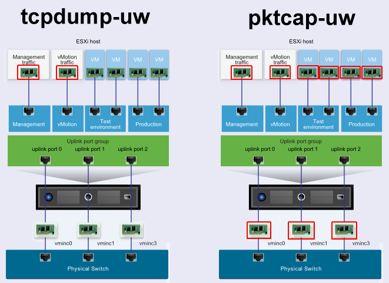

# 一、ESXI 管理常用命令

## 1、esxcli

### 获取基础信息

```bash
vmware -v                      #  看你的esx版本
VMware ESXi 5.0.0 build-469512
 
esxcfg-info -a                 #  显示所有ESX相关信息
esxcfg-info -w                 #  显示esx上硬件信息
service mgmt-vmware restart    #  重新启动vmware服务
esxcfg-vmknic -l               #  查看宿主机IP地址
 
esxcli hardware cpu list       #  cpu信息 Brand，Core Speed，
esxcli hardware cpu global get #  cpu信息 （CPU Cores）
esxcli hardware memory get     #  内存信息 内存 Physical Memory
esxcli hardware platform get   #  硬件型号，供应商等信息,主机型号,Product Name 供应商,Vendor Name
esxcli hardware clock get      #  当前时间
 
esxcli system version get                           # 查看ESXi主机版本号和build号
esxcli system maintenanceMode set --enable yes      # 将ESXi主机进入到维护模式
esxcli system maintenanceMode set --enable no       # 将ESXi主机退出维护模式
esxcli system settings advanced list -d             # 列出ESXi主机上被改动过的高级设定选项
esxcli system settings kernel list -d               # 列出ESXi主机上被变动过的kernel设定部分
esxcli system snmp get | hash | set | test          # 列出、测试和更改SNMP设定
 
esxcli vm process list                              # 利用esxcli列出ESXi服务器上VMs的World I(运行状态的)
esxcli vm process kill -t soft -w WorldI           # 利用esxcli命令杀掉VM
 
vim-cmd hostsvc/hostsummary          # 查看宿主机摘要信息
vim-cmd vmsvc/get.datastores         # 查看宿主存储空间信息
vim-cmd vmsvc/getallvms              # 列出所有虚拟机
 
vim-cmd vmsvc/power.getstate VMI    # 查看指定VMI虚拟状态
vim-cmd vmsvc/power.shutdown VMI    # 关闭虚拟机
vim-cmd vmsvc/power.off VMI         # 如果虚拟机没有关闭，使用poweroff命令
vim-cmd vmsvc/get.config VMI        # 查看虚拟机配置信息
 
esxcli software vib install -d /vmfs/volumes/datastore/patches/xxx.zip  # 为ESXi主机安装更新补丁和驱动
 
esxcli network nic list         # 列出当前ESXi主机上所有NICs的状态
esxcli network vm list          # 列出虚拟机的网路信息
esxcli storage nmp device list  # 理出当前NMP管理下的设备satp和psp信息
esxcli storage core device vaai status get # 列出注册到PS设备的VI状态
 
esxcli storage nmp satp set --default-psp VMW_PSP_RR --satp xxxx # 利用esxcli命令将缺省psp改成Round Robin
```

### 维护模式管理

```bash
esxcli system maintenanceMode {cmd} [cmd options]

Available Commands:
  get                   获取系统维护状态
  set                   Enable or disable the maintenance mode of the system.
  	-e|--enable           开启维护模式 (必须)
    -t|--timeout=<long>   多少秒后进入维护模式 (默认0秒)
    -m|--vsanmode=<str>   在主机进入维护模式(默认ensureObjectAccessibility)之前，VSAN服务必须执行														的操作。允许的值是:
														ensureObjectAccessibility:
																在进入维护模式之前，从磁盘中提取数据以确保虚拟SAN集群中的对象可访问性。
														evacuateAllData:在进入维护模式之前，从磁盘中撤离所有数据。
														noAction:在进入维护模式之前，不要将虚拟SAN数据移出磁盘。
```

### 关机重启管理（必须进入维护模式）

```bash
esxcli system shutdown {cmd} [cmd options]

Available Commands:
  poweroff              断开电源
    -d|--delay=<long>     多少秒后关机，范围在10-4294967295
    -r|--reason=<str>     执行该操作的原因
  reboot                重启系统
    -d|--delay=<long>     多少秒后关机，范围在10-4294967295
    -r|--reason=<str>     执行该操作的原因
```

### 系统时间管理

```bash
esxcli system time set [cmd options]

Cmd options:
  -d|--day=<long>       Day
  -H|--hour=<long>      Hour
  -m|--min=<long>       Minute
  -M|--month=<long>     Month
  -s|--sec=<long>       Second
  -y|--year=<long>      Year
```

### 查看vswitch接口信息

```bash
esxcli network vswitch standard list

vSwitch0
   Name: vSwitch0
   Class: etherswitch
   Num Ports: 4352
   Used Ports: 10
   Configured Ports: 128
   MTU: 1500
   CDP Status: listen
   Beacon Enabled: false
   Beacon Interval: 1
   Beacon Threshold: 3
   Beacon Required By:
   Uplinks: vmnic0
   Portgroups: VM Network, synology-iscsi, Management Network
```

### 查看物理网络接口

```bash
esxcli network nic list

Name    PCI Device    Driver  Admin Status  Link Status  Speed  Duplex  MAC Address         MTU  Description
------  ------------  ------  ------------  -----------  -----  ------  -----------------  ----  ---------------------------------------------------------
vmnic0  0000:01:00.0  bnx2    Up            Up             100  Full    84:8f:69:e3:e3:98  1500  QLogic Corporation QLogic NetXtreme II BCM5709 1000Base-T
vmnic1  0000:01:00.1  bnx2    Up            Down             0  Half    84:8f:69:e3:e3:9a  1500  QLogic Corporation QLogic NetXtreme II BCM5709 1000Base-T
vmnic2  0000:02:00.0  bnx2    Up            Down             0  Half    84:8f:69:e3:e3:9c  1500  QLogic Corporation QLogic NetXtreme II BCM5709 1000Base-T
vmnic3  0000:02:00.1  bnx2    Up            Down             0  Half    84:8f:69:e3:e3:9e  1500  QLogic Corporation QLogic NetXtreme II BCM5709 1000Base-T
```

### 当前运行虚拟机列表

```bash
esxcli vm process list

k8s118-node1
   World ID: 35805
   Process ID: 0
   VMX Cartel ID: 35804
   UUID: 56 4d 7f 25 bf 12 08 6c-21 36 96 29 58 61 80 bc
   Display Name: k8s118-node1
   Config File: /vmfs/volumes/5ad72ff6-920c8d20-3ee7-848f69e3e398/k8s118-node1/k8s118-node1.vmx

k8s118-node2
   World ID: 35830
   Process ID: 0
   VMX Cartel ID: 35829
   UUID: 56 4d c7 a7 05 ba e8 27-4a cf e3 3c 22 77 e2 27
   Display Name: k8s118-node2
   Config File: /vmfs/volumes/5ad72ff6-920c8d20-3ee7-848f69e3e398/k8s118-node2/k8s118-node2.vmx
```

### 创建datastore

创建NFS类型的Datastore

```bash
# ESXI安装Synology NFS VAAI
参考附录2。ESXI安装完Synology NFS VAAI后再创建NFS类型Datastore后，会显示Datastore已支持硬件加速

esxcfg-nas -a synology-nfs-datastore -o 192.168.1.7 -s /volume2/ESXI

# 删除Datastore
esxcfg-nas -d synology-nfs-datastore

esxcli storage vmfs extent list
```

### 查看卷信息

```bash
esxcli storage filesystem list 

Mount Point                                        Volume Name  UUID                                 Mounted  Type            Size          Free
-------------------------------------------------  -----------  -----------------------------------  -------  ------  ------------  ------------
/vmfs/volumes/5ad72ff6-920c8d20-3ee7-848f69e3e398  datastore1   5ad72ff6-920c8d20-3ee7-848f69e3e398     true  VMFS-5  890131972096  156750577664
/vmfs/volumes/5ad93bed-3b0a5ee0-8d62-848f69e3e398               5ad93bed-3b0a5ee0-8d62-848f69e3e398     true  vfat      4293591040    4257939456
/vmfs/volumes/5a613a7b-adc12ea1-59ec-8b00e5327863               5a613a7b-adc12ea1-59ec-8b00e5327863     true  vfat       261853184      91848704
/vmfs/volumes/d7f0b67d-93f4d99c-13e2-fc95a98c5631               d7f0b67d-93f4d99c-13e2-fc95a98c5631     true  vfat       261853184      91987968
/vmfs/volumes/5ad72ff5-a0c06292-f641-848f69e3e398               5ad72ff5-a0c06292-f641-848f69e3e398     true  vfat       299712512      88342528
```

## 2、vim-cmd命令

### 列出所有虚拟机清单

```bash
vim-cmd vmsvc/getallvms
```

### 查看指定虚拟机设备信息

其中包括网卡型号、MC地址等信息。

```bash
vim-cmd vmsvc/device.getdevices 101
```

### 查看指定虚拟机配置

```bash
vim-cmd vmsvc/get.config 101
```

### 查看指定虚拟机摘要信息

```bash
vim-cmd vmsvc/get.summary 101
```

## 3、其他命令

查看虚拟网卡接口

```bash
esxcfg-vmknic -l
```

# 二、挂载本地磁盘上VMFS文件系统分区

```bash
esxcfg-volume -l |grep "VMFS UUID/label"
# 会显示当前磁盘分区UUID

esxcli storage filesystem list
# 

esxcfg-volume -M UUID
# 会将磁盘分区挂载到/vmfs/volumes/UUID下
# -M 重启后依旧会挂载。-m 重启后不会再挂载
```

> **应用实例：**
>
> ​		四块SAAS硬盘做的raid5。其中一块出现坏块，导致其上的VMWare系统奔溃。将硬盘位置打乱换了以后在开机期间Crtl+ R进入raid工具界面，显示raid正在重建。等重建完成后，还是无法进入VMWare。随后找到一块临时SATA即可的SSD硬盘插入光驱位，然后下载6.7的ESXI刻录到U盘中，将VMWare安装到SSD中。开机进入新的VMWare后，可以看到旧硬盘，分区依旧在，说明数据也在。此时需要将旧硬盘上的VMFS文件系统分区挂载到新的VMWare即可显示VM的数据存储。之后就可以使用各种工具备份导出VM啦，推荐使用群晖上的ABB。

# 三、ESXI网络抓包工具



https://www.virten.net/2015/10/esxi-network-troubleshooting-with-tcpdump-uw-and-pktcap-uw/

## 1、tcpdump-uw

详细文档：https://kb.vmware.com/s/article/1031186

```bash
esxcfg-vmknic -l
# 或者
esxcli network ip interface list

tcpdump-uw -i vmk0
```

## 2、pktcap-uw 

详细文档：https://kb.vmware.com/s/article/2051814?lang=zh_CN

```bash
net-stats -l

pktcap-uw --vmk vmk0
```


# 附录

## 1、ESXI VAAI

在虚拟化环境中，从资源角度来看，传统上的存储操作非常昂贵。与主机相比，存储设备可以更高效地执行克隆和快照等功能。VMware vSphere存储API阵列集成（VAAI），也称为硬件加速或硬件卸载API，是一组API，用于启用VMware vSphere ESXi主机与存储设备之间的通信。这些API定义了一组“存储原语”，它们使ESXi主机能够将某些存储操作卸载到阵列上，从而减少了ESXi主机上的资源开销，并可以显着提高存储密集型操作（如存储克隆，清零等）的性能。VAAI的目标是帮助存储供应商提供硬件帮助，以加快在存储硬件中更有效地完成的VMware I / O操作。

参考：https://www.vmware.com/techpapers/2012/vmware-vsphere-storage-apis-array-integration-10337.html

## 2、ESXI安装Synology NFS VAAI

下载地址：https://www.synology.cn/en-global/support/download/DS110+#utilities

安装参看：https://global.download.synology.com/download/www-res/dsm/Tools/NFSVAAIPlugin/README

```bash
scp synonfs-vaai-plugin.vib root@192.168.1.103:/tmp

esxcli software vib install -v /tmp/synonfs-vaai-plugin.vib --no-sig-check
# 或
esxcli software vib install -d /tmp/synonfs-vaai-plugin.zip --no-sig-check

重启ESXI

# 查看ESXI插件中是否已安装Synology NFS VAAI
esxcli software vib list | more

# 删除ESXI插件
esxcli software vib remove -n {PLUGIN_NAME}
```

参考：https://www.jonathanmedd.net/category/nfs

