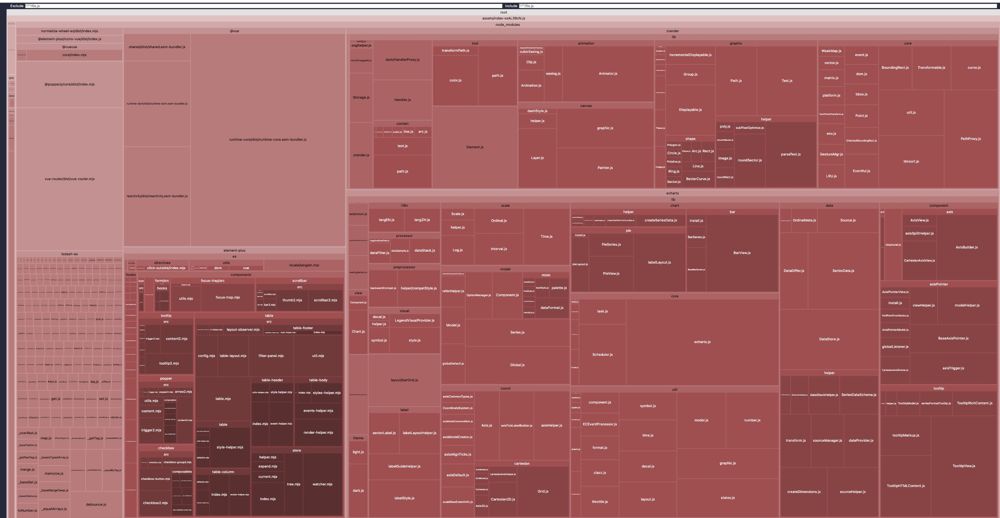
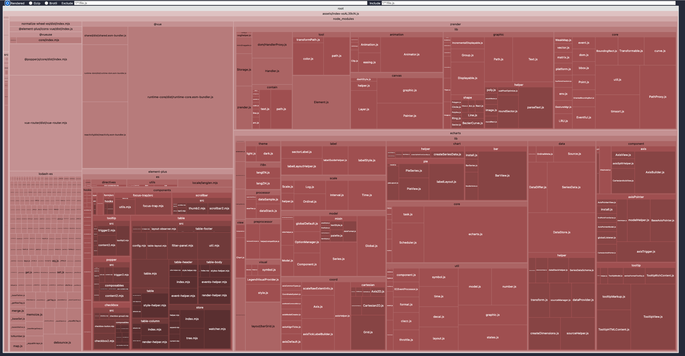
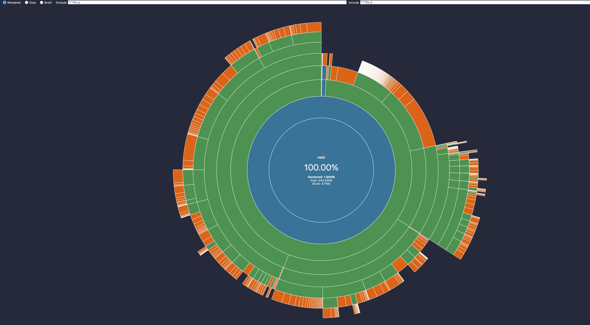
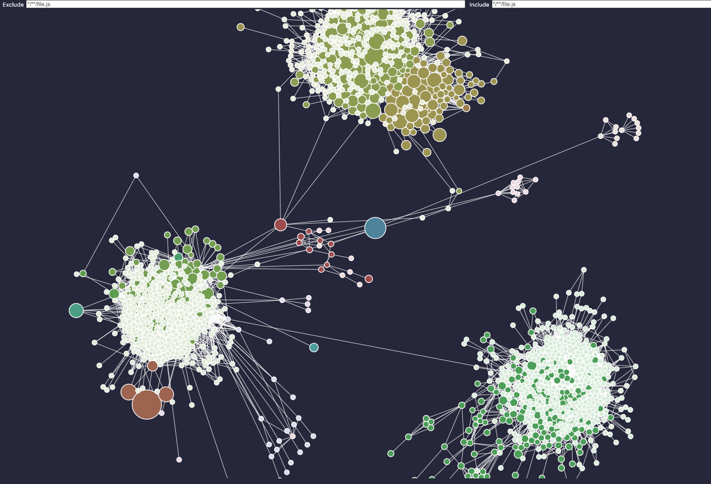
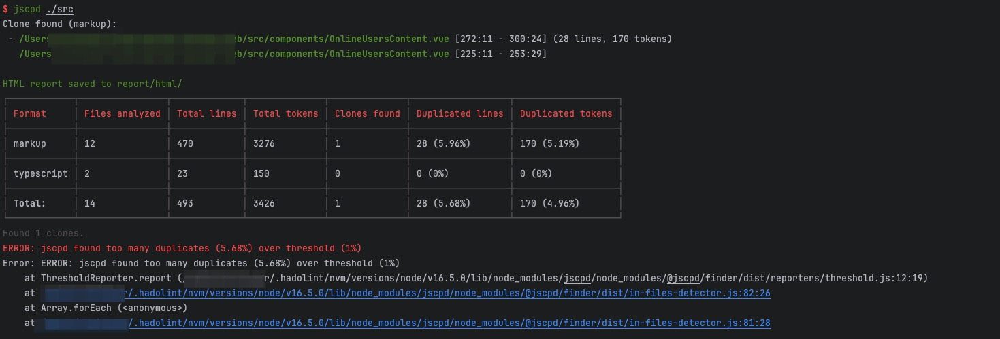
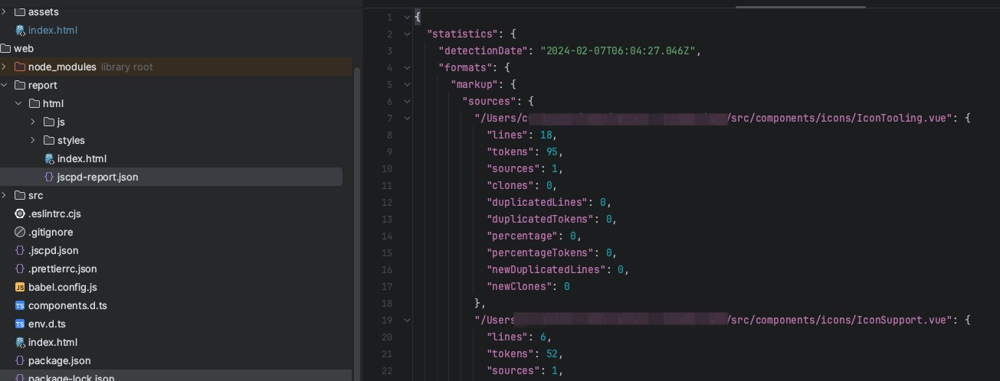
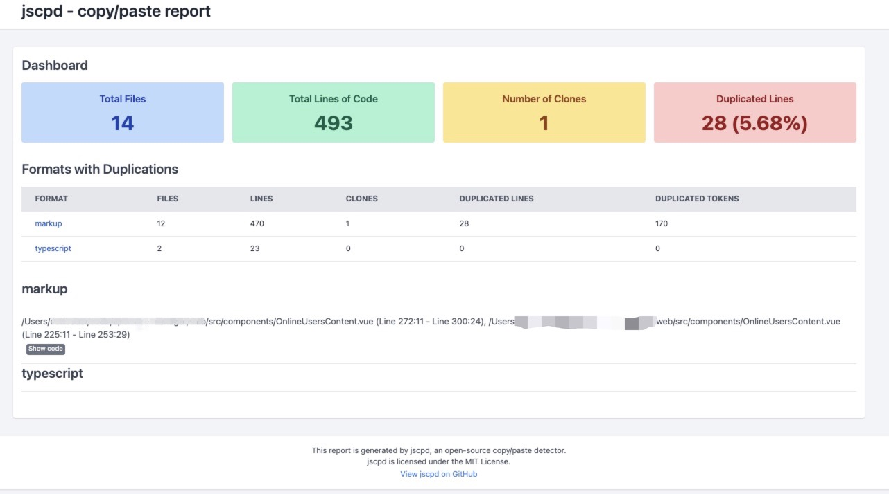
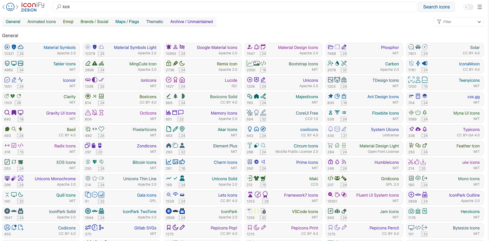
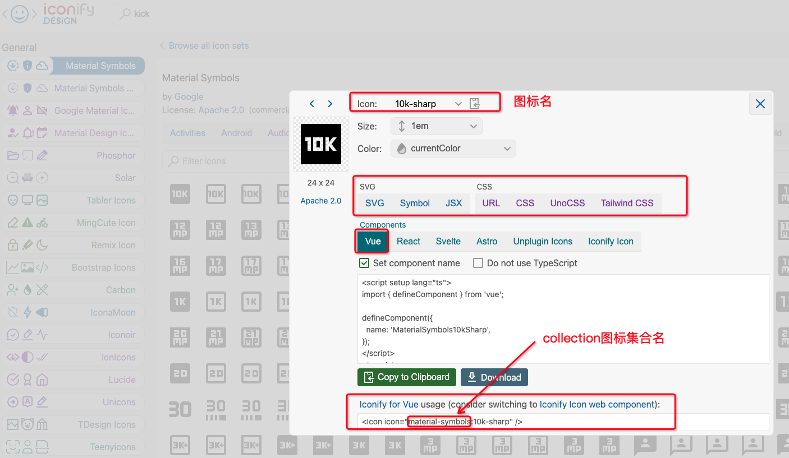

# 前端代码工具集

# 一、包可视化分析工具rollup-plugin-visualizer

Github: https://github.com/btd/rollup-plugin-visualizer

## 1、安装引入

- 集成在项目中

  ```bash
  npm install --save-dev rollup-plugin-visualizer
  ```

  配置`vite.config.ts`

  ```bash
  import { visualizer } from 'rollup-plugin-visualizer'
  //....,
    
  export default defineConfig({
    // ....,
    build: {
      rollupOptions: {
        //....,
        plugins: [visualizer()]
      },
    }
  })
  ```

- 安装命令行

  ```bash
  npm install -g rollup-plugin-visualizer
  rollup-plugin-visualizer
  ```


## 2、分析

每次构建时生成分析页面

```bash
npm run build
```

构建完成后会在项目根目录生成一个 stats.html文件




# 二、包可视化分析工具vite-bundle-visualizer

Github: https://github.com/KusStar/vite-bundle-visualizer

## 1、安装引入

```bash
npm install -g vite-plugin-analyzer
```

## 2、分析命令

#### Treemap

```bash
npx vite-bundle-visualizer
```



#### Sunburst

```bash
npx vite-bundle-visualizer -t sunburst
```



#### Network

```bash
npx vite-bundle-visualizer -t network
```



# 三、代码重复分析工具：jscpd

## 1、简介

Github：https://github.com/kucherenko/jscpd

## 2、安装配置

```bash
npm install -g jscpd
```

创建配置文件.jscpd.json

```bash
{
  "threshold": 1,
  "reporters": [
    "html",
    "console"
  ],
  "absolute": true
}
```

或者配置在命令行

```bash
jscpd ./src -t 1 

-l, --min-lines [number]   min size of duplication in code lines (Default is 5)
-k, --min-tokens [number]  min size of duplication in code tokens (Default is 50)
-x, --max-lines [number]   最大文件大小（以行为单位）。大于 max-lines 的文件将被跳过(默认1000行)
-z, --max-size [string]    最大文件大小（以字节为单位）。大于 max-size 的文件将被跳过。例如: 1kb, 1mb, 120kb(默认100kb)
-t, --threshold [number]   重复级别阈值，检查当前重复级别是否大于阈值 jscpd 错误退出。
-c, --config [string]      配置文件的路径。json 格式。配置文件中支持的选项可以与 cli 选项相同。 (默认读取当前路径下的.jscpd.json)
-i, --ignore [string]      具有要在分析中忽略的全局模式的选项。对于多个glob，可以使用逗号作为分隔符。
															例子：--ignore "**/*.min.js,**/*.map" /path/to/files
--ignore-pattern [string]  Ignore code blocks matching the regexp patterns
-r, --reporters [string]   指定输出类型。console(控制台、consoleFull(控制台代码也输出)，json、xml、csv、markdown、html等格式文件
-o, --output [string]      指定报告存储目录的路径。 json、csv、markdown、html等格式文件 报告将保存在那里 (默认当前路径下./report/)
-m, --mode [string]        检测质量的方式。可选strict、mild(默认)、weak 
-f, --format [string]      用于检测重复的格式列表。例如：php、javascript、python等150种格式
-p, --pattern [string]     glob pattern to file search (Example **/*.txt)
-b, --blame                从 git 获取有关重复块的作者和日期的信息。
-s, --silent               不要向控制台写入大量信息。
--store [string]           用于收集有关代码的信息的存储，默认情况下所有信息都收集在内存中 (e.g. --store leveldb used for big codebase)
-a, --absolute             use absolute path in reports
-n, --noSymlinks           dont use symlinks for detection in files
--ignoreCase               ignore case of symbols in code (experimental)
-g, --gitignore            ignore all files from .gitignore file
--formats-exts [string]    list of formats with file extensions (javascript:es,es6;dart:dt)
-d, --debug                show debug information, not run detection process(options list and selected files)
--list                     show list of total supported formats
--skipLocal                skip duplicates in local folders, just detect cross folders duplications
--exitCode [number]        exit code to use when code duplications are detected
```

## 3、分析结果

结果可以输出在控制台，还可以生成报告文件在根目录下report 目录中。有 json格式，还有可视化的 HTML 文件。







# 四、自动按需导入工具

## 1、简介

在前端项目中，按需引入是优化项目的重要方法之一。

```bash
npm install -d unplugin-auto-import unplugin-vue-components 
```

## 2、unplugin-auto-import

- unplugin-auto-import是 基于  unplugin ，支持 Vite、Webpack、Rollup 和 esbuild **按需自动导入**。同时也支持 TypeScript。
- Github：https://github.com/unplugin/unplugin-auto-import

### ①vite中配置

> vit.config.ts

```ts
import { defineConfig } from 'vite'
import vue from '@vitejs/plugin-vue'

// 使用unplugin-auto-import按需导入Vite
import AutoImport from 'unplugin-auto-import/vite'

export default defineConfig({
  // ...
  plugins: [
    vue(),
    // ....,
    AutoImport({
      imports: ['vue'],
      // 如果使用的是Typescript，设置dts为true
      dts: true,
      // 如果使用了eslint，设置eslintrc字段为true
      eslintrc: {
        enabled: true
      },
      // ....
    })
  ]
})
```

插件会在项目根目录生成类型文件 `.eslintrc-auto-import.json` 、`auto-imports.d.ts`

在`tsconfig.app.json`设置包含`auto-imports.d.ts`

```json
{
  // .....
  "include": [
  	"env.d.ts", 
    "src/**/*",
    "src/**/*.vue"
    // 添加auto-imports.d.ts文件
    "auto-imports.d.ts", 
  ],
  // .....
}
```

在`eslintrc.cjx`设置包含`auto-imports.d.ts`

### ②使用

使用插件之前

```vue
<script lang="ts" setup>
  import { ref, onMounted } from 'vue';
  const test = ref<string>('');
</script>
```

使用插件之后

```vue
<script lang="ts" setup>
  const test = ref<string>('');
</script>
```

## 3、unplugin-vue-components

### ①配置

**`vite.config.ts`**

```tsx
import { defineConfig } from 'vite'
import Components from 'unplugin-vue-components/vite'
import { ElementPlusResolver } from 'unplugin-vue-components/resolvers'
//....
export default defineConfig({
  plugins: [
    // ....
    // 例如添加 ElementPlusResolver 解析器，这样我们在使用ElementPlus中的组件时就无需import 导入，可直接在template使用
    Components({
      resolvers: [
        ElementPlusResolver()
      ],
    }),
  ]
})
```

**`tsconfig.json`**

```json
{
    // .....
    "include": ["components.d.ts"],
}
```

以上全部设置后会在根目录下生成并会自动更新 `components.d.ts`此类型声明文件

```ts
/* eslint-disable */
/* prettier-ignore */
// @ts-nocheck
// Generated by unplugin-vue-components
// Read more: https://github.com/vuejs/core/pull/3399
export {}

declare module 'vue' {
  export interface GlobalComponents {
    ElButton: typeof import('element-plus/es')['ElButton']
    ElTable: typeof import('element-plus/es')['ElTable']
    ElTableColumn: typeof import('element-plus/es')['ElTableColumn']
    RouterLink: typeof import('vue-router')['RouterLink']
    RouterView: typeof import('vue-router')['RouterView']
  }
}
```

全量导入时打包后 css文件大小 **315.55 kB**，按需之后仅有 **58.93KB**


参考:

- https://stackoverflow.com/questions/75746767/is-there-any-bundle-analyzer-for-vite
- https://github.com/KusStar/vite-bundle-visualizer

# 五、自动按需导入icon工具：unplugin-icons

**unplugin-icons插件 Github**: https://github.com/unplugin/unplugin-icons

**iconify网站**：https://icon-sets.iconify.design/





## 1、功能

- 可以自动从`iconify网站`按需导入icon
- 可以加载本地 各种格式icon文件进行按需导入

## 2、安装插件

```bash
npm i -D unplugin-icons
```

## 3、配置插件

> vite.config.ts

```ts
// .....
// 自动导入Icon图标
import IconsResolver from 'unplugin-icons/resolver'
import Icons from 'unplugin-icons/vite';
import { FileSystemIconLoader } from 'unplugin-icons/loaders'


export default defineConfig({
  plugins: [
    // .....
    Components({
      resolvers: [
        // .....
        // 自动注册图标组件
        IconsResolver({
          // 修改Icon组件名字前缀，不设置则默认为i, 禁用则设置为false。
          prefix: 'icon',
          // 指定collection图标集。ElementPlus图标集：ep
          enabledCollections: ['ep','game-icons'],
          // 使用自定义的本地icon集合名
          customCollections: ['myIcons']
        })
      ]
    }),
    Icons({
      autoInstall: true,
      // 配置自定义的icon集合文件的路径
      customCollections: {
        'myIcons': FileSystemIconLoader('src/assets/icons'),
      }
    })
  ]
})
```

## 3、使用

> 使用组件解析器IconsResolver时，必须遵循名称转换才能正确推断图标，icon引用命名格式: {prefix}-{collection}-{icon}
>
> 如果在IconsResolver没有设置prefix。则前缀默认为i。icon引用命名格式为：i-{collection}-{icon}

例如：引用iconify网站game-icons图集中的[high-kick](https://icon-sets.iconify.design/game-icons/high-kick/)图标。可以使用**`<icon-game-icons-high-kick />`**

```vue
<template>
  <el-table>
    <el-table-column align="center" label="操作" prop="actions">
      <template v-slot="{ row }">
        <el-button type="danger" size="small"> 
          <icon-game-icons-high-kick />下线该用户
  			</el-button>
      </template>
    </el-table-column>
  </el-table>
</template>
```

## 参考：

- https://element-plus.org/zh-CN/component/icon.html
- https://www.cnblogs.com/fuct/p/17533365.html

