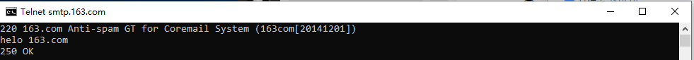
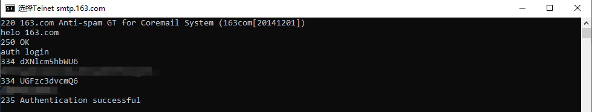
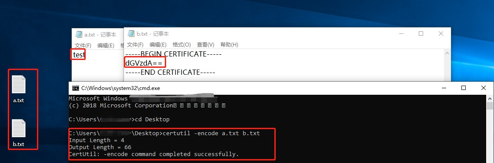
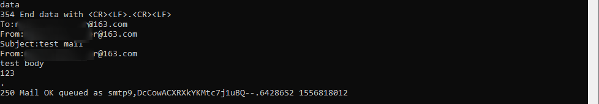
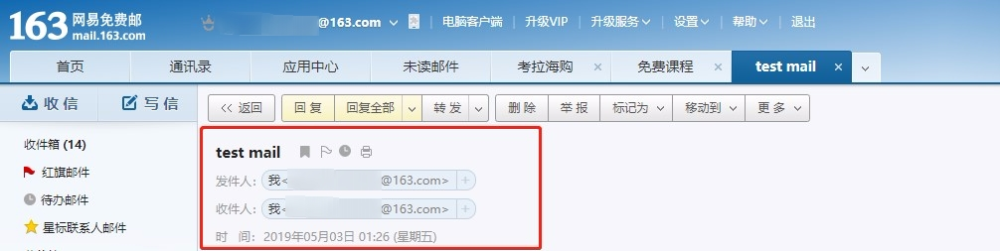

# Preflight

邮箱开启POP3/SMTP和IMAP/SMTP服务

# 一、操作

## 1. windows开启telnet服务

    打开控制面板，找到“打开或关闭windows功能”（在“程序”里面），选中对话框中的Telnet客户端，然后确定，等待完成。这时就开启了telnet功能。

## 2. 在命令刚窗口输入

    telnet smtp.163.com 25

## 3. 向服务器表明身份

    helo 163.com
    # 如果成功，服务器返回 250 OK

   
   
## 4. 登录认证

    auth login
    # 用户名的Base64加密字符。如果成功，服务器返回一串字符，类似于：334 UGFzc3dvcmQ6（334 是不变的，后面的字母可能会变）
    *****
    # 密码的Base64加密字符，如果登录成功，服务器返回一串字符：235 Authentication successful表示登录成功，如果不能成功登录，请检查账号密码是否正确。
    *****
    # 对于字符串的Base64加密可使用CMD中的“certutil -encode 包含想要加密字符串的文本文件 Base64加密后输出文本文件”

   
    
   
    
## 5. 填写发件人和收件人邮箱地址

    mail from:<******@163.com>
    # 若格式不正确，服务器返回501 错误；若格式正确，服务器返回250 Ok。
    rcpt to:<******@163.com>
    # 若格式不正确，服务器返回501 错误；若格式正确，服务器返回250 Ok。

## 6. 编写邮件

    data
    # 服务器返回 354 End data with <CR><LF>.<CR><LF>
    To:******@163.com
    From:******@163.com
    Subject:test mail
    From:******@163.com
    test body
    123
    .
    # 服务器返回 250 Ok: queues as ... 表示邮件已经发送
    
   
   