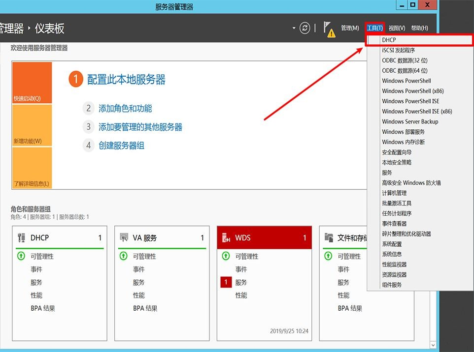

# Windows 部署服务

# 一、简介

Windows Server 提供的WDS（Windows Deploy Service）很方便的帮助用户去批量部署windows 操作系统，而且可以和MDT（Microsoft Deployment Toolkit）去结合使用，达到无人值守快速部署Windows系统（Linux下使用的是Kickstart）。


# 二、Windows Server安装基础服务

- DHCP服务
- Windows部署服务


# 三、配置DHCP服务




# 四、配置Windows部署服务


# 五、配置Windows部署服务

## 1、上传Windows ISO镜像文件到服务器中并挂载


## 2、将ESD转换WIM

### 参看ESD文件中包括的WIM

```bash
dism /Get-WimInfo /WimFile:install.esd
```

### 转换WIM文件

```bash
dism /export-image /SourceImageFile:.\install.esd 
/SourceIndex:4 /DestinationImageFile:wndows10-1903.wim /Compress:none /CheckInt
egrity

/Compress参数项：
- fast
- recovery
- none
```

参考：https://www.wintips.org/how-to-extract-install-esd-to-install-wim-windows-10-8/


# 参考

1. https://www.jianshu.com/p/3eabf3ae0c27
2. https://www.dianshouit.com/?thread-63.htm=
3. https://blog.51cto.com/gaowenlong/824781