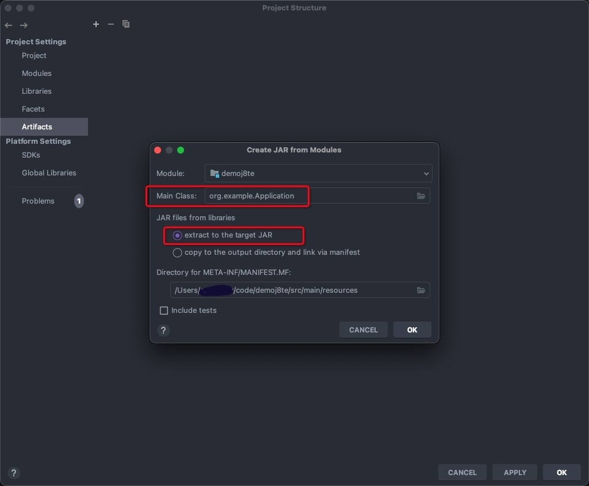

# 如何将 Java代码打包成 EXE 可安装执行软件

# 一、简介

# 二、依赖软件

## 1、exe4j

## 2、inno setup compiler

## 3、JRE

SpringBoot使用了3.0或者3.0以上，开始最低支持JDK17。

使用 JRE 运行 java jar程序，减少最终安装包的体积。

# 三、示例步骤

## 1、使用 IDEA 构建项目的 Artifacts

使用 IDEA 的 Artifacts构建包含项目所有依赖项的 class到 Jar 包。使用 Maven 同样可以实现效果。但是需要繁琐的配置。

IDEA 的Project Structure, 找到Artifacts, 如图添加构建Artifacts的配置

bulid完成后, 在项目中/out文件夹下可以找到jar包。

**注意事项：**

- 如果 POM 改过依赖版本，要检查 IDEA 中的 External Libraries中第三方包的版本有没有更新。如果没有，重启 IDEA 后，在 IDEA Maven 工具中重现 Reload project。再次检查版本
- 查看构建好的Jar包中文件：`tar -tvf jar包`

## 2、使用exe4j

使用 exe4j 是无法将 JRE 打到 exe安装包里的

## 3、

## 4、

## 5、

## 6、

## 7、

## 8、

# 参考

- https://blog.csdn.net/wangpaiblog/article/details/119658741
- https://blog.csdn.net/orangeTop/article/details/120287684
- https://www.cnblogs.com/diysoul/p/14778834.html
- https://www.ngui.cc/el/2852791.html?action=onClick
- https://github.com/spring-projects/spring-boot/issues/24889
- https://www.eolink.com/news/post/47095.html