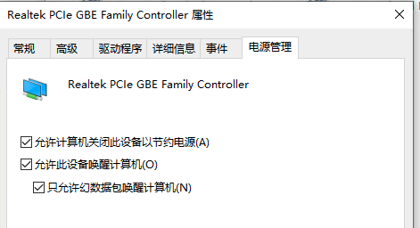
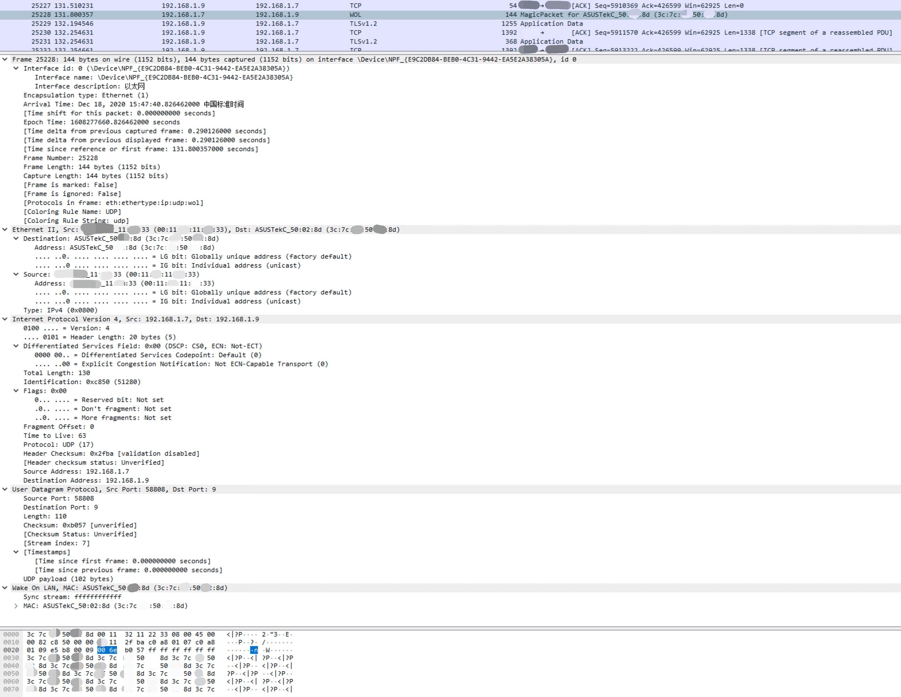

# 主机的网络唤醒服务Wake On Lan

# 一、简介

为了实现远程控制主机的开关机，现在大部分主板及网卡支持网络接收信号唤醒关机状态的主机的功能。

# 二、BIOS及网卡配置

## 1、BIOS设置

- 确保在 BIOS 中的电源管理设置下启用 WOL。

- 确保在 BIOS 中禁用深度睡眠（不适用于所有系统）。此节能设置会关闭 NIC。
- 确认系统电源关闭时链路指示灯保持亮起状态。如果没有链路指示灯，则 NIC 无法接收到用于唤醒系统的魔术包。

## 2、网卡配置允许接收魔幻数据包

>  注意无线网卡可能无法接收魔幻数据包，所以不支持网络唤醒

Windows



> 有的网卡需要更新最新驱动才能看到电源管理配置

Linux

```bash
# 查看网卡是否支持网络唤醒
ethtool eth0

	Supports Wake-on: g
	Wake-on: g
	# 如果显示g,表示wol功能已经开启

# 使用ethtool设置网卡接受什么形式的网络唤醒
ethtool -s eth0 wol g

a  -- wake on ARP
b  -- wake on broadcast messages
d  -- disable (wake on nothing)
f  -- wake on filter(s)
g  -- wake on MagicPacket(tm)
m  -- wake on multicast messages
p  -- wake on phy activity
s  -- enable SecureOn(tm) password for MagicPacket(tm)
u  -- wake on unicast messages
```

# 三、唤醒工具

- 确认发送魔术包的系统可以对客户端系统执行 ping 命令。
- 确认魔术包中使用的 MAC 地址与客户端系统上用于以太网 1 的 MAC 地址相匹配。
- 如果您在魔术包中指定了 IP 地址，则网络交换机可能无法将其正确广播到整个网络。您可能需要更改地址，以将该包广播到整个网络。例如，如果客户端地址为 192.168.1.12，则该包中使用的广播地址将是 192.168.1.255。

## **命令行**

- MAOS：`brew install wakeonlan`

- Linux：`apt/yum install -y wakeonlan`

由于主机在关机状态，其他主机无法通过arp协议主动探测其IP地址与MAC地址的映射关系，所以先手动添加ARP记录，再使用唤醒工具发送魔幻数据包。

```bash
arp -s IP地址 MAC地址
```

> wakeonlan命令有个zsh插件`wakeonlan`，创建`~/.wakeonlan/Test`文件，写入`MAC地址 IP地址`，即可使用`wake Test`快捷命令唤醒主机。或者手动使用以下命令

```bash
wakeonlan -i 192.168.1.9 -p 9 AA:BB:CC:DD:EE:FF
```

## **手机APP**

- IOS：`RemoteBoot`

## **Python脚本**

```bash
#!/usr/bin/env python
import socket
import sys
if len(sys.argv) < 3:
    print "Usage: wakeonlan.py <ADR> <MAC>     (example: 192.168.1.255 00:11:22:33:44:55)"
    sys.exit(1)
mac = sys.argv[2]
data = ''.join(['FF' * 6, mac.replace(':', '') * 16])
sock = socket.socket(socket.AF_INET, socket.SOCK_DGRAM)
sock.setsockopt(socket.SOL_SOCKET, socket.SO_BROADCAST, 1)
sock.sendto(data.decode("hex"), (sys.argv[1], 9))
```

```bash
python wake.py 192.168.1.255 00:11:22:33:44:55
```

## **Synology NAS**

使用`IPKGui`搜索下载`wakelan`，默认安装在`/opt/bin/`路径下


# 四、魔幻数据包

下图是使用Wireshark抓到的魔幻数据包



# 参考

1. https://apple.stackexchange.com/questions/95246/wake-other-computers-from-mac-osx