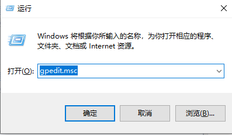

# 1. CMD下的换行符

    在CMD下,可以用^作为换行符,类似于Linux下的\

# 2. CMD下查看端口使用情况

    netstat -ano |findstr 8080

# 3. CMD下杀掉进程

    taskkill /pid 8080 -t -f

# 4. CMD下校验文件的MD5、SHA1、SHA256值

    certutil -hashfile yourfilename.ext MD5
    certutil -hashfile yourfilename.ext SHA1
    certutil -hashfile yourfilename.ext SHA256

# 5. CMD下激活windows系统

使用Docker本地部署KMS服务端

```bash
docker run -d -p 1688:1688 --name=kms-server luodaoyi/kms-server 
```

以管理员身份运行CMD

卸载之前的激活密钥

    slmgr -upk

设置KMS服务器

    slmgr -skms 本地部署的KMS服务端IP地址:1688

常用的KMS服务器

    kms.03k.org
    kms.chinancce.com
    kms.lotro.cc
    cy2617.jios.org
    kms.shuax.com
    kms.luody.info
    kms.cangshui.net
    zh.us.to
    122.226.152.230
    kms.digiboy.ir
    kms.library.hk
    kms.bluskai.com

输入新的密钥

    slmgr -ipk 激活密钥

密钥

    win10专业版密钥
    W269N-WFGWX-YVC9B-4J6C9-T83GX

激活

    slmgr -ato

# 6. PowerShell下载文件

    $client = new-object System.Net.WebClient
    $client.DownloadFile('#1', '#2')
    # #1为下载链接 #2为文件保存的路径

**`Note`**：
- 一定要在路径中写上保存的新文件的全名（包括后缀）
- 建议保存的文件格式与下载的文件格式一致

# 7. 离线安装.NET Framework 3.5

**`Preflight`**
- windows 10 的系统ISO镜像
- 以管理员身份运行的CMD


将ISO镜像中source/sxs目录拷贝到某个路径下（以桌面为例）


在以管理员身份运行的CMD执行以下命令
    
    dism.exe /online /enable-feature /featurename:netfx3 /Source:C:\Users\user\Desktop\sxs


# 8. 添加开机自启动bat脚本

**`方法一`**：（推荐）

    将脚本放置“C:\Users\Curiouser\AppData\Roaming\Microsoft\Windows\Start Menu\Programs\Startup”路径下

**`方法二`**：




# 9. 修改远程桌面的默认端口3389

Windows+R,输入regedit，打开注册表，修改一下注册表的值(十进制)，然后重启远程桌面

    HKEY_LOCAL_MACHINE\System\CurrentControlSet\Control\Terminal Server\WinStations\RDP-Tcp\PortNumber

防火墙放行新指定的远程桌面端口

# 10. 防火墙放行指定端口


# 11. CMD下的用户管理

- `net user`：查看目前系统存在的用户
   `net user username`：查看用户的详细信息
- `whoami`：查看计算机当前登陆的用户
- `query user`：查看已登陆用户的详细信息
- `logoff+空格+ID号`：注销用户
- `net user 用户名 密码 /add`：新增本地用户
- `net localgroup administrators 用户名 /add`：将本地用户加入管理员用户组
- `net user 用户名 /del`：删除用户
- `runas /user:用户 cmd`：以某个用户运行命令

# 12. Windows软件授权管理工具slmgr命令


# 13. Window下类Unix终端Cygwin

官网下载地址：https://cygwin.com/install.html

注意：在安装时，会让选择预下载的软件，记得预下载`lynx、wget、curl、zsh`


## ①安装apt-cyg包管理器

apt-cyg是Cygwin下类似于apt的包管理器，可安装Github 地址：https://github.com/transcode-open/apt-cyg

```bash
git clone https://github.com/transcode-open/apt-cyg.git
cd apt-cyg
install apt-cyg /bin
# 或者
lynx -source rawgit.com/transcode-open/apt-cyg/master/apt-cyg > apt-cyg # 先为lynx命令设置代理，不然下载很慢
install apt-cyg /bin
```

```bash
# 配置apt-cyg的镜像源
apt-cyg mirror http://mirrors.163.com/cygwin
# 更新源
apt-cyg update
# 安装软件
apt-cyg install jq vim 
```

参考：

1. https://zhuanlan.zhihu.com/p/66930502

## ②安装配置zsh及oh-my-zsh

参考[ZSH](linux-zsh.md)

## ③设置默认终端shell

```bash
$ mkpasswd > /etc/passwd
# 然后在/etc/passwd文件中设置当前用户为/bin/zsh
```

## ④为lynx命令设置代理

```bash
echo -e "http_proxy:http://localhost:80\nhttps_proxy:http://localhost:80" >> /etc/lynx.cfg
```

## ⑤mv重命名文件提示“权限不足”

更新cgywin自带的mv

```bash
apt-cyg install mv
```

# 14、Windows下Docker Desktop挂在本地文件或目录

Docker Desktop在Windows下使用使用虚拟机的形式。挂载路径只能是用户家目录下文件或文件夹。特别是在Cygwin中使用docker命令进行挂载时，将用户家目录进行软链在进行挂载

```bash
ln -s /cygdrive/c /c
docker run -it -v /c/User/用户名/Docker-data:/data nginx sh
```

# 15、Windows 查看文件被哪个进程占用

`任务管理器` --> `性能` --> `打开资源监视器` --> `CPU` 下的`关联的句柄`右侧搜索框内输入文件名称即可查看该文件被那几个程序占用了。

# 16、Windows下Docker Desktop容器映射端口报错

报错：`An attempt was made to access a socket in a way forbidden by its access permissions.`

打开Powershell

```bash
net stop winnat
net start winnat
```

参考：https://github.com/docker/for-win/issues/9272

# 17、Windows语言栏消失且无法切换输入法

**现象：**右下角语言栏消失且无法来回切换输入法，原生微软拼音输入法也无法使用，只能输入英文。但在Windows登陆页面的输入法界面可以看到安装的搜狗书法。

**原因：**手贱禁用掉了系统服务**`Touch Keyboard and Handwriting Panel Service`**，导致**ctfmon**进程无法启动


- **Point1：**手动运行cftmon.exe（Win+R中运行），进程管理器看不到**`CTF加载程序`**进程，则说明**ctfmon**进程无法启动
- **Point2：**检查系统服务中**`Touch Keyboard and Handwriting Panel Service`**是否启动，是否禁止运行

# 18、Windows系统组件修复命令

在系统管理员权限下的CMD中运行以下命令

```bash
Dism /Online /Cleanup-Image /CheckHealth  是检查映像以查看是否有检测到损坏
Dism /Online /Cleanup-Image /ScanHealth   是扫描你全部系统文件并和官方系统文件对比
Dism /Online /Cleanup-Image /RestoreHealth   是把那些不同的系统文件还原成系统官方源文件，跟重装差不多
sfc /scannow  修复还原
```

# 19、Windows包管理器Chocolatey

官网：https://community.chocolatey.org/

包仓库：https://community.chocolatey.org/packages

Github: https://github.com/chocolatey/choco

文档：https://docs.chocolatey.org/en-us/choco/

## **①安装**

CMD下执行

```bash
@"%SystemRoot%\System32\WindowsPowerShell\v1.0\powershell.exe" -NoProfile -InputFormat None -ExecutionPolicy Bypass -Command "[System.Net.ServicePointManager]::SecurityProtocol = 3072; iex ((New-Object System.Net.WebClient).DownloadString('https://community.chocolatey.org/install.ps1'))" && SET "PATH=%PATH%;%ALLUSERSPROFILE%\chocolatey\bin"
```

PowerShell下执行

```powershell
Set-ExecutionPolicy Bypass -Scope Process -Force; [System.Net.ServicePointManager]::SecurityProtocol = [System.Net.ServicePointManager]::SecurityProtocol -bor 3072; iex ((New-Object System.Net.WebClient).DownloadString('https://community.chocolatey.org/install.ps1'))
```

## **②相关信息**

- **软件路径**：`C:\ProgramData\chocolatey\bin`
- **快捷命令**

  - **chocolatey = choco别名**

  - **cinst =  choco install**

  - **cpush = choco push**

  - **cuninst = cuninst**

  - **cup = choco upgrade**

## ③chocolatey配置

```bash
# 如果遇到安装软件需要重启操作的话，设置稍后重启，防止无法安装后续软件
choco feature enable --name="'exitOnRebootDetected'"

# 安装过程中设置代理
choco install --proxy=127.0.0.1:1088
```

## ④软件管理

**自我升级**

```bash
# 升级chocolatey
choco upgrade chocolatey
```

**安装**

```bash
# 安装软件
choco install -y awk sed nodejs-lts vscode
# 或者cinst(choco install的简写)
cinst -y awk sed nodejs-lts

# 从自定义的源处获取包：
choco install {{包名}} --source {{源 URL|别名}}

# 允许安装一个包的多个版本
choco install {{包名}} --allow-multiple

# 安装一个指定版本的包
choco install {{包名}} --version {{版本号}}

# 从一个自定义的配置文件中安装包
choco install {{配置文件的路径}}

# 修改安装路径
choco install --install-directory ="'C:\Softwares'" sudo

# 安装一个特定的 “nuspec” 或 “nupkg” 文件：
choco install {{文件的路径}}

# 安装一个非stable的软件
choco install --pre {{包名}}
```

**搜索、列出软件**

```bash
# 搜索软件
choco search git

# 展示源中的软件
choco list --source webpi --page=0 --page-size=25
```

## ⑤备份恢复

备份已安装软件列表

```bash
choco list -l --idonly > choco-installed.txt
# 导出的软件列表为XML格式，包含了软件的版本信息
choco export -o="'c:\packages.config'" --include-version-numbers
```

恢复

```bash
choco install packages.config -y
```

## ⑥常用软件的安装

```bash
choco install --pre --force --ignore-detected-reboot --ignorechecksum --proxy=127.0.0.1:1088 -y  \
  wsl-ubuntu-2004 windows-sandbox amd-ryzen-chipset screentogif \
  beyondcompare fsviewer fscapture potplayer wox tiny-pxe-server 7zip winrar teamviewer \
  blender  cpu-z.install gpu-z googleearthpro github-desktop \
  googlechrome sourcetree drawio virtualbox nssm postman everything kubernetes-cli kubernetes-helm docker-desktop \
  wakemeonlan wireshark v2ray openvpn \
  winscp.install chocolateygui cygwin cyg-get \
  python golang oracle17jdk maven nodejs-lts nginx jmeter git.install \
  vscode intellijidea-community pycharm-community goland \
  sublimetext3 notepadplusplus.install typora foxitreader \
  ffmpeg opencv openssl.light \
  sudo make vim wget curl jq yq nano sed grep aliyun-cli telnet checksum base64 nmap \
  win32diskimager diskgenius ultraiso etcher \
  wechat dingtalk tencentmeeting xmind wps-office-free telegram.install \
  prometheus-windows-exporter.install sonarqube-scanner.portable kafkaexplorer shellcheck vmrc ssh-copy-id winlogbeat
```

