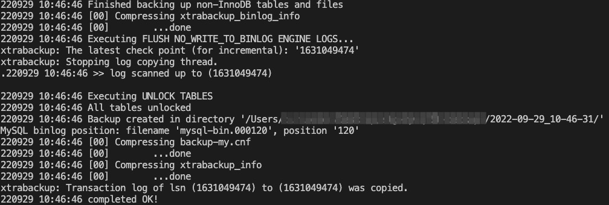

# Xtrabackup数据库备份工具

# 一、简介

Xtrabackup是由percona提供的mysql数据库备份工具，据官方介绍，这也是世界上惟一一款开源的能够对innodb和xtradb数据库进行热备的工具。特点：

1. 备份过程快速、可靠；
2. 备份过程不会打断正在执行的事务；
3. 能够基于压缩等功能节约磁盘空间和流量；
4. 自动实现备份检验；
5. 还原速度快；


# 二、概念

## 1、xtrabackup与MySQL版本对应关系

Percona XtraBackup软件版本通常与Mysql版本对应

2.4.20 based on MySQL server 5.7.26

## 2、备份的文件

| 文件                       | 内容                                                         |
| -------------------------- | ------------------------------------------------------------ |
| **backup-my.cnf**          | 只包含[mysqld]配置片段和备份有关的选项。                     |
| **xtrabackup_binlog_info** | 记录的是当前使用的二进制日志文件。                           |
| **xtrabackup_checkpoints** | 记录了备份的类型是全备(full-backuped)还是增备(incremental)，还有备份的起始、终止LSN号。 |
| **xtrabackup_info**        | 记录的是备份过程中的一些信息。                               |
| **xtrabackup_logfile**     | 复制和监控后写的redo日志。该日志是备份后下一个操作"准备"的关键。只有通过它才能实现数据一致性。 |
| **ibdata1**                | 用来构建innodb系统表空间的文件，这个文件包含了innodb表的元数据、undo日志、修改buffer和双写buffer |
| **其他文件**               | 源库的物理存储文件                                           |

## 3、备份使用的用户权限

- RELOAD和LOCK TABLES权限，执行FLUSH TABLES WITH READ LOCA；
- REPLICATION CLIENT权限，获取binary log（二进制日志文件）位置；
- CREATE TABLEPACE权限，导入表，用户表级别的恢复；
- SUPER权限，在slave环境下备份用来启用和关闭slave线程。

```sql
create user 'xtrabackup'@'192.168.1.%' identified by '密码';
GRANT reload,
			LOCK TABLES,
			process,
			replication client 
	ON *.* 
	TO 'xtrabackup'@'192.168.1.%';
flush privileges;
```

## 4、备份恢复过程步骤

### ①备份过程(backup)

- 在启动xtrabackup时记下LSN并将redo log拷贝到备份目标目录下的xtrabackup_logfile文件中。由于拷贝需要一定时间，如果在拷贝时间段内有日志写入，将导致拷贝的日志和MySQL的redo log不一致，所以xtrabackup还有一个后台进程监控着mysql的redo log，每秒监控一次，当MySQL的redo log有变化，该监控进程会立即将变化的内容写入到xtrabackup_logfile文件，这样就能保证拷贝走的redo log中记录了一切变化。但是这也是有风险的，因为redo是轮训式循环写入的，如果某一时刻有非常大量的日志写到redo log中，使得还没开始复制的日志就被新日志覆盖了，这样会日志丢失，并报错。

- 拷贝完初始版的redo log后，xtrabackup开始拷贝innodb表的数据文件(即表空间文件.ibd文件和ibdata1)。注意，此时不拷贝innodb的frm文件。

- 当innodb相关表的数据文件拷贝完成后，xtrabackup开始准备拷贝非innodb的文件。但在拷贝它们之前，要先对非innodb表进行加锁防止拷贝时有语句修改这些类型的表数据。

  > **对于不支持backup lock的版本，只能通过flush tables with read lock来获取全局读锁，但这样也同样会锁住innodb表，杀伤力太大。所以使用xtrabackup备份Oracle的MySQL，实质上只能实现innodb表的部分时间热备、部分时间温备。**
  >
  > **对于支持backup lock的版本，xtrabackup通过lock tables for backup获取轻量级的backup locks来替代flush tables with read lock，因为它只锁定非innodb表，所以由此实现了innodb表的真正热备。**

- 当获取到非innodb表的锁以后，开始拷贝非innodb表的数据和.frm文件。当这些拷贝完成之后，继续拷贝其他存储引擎类型的文件。(实际上，拷贝非innodb表的数据是在获取backup locks(如果支持)后自动进行的，它们属于同一个过程)

- 当拷贝阶段完成后，就到了备份的收尾阶段。包括获取二进制日志中一致性位置的坐标点、结束redo log的监控和拷贝、释放锁等。

  > **对于不支持backup lock的版本，收尾阶段的过程是这样的：获取二进制日志的一致性坐标点、结束redo log的监控和拷贝、释放锁。**
  >
  > **对于支持backup lock的版本，收尾阶段的过程是这样的：先通过lock binlog for bakcup来获取二进制日志锁，然后结束redo log的监控和拷贝，再unlock tables释放表锁，随后获取二进制日志的一致性位置坐标点，最后unlock binlog释放二进制日志锁。**

- 如果一切都OK，xtrabackup将以状态码0退出。

### ②准备过程(prepare)

由于备份的时候拷贝走的数据文件可能是不一致的，比如监控着MySQL的redo log中在拷贝过程完成后又新的事务提交了，而拷贝走的数据是未提交状态的，那么就需要对该事务前滚；如果监控到的日志中有事务未提交，那么该事务就需要回滚。

但是如果只备份了myisam表或其他非事务表数据，因为备份阶段直接锁定了这些表，所以不会有不一致的状态。

xtrabackup有一个"准备"的阶段。这个阶段的实质就是对备份的innodb数据应用redo log，该回滚的回滚，该前滚的前滚，最终保证xtrabackup_logfile中记录的redo log已经全部应用到备份数据页上，并且实现了一致性。当应用结束后，会重写"xtrabackup_logfile"再次保证该redo log和备份的数据是对应的。

准备过程不需要连接数据库，该过程可以在任意装了xtrabackup软件的机器上进行，之所能实现是因为xtrabackup软件的内部嵌入了一个简化的innodb存储引擎，可以通过它完成日志的应用

### ③恢复过程(copy back)

xtrabackup的恢复过程实质是将备份的数据文件和结构定义等文件拷贝回MySQL的datadir。同样可以拷贝到任意机器上。

要求恢复之前MySQL必须是停止运行状态，且datadir是空目录。

# 三、安装

## YUM

```bash
yum install -y perl rsync perl-Data-Dumper
wget https://www.percona.com/downloads/XtraBackup/Percona-XtraBackup-2.3.5/binary/redhat/7/x86_64/percona-xtrabackup-2.3.5-1.el7.x86_64.rpm
yum clean all 
yum repolist
yum localinstall percona-xtrabackup-2.3.2-1.el7.x86_64.rpm
```

## APT

```bash
wget https://repo.percona.com/apt/percona-release_0.1-6.$(lsb_release -sc)_all.deb
dpkg -i percona-release_0.1-6.bionic_all.deb
apt-get update
apt-get install percona-xtrabackup

# 安装percona-xtrabackup-24
wget https://repo.percona.com/apt/percona-release_latest.$(lsb_release -sc)_all.deb
dpkg -i percona-release_latest.$(lsb_release -sc)_all.deb
apt update
apt install -y percona-xtrabackup-24 qpress

# 安装percona-xtrabackup-80
wget https://repo.percona.com/apt/percona-release_latest.$(lsb_release -sc)_all.deb
dpkg -i percona-release_latest.$(lsb_release -sc)_all.deb
apt update
apt install -y percona-xtrabackup-80 qpress zstd
```

## 源代码

①下载源代码

```bash
git clone https://github.com/percona/percona-xtrabackup.git
```

②安装编译依赖

```bash
apt-get install build-essential flex bison automake autoconf \
   libtool cmake libaio-dev mysql-client libncurses-dev zlib1g-dev \
   libgcrypt11-dev libev-dev libcurl4-gnutls-dev vim-common
   
yum install cmake gcc gcc-c++ libaio libaio-devel automake autoconf \
  bison libtool ncurses-devel libgcrypt-devel libev-devel libcurl-devel \
  vim-common 
```

③编译安装

```bash
cd percona-xtrabackup
git checkout 2.3
cmake -DBUILD_CONFIG=xtrabackup_release -DWITH_MAN_PAGES=OFF 
make -j4
make install
# 默认安装在/usr/local/xtrabackup路径下，可使用 make DESTDIR=安装路径 install 指定安装路径
```

**2.3 编译参考文档：**https://www.percona.com/doc/percona-xtrabackup/2.3/installation/compiling_xtrabackup.html

**2.4 编译参考文档：**https://docs.percona.com/percona-xtrabackup/2.4/installation/compiling_xtrabackup.html

**2.4.x不再支持在MacOS X上编译**，参考https://bugs.launchpad.net/percona-xtrabackup/+bug/1736119

## Docker

只有2.4以上的版本

- **<font color=red>需要挂载数据库实例数据目录到容器内相同路径下，可使用只读模式进行挂载。</font>**

- **<font color=red>同时可以持久化挂载本地文件到容器的`/backup`路径下，将数据备份到该路径下。</font>**

  ```bash
  docker run -it --rm --name percona-xtrabackup \
    -v ./stg-mysql56-backups:/backup \
    -v /usr/local/var/mysql57:/usr/local/var/mysql57:ro \
    percona/percona-xtrabackup:2.4.26 \
    innobackupex --backup -uxtrabackup -p**密码** -P3306 -H127.0.0.1 /backup
  ```

- **<font color=red>对于容器化的MySQL，实例数据路径需要挂载到/var/lib/mysql</font>**

  ```bash
  docker run -it --rm --name percona-xtrabackup \
    -v ./stg-mysql56-backups:/backup \
    -v /data/docker-volume-data/mysql57:/var/lib/mysql:ro \
    percona/percona-xtrabackup:2.4.26 \
    innobackupex --backup -uxtrabackup -p**密码** -P3306 -H127.0.0.1 /backup
  ```

## MacOS

默认安装最新的8.+版本

```bash
brew install percona-xtrabackup
# 默认安装在/usr/local/Cellar/percona-xtrabackup/版本  路径下
```

# 四、命令参数

| 命令         | 功能                                                         |
| ------------ | ------------------------------------------------------------ |
| xtrabackup   | 主程序                                                       |
| innobackupex | 在以前是一个perl脚本，会调用xtrabackup这个二进制工具，从xtrabackup 2.3开始，该工具使用C语言进行了重写，当前它是xtabackup二进制工具的一个软连接，但是实际的使用方法却不同，并且在以后的版本中会删除该工具。 |
| xbcrypt      | 加密备份集                                                   |
| xbstream     | 是xtrabackup的流数据功能，通过流数据功能，可将备份内容打包并传给管道后的压缩工具进行压缩； |

## 1、innobackupex命令

| 参数                        | 含义                                                         |
| --------------------------- | :----------------------------------------------------------- |
| --compress                  | 该选项表示压缩innodb数据文件的备份。                         |
| --compress-threads          | 该选项表示并行压缩worker线程的数量。                         |
| --compress-chunk-size       | 该选项表示每个压缩线程worker buffer的大小，单位是字节，默认是64K。 |
| --encrypt                   | 该选项表示通过ENCRYPTION_ALGORITHM的算法加密innodb数据文件的备份.<br/>目前支持的算法有ASE128,AES192,AES256。 |
| --encrypt-threads           | 该选项表示并行加密的worker线程数量。                         |
| --encrypt-chunk-size        | 该选项表示每个加密线程worker buffer的大小，单位是字节，默认是64K。 |
| --encrypt-key               | 该选项使用合适长度加密key，因为会记录到命令行，所以不推荐使用。 |
| --encryption-key-file       | 该选项表示文件必须是一个简单二进制或者文本文件，加密key可通过以下命令行命令生成 |
| --include                   | 该选项表示使用正则表达式匹配表的名字[db.tb]，要求为其指定匹配要备份的表的完整名称，即databasename.tablename。 |
| --user                      | 该选项表示备份账号。                                         |
| --password                  | 该选项表示备份的密码。                                       |
| --port                      | 该选项表示备份数据库的端口。                                 |
| --host                      | 该选项表示备份数据库的地址。                                 |
| --databases                 | 该选项接受的参数为数据名，如果要指定多个数据库，彼此间需要以空格隔开；<br>如 "xtra_test dba_test"，同时，在指定某数据库时，也可以只指定其中的某张表。如 |
| --tables-file               | 该选项表示指定含有表列表的文件，格式为database.table，该选项直接传给--tables-file。 |
| --socket                    | 该选项表示mysql.sock所在位置，以便备份进程登录mysql。        |
| --no-timestamp              | 该选项可以表示不要创建一个时间戳目录来存储备份，指定到自己想要的备份文件夹。 |
| --ibbackup                  | 该选项指定了使用哪个xtrabackup二进制程序。<br/>IBBACKUP-BINARY是运行percona xtrabackup的命令。<br/>这个选项适用于xtrbackup二进制不在你是搜索和工作目录，<br/>如果指定了该选项,innoabackupex自动决定用的二进制程序。 |
| --slave-info                | 该选项表示对slave进行备份的时候使用，打印出master的名字和binlog pos，<br/>同样将这些信息以change master的命令写入xtrabackup_slave_info文件。<br/>可以通过基于这份备份启动一个从库。 |
| --safe-slave-backup         | 该选项表示为保证一致性复制状态，这个选项停止SQL线程并且等到show status中的slave_open_temp_tables为0的时候开始备份，如果没有打开临时表，bakcup会立刻开始，否则SQL线程启动或者关闭知道没有打开的临时表。<br/>如果slave_open_temp_tables在--safe-slave-backup-timeount（默认300秒）秒之后不为0，从库sql线程会在备份完成的时候重启。 |
| --rsync                     | 该选项表示通过rsync工具优化本地传输。<br/>当指定这个选项，innobackupex使用rsync拷贝非Innodb文件而替换cp，<br/>当有很多DB和表的时候会快很多，不能--stream一起使用。 |
| --kill-long-queries-timeout | 该选项表示从开始执行FLUSH TABLES WITH READ LOCK到kill掉阻塞它的这些查询之间等待的秒数。<br/>默认值为0，不会kill任何查询，使用这个选项xtrabackup需要有Process和super权限。 |
| --kill-long-query-type      | 该选项表示kill的类型，默认是all，可选select。                |
| --ftwrl-wait-threshold      | 该选项表示检测到长查询，单位是秒，表示长查询的阈值。         |
| --ftwrl-wait-query-type     | 该选项表示获得全局锁之前允许那种查询完成，默认是ALL，可选update。 |
| --galera-info               | 该选项表示生成了包含创建备份时候本地节点状态的文件xtrabackup_galera_info文件，<br/>该选项只适用于备份PXC。 |
| --stream                    | 该选项表示流式备份的格式，backup完成之后以指定格式到STDOUT，目前只支持tar和xbstream。 |
| --defaults-file             | 该选项指定了从哪个文件读取MySQL配置，必须放在命令行第一个选项的位置。 |
| --defaults-extra-file       | 该选项指定了在标准defaults-file之前从哪个额外的文件读取MySQL配置，必须在命令行的第一个选项的位置。<br/>一般用于存备份用户的用户名和密码的配置文件。 |
| ----defaults-group          | 该选项表示从配置文件读取的组，innobakcupex多个实例部署时使用。 |
| --no-lock                   | 该选项表示关闭FTWRL的表锁，只有在所有表都是Innodb表并且不关心backup的binlog pos点，如果有任何DDL语句正在执行或者非InnoDB正在更新时（包括mysql库下的表），都不应该使用这个选项，后果是导致备份数据不一致，如果考虑备份因为获得锁失败，可以考虑--safe-slave-backup立刻停止复制线程。 |
| --tmpdir                    | 该选项表示指定--stream的时候，指定临时文件存在哪里，在streaming和拷贝到远程server之前，事务日志首先存在临时文件里。在 使用参数stream=tar备份的时候，你的xtrabackup_logfile可能会临时放在/tmp目录下，如果你备份的时候并发写入较大的话 xtrabackup_logfile可能会很大(5G+)，很可能会撑满你的/tmp目录，可以通过参数--tmpdir指定目录来解决这个问题。 |
| --history                   | 该选项表示percona server 的备份历史记录在percona_schema.xtrabackup_history表。 |
| --incremental               | 该选项表示创建一个增量备份，需要指定--incremental-basedir。  |
| --incremental-basedir       | 该选项表示接受了一个字符串参数指定含有full backup的目录为增量备份的base目录，与--incremental同时使用。 |
| --incremental-dir           | 该选项表示增量备份的目录。                                   |
| --incremental-force-scan    | 该选项表示创建一份增量备份时，强制扫描所有增量备份中的数据页。 |
| --incremental-lsn           | 该选项表示指定增量备份的LSN，与--incremental选项一起使用。   |
| --incremental-history-name  | 该选项表示存储在PERCONA_SCHEMA.xtrabackup_history基于增量备份的历史记录的名字。Percona Xtrabackup搜索历史表查找最近（innodb_to_lsn）成功备份并且将to_lsn值作为增量备份启动出事lsn.与innobackupex--incremental-history-uuid互斥。如果没有检测到有效的lsn，xtrabackup会返回error。 |
| --incremental-history-uuid  | 该选项表示存储在percona_schema.xtrabackup_history基于增量备份的特定历史记录的UUID。 |
| --close-files               | 该选项表示关闭不再访问的文件句柄，当xtrabackup打开表空间通常并不关闭文件句柄目的是正确的处理DDL操作。如果表空间数量巨大，这是一种可以关闭不再访问的文件句柄的方法。使用该选项有风险，会有产生不一致备份的可能。 |
| --compact                   | 该选项表示创建一份没有辅助索引的紧凑的备份。                 |
| --throttle                  | 该选项表示每秒IO操作的次数，只作用于bakcup阶段有效。apply-log和--copy-back不生效不要一起用。 |

## 2、xtrabackup命令

| 参数 | 含义 |
| --- | --- |
| --apply-log-only | prepare备份的时候只执行redo阶段，用于增量备份。 |
| --backup | 创建备份并且放入--target-dir目录中 |
| --close-files | 不保持文件打开状态，xtrabackup打开表空间的时候通常不会关闭文件句柄，目的是为了正确处理DDL操作。如果表空间数量非常巨大并且不适合任何限制，一旦文件不在被访问的时候这个选项可以关闭文件句柄.打开这个选项会产生不一致的备份。 |
| --compact | 创建一份没有辅助索引的紧凑备份 |
| --compress | 压缩所有输出数据，包括事务日志文件和元数据文件，通过指定的压缩算法，目前唯一支持的算法是quicklz.结果文件是qpress归档格式，每个xtrabackup创建的*.qp文件都可以通过qpress程序提取或者解压缩 |
| --compress-chunk-size=# | 压缩线程工作buffer的字节大小，默认是64K |
| --compress-threads=# | xtrabackup进行并行数据压缩时的worker线程的数量，该选项默认值是1，并行压缩（'compress-threads'）可以和并行文件拷贝('parallel')一起使用。例如:'--parallel=4 --compress --compress-threads=2'会创建4个IO线程读取数据并通过管道传送给2个压缩线程。 |
| --create-ib-logfile | 这个选项目前还没有实现，目前创建Innodb事务日志，你还是需要prepare两次。 |
| --datadir=DIRECTORY | backup的源目录，mysql实例的数据目录。从my.cnf中读取，或者命令行指定。 |
| --defaults-extra-file=[MY.CNF] | 在global files文件之后读取，必须在命令行的第一选项位置指定。 |
| --defaults-file=[MY.CNF] | 唯一从给定文件读取默认选项，必须是个真实文件，必须在命令行第一个选项位置指定。 |
| --defaults-group=GROUP-NAME | 从配置文件读取的组，innobakcupex多个实例部署时使用。 |
| --export | 为导出的表创建必要的文件 |
| --extra-lsndir=DIRECTORY | (for --bakcup):在指定目录创建一份xtrabakcup_checkpoints文件的额外的备份。 |
| --incremental-basedir=DIRECTORY | 创建一份增量备份时，这个目录是增量别分的一份包含了full bakcup的Base数据集。 |
| --incremental-dir=DIRECTORY | prepare增量备份的时候，增量备份在DIRECTORY结合full backup创建出一份新的full backup。 |
| --incremental-force-scan | 创建一份增量备份时，强制扫描所有增在备份中的数据页即使完全改变的page bitmap数据可用。 |
| --incremetal-lsn=LSN | 创建增量备份的时候指定lsn。 |
| --innodb-log-arch-dir | 指定包含归档日志的目录。只能和xtrabackup --prepare选项一起使用。 |
| --innodb-miscellaneous | 从My.cnf文件读取的一组Innodb选项。以便xtrabackup以同样的配置启动内置的Innodb。通常不需要显示指定。 |
| --log-copy-interval=# | 这个选项指定了log拷贝线程check的时间间隔（默认1秒）。 |
| --log-stream | xtrabakcup不拷贝数据文件，将事务日志内容重定向到标准输出直到--suspend-at-end文件被删除。这个选项自动开启--suspend-at-end。 |
| --no-defaults | 不从任何选项文件中读取任何默认选项,必须在命令行第一个选项。 |
| --databases=# | 指定了需要备份的数据库和表。 |
| --database-file=# | 指定包含数据库和表的文件格式为databasename1.tablename1为一个元素，一个元素一行。 |
| --parallel=# | 指定备份时拷贝多个数据文件并发的进程数，默认值为1。 |
| --prepare | xtrabackup在一份通过--backup生成的备份执行还原操作，以便准备使用。 |
| --print-default | 打印程序参数列表并退出，必须放在命令行首位。 |
| --print-param | 使xtrabackup打印参数用来将数据文件拷贝到datadir并还原它们。 |
| --rebuild_indexes | 在apply事务日志之后重建innodb辅助索引，只有和--prepare一起才生效。 |
| --rebuild_threads=# | 在紧凑备份重建辅助索引的线程数，只有和--prepare和rebuild-index一起才生效。 |
| --stats | xtrabakcup扫描指定数据文件并打印出索引统计。 |
| --stream=name | 将所有备份文件以指定格式流向标准输出，目前支持的格式有xbstream和tar。 |
| --suspend-at-end | 使xtrabackup在--target-dir目录中生成xtrabakcup_suspended文件。在拷贝数据文件之后xtrabackup不是退出而是继续拷贝日志文件并且等待知道xtrabakcup_suspended文件被删除。这项可以使xtrabackup和其他程序协同工作。 |
| --tables=name | 正则表达式匹配database.tablename。备份匹配的表。 |
| --tables-file=name | 指定文件，一个表名一行。 |
| --target-dir=DIRECTORY | 指定backup的目的地，如果目录不存在，xtrabakcup会创建。如果目录存在且为空则成功。不会覆盖已存在的文件。 |
| --throttle=# | 指定每秒操作读写对的数量。 |
| --tmpdir=name | 当使用--print-param指定的时候打印出正确的tmpdir参数。 |
| --to-archived-lsn=LSN | 指定prepare备份时apply事务日志的LSN，只能和xtarbackup --prepare选项一起用。 |
| --user-memory = # | 通过--prepare prepare备份时候分配多大内存，目的像innodb_buffer_pool_size。默认值100M如果你有足够大的内存。1-2G是推荐值，支持各种单位(1MB,1M,1GB,1G)。 |
| --version | 打印xtrabackup版本并退出。 |
| --xbstream | 支持同时压缩和流式化。需要客服传统归档tar,cpio和其他不允许动态streaming生成的文件的限制，例如动态压缩文件，xbstream超越其他传统流式/归档格式的的优点是，并发stream多个文件并且更紧凑的数据存储（所以可以和--parallel选项选项一起使用xbstream格式进行streaming）。 |

# 五、备份

## 1、全量备份

MySQL 5.6及之前的版本只能使用XtraBackup 2.3版本的innobackupex命令进行备份（XtraBackup 2.3版本的安装参照第三章节的源码安装步骤）

> -H, --host 指定主机  
>
> -u, --user 指定用户名  
>
> -p, --password 指定密码  
>
> -P, --port 指定端口  
>
> --databases 指定数据库  

```bash
/usr/local/xtrabackup2.3/bin/innobackupex \
  -H 127.0.0.1 \
  -P 3306 \
  -u xtrabackup \
  -p **密码** \
  --backup \
  ./stg-mysql56-backups

# 2.4.x备份命令
xtrabackup \
  -H 127.0.0.1 \
  -P 3306 \
  -u xtrabackup \
  -p **密码** \
  --backup --target-dir=/data/backups/
```

备份成功后



## 2、加解密备份

- **加密**

  生成加密key：`openssl rand -base64 24`

  > –encrypt=加密算法   支持的加密算法：AES128, AES192, AES256
  >
  > –encrypt-key=密钥
  >
  > --encrypt-threads=N   加密进程个数。默认一个

  ```bash
  encryptkey=$(openssl rand -base64 24)
  
  /usr/local/xtrabackup2.3/bin/innobackupex \
    -H 127.0.0.1 \
    -P 3306 \
    -u xtrabackup \
    -p **密码** \
    --encrypt=AES256 \
    --encrypt-key=$encryptkey  \
    --encrypt-threads=3 \
    --backup \
    --compress \
    ./stg-mysql56-backups
  ```

- **解密**

  ```bash
  /usr/local/xtrabackup2.3/bin/innobackupex \
    --decrypt=AES256 \
    --encrypt-key=$encryptkey \
    --remove-original \
    ./stg-mysql56-backups/2022-09-28_16-44-37
  ```

## 3、解压缩备份

### ①自带quicklz压缩算法

***.qp压缩文件是qpress压缩格式**

> **--compress：**开启压缩
>
> **--compress-threads=N** ： 使用N个压缩线程 
>
> **--compress-chunk-size**：该选项表示每个压缩线程worker buffer的大小，单位是字节，默认是64K。

```bash
/usr/local/xtrabackup2.3/bin/innobackupex \
  -H 127.0.0.1 \
  -P 3306 \
  -u xtrabackup \
  -p **密码** \
  --compress \
  --compress-threads=4 \
  --backup \
  ./stg-mysql56-backups
```

**解压备份文件**

>  解压需要安装qpress命令。
>
>  ```bash
>  # https://github.com/mhorbul/homebrew-qpress
>  brew tap mhorbul/qpress
>  brew install qpress
>  
>  yum install epel-release
>  yum install -y qpress
>  ```

> --decompress  解压参数
>
> --remove-original 解压完成后并删除压缩文件 
>
> --parallel 多线程解压

```bash
/usr/local/xtrabackup2.3/bin/innobackupex \
  --decompress \
  --remove-original \
  --parallel 4 \
  ./stg-mysql56-backups/2022-09-28_16-44-37
  
# 手动删除原压缩文件
find ./stg-mysql56-backups/2022-09-28_16-44-37 -name "*.qp" | xargs rm -f 
```

### ②流式tar

> --stream=tar 表示流式备份的格式，backup完成之后以指定格式到STDOUT，目前只支持tar和xbstream。

```bash
/usr/local/xtrabackup2.3/bin/innobackupex \
  -H 127.0.0.1 \
  -P 3306 \
  -u xtrabackup \
  -p **密码** \
  --stream=tar /tmp |gzip -> stg-mysql56-backups-20220928.tar.gz
```

**将备份发送到另一个主机并解压**

```bash
/usr/local/xtrabackup2.3/bin/innobackupex \
  -H 127.0.0.1 \
  -P 3306 \
  -u xtrabackup \
  -p **密码** \
  --stream=tar ./ | ssh user@destination \
  "cat - > /data/mysql-backups/stg-mysql56-backups-20220928.tar"
```

**解压备份文件**

```bash
tar -zxvf stg-mysql56-backups-20220928.tar.gz 
```

### ③流式xstream

压缩备份

```bash
/usr/local/xtrabackup2.3/bin/innobackupex \
  -H 127.0.0.1 \
  -P 3306 \
  -u xtrabackup \
  -p **密码** \
  --compress \
  --stream=xbstream /tmp > ./stg-mysql56-backups-20220928.xb

# 使用容器化的xtrabackup 2.4备份MySQL 5.7 
mkdir test && cd test ; \
docker run -it --rm --name percona-xtrabackup \
  -v MySQL57的数据目录:MySQL配置中datadir参数对应的数据路径 \
  -v ${PWD}:/backup \
  percona/percona-xtrabackup:2.4.26 \
  /bin/bash -c 'innobackupex \
  -H host.docker.internal \
  -P 3306 \
  -u xtrabackup \
  -p **密码** \
  --compress \
  --stream=xbstream /tmp > /backup/stg-mysql57-backups-20220928.xb'
```

**将备份发送到另一个主机并解压**

```bash
/usr/local/xtrabackup2.3/bin/innobackupex \
  -H 127.0.0.1 \
  -P 3306 \
  -u xtrabackup \
  -p **密码** \
  --compress \
  --stream=xbstream /tmp | ssh user@destination \
  "/usr/local/xtrabackup2.3/bin/xbstream -x -C /data/mysql-backups/stg-mysql56-backups-20220928"
```

**解压备份文件**

```bash
cat ./stg-mysql56-backups-20220928.xb | /usr/local/xtrabackup2.3/bin/xbstream -x -C ./test

# 使用容器化的xtrabackup 2.4解压备份文件
mkdir ./restore-data ; \
docker run -it --rm --name percona-xtrabackup \
  -v ${PWD}:/backup \
  percona/percona-xtrabackup:2.4.26 \
  /bin/bash -c 'cat /backup/stg-mysql57-backups-20220928.xb | xbstream -x -v -C /backup/restore-data'
```

**解压备份文件夹中的压缩数据文件\*.qb**

```bash
# 对于MySQL 5.6/5.7
innobackupex --decompress --remove-original /home/mysql/data
# 对于MySQL 8.0
xtrabackup --decompress --remove-original --target-dir=/home/mysql/data

# 使用容器化的xtrabackup 2.4解压备份文件夹中的压缩数据文件*.qb
docker run -it --rm --name percona-xtrabackup \
  -v ${PWD}:/backup \
  percona/percona-xtrabackup:2.4.26 \
  /bin/bash -c 'innobackupex --decompress --remove-original /backup/restore-data'
```

### ④压缩方式对比

| 压缩方式        | 耗时 | 大小 |
| --------------- | ---- | ---- |
| 未压缩          | 14s  | 1.2G |
| qr压缩          | 16s  | 618M |
| 流式tar压缩     | 66s  | 432M |
| 流式xstream压缩 | 6s   | 596M |

## 4、准备备份文件

> --apply-log  回滚未提交的事务及同步已经提交的事务至数据文件使数据文件处于一致性状态。
>
> --redo-only 不回滚未提交事务

```bash
/usr/local/xtrabackup2.3/bin/innobackupex \
  --apply-log \
  --redo-only ./stg-mysql56-backups/2022-09-28_16-44-37
```

## 5、增量备份

> --incremental：增量备份目录
>
> --incremental-basedir：全量备份目录

```bash
/usr/local/xtrabackup2.3/bin/innobackupex \
  -H 127.0.0.1 \
  -P 3306 \
  -u xtrabackup \
  -p **密码** \
  --compress \
  --compress-threads=4 \
  --incremental ./stg-mysql56-backups \
  --incremental-basedir=./stg-mysql56-backups/2022-09-28_16-44-37
```

## 6、合并增量备份

将增量备份数据合并到全备数据目录当中

```bash
/usr/local/xtrabackup2.3/bin/innobackupex \
  --apply-log \
  --redo-only ./stg-mysql56-backups/2022-09-28_16-44-37 \
  --incremental-dir=./stg-mysql56-backups/2022-09-28_17-51-02
```

## 7、选择性备份

选择性备份有三种方式

- **--include：**可以指定正则来匹配要备份的表，多个正则规则使用**"|"**分割。

- **--tables-file / --databases-file ：**从文件中读取要备份的库或表
  - 一行一个库名或者全限定表名
  - 最后一个行必须是空行
  - 文件路径必须是绝对路径。因为命令执行的

- **--databases：**指定要备份的数据库或表，指定备份的表时要使用完整对象引用格式，多个元素使用**空格**分割。

<font color=red>使用前两种部分备份方式，只能备份innodb表，不会备份任何myisam，即使指定了也不会备份。而且要备份的表必须有独立的表空间文件，也就是说必须开启了innodb_file_per_table，更精确的说，要备份的表是在开启了innodb_file_per_table选项之后才创建的。</font>

<font color=red>第三种备份方式可以备份myisam表。</font>

### ①备份指定的库或表

```bash
# 指定备份某个database所有的表
backup_database="sysbench sgp"

/usr/local/xtrabackup2.3/bin/innobackupex \
  -H 127.0.0.1 \
  -P 3306 \
  -u xtrabackup \
  -p **密码** \
  --databases=${backup_database} \
  --backup \
  ./stg-mysql56-backups
  
# 从文件中读取要备份的库
echo -e 'sysbench\nsgp' > backup-database-file

/usr/local/xtrabackup2.3/bin/innobackupex \
  -H 127.0.0.1 \
  -P 3306 \
  -u xtrabackup \
  -p **密码** \
  --databases-file=./stg-mysql56-backups/backup-database-file \
  --backup \
  ./stg-mysql56-backups 
  
# ==========================================================================================

# 备份某个database指定的表
backup_tables="sysbench.sbtest1 sgp.user"
/usr/local/xtrabackup2.3/bin/innobackupex \
  -H 127.0.0.1 \
  -P 3306 \
  -u xtrabackup \
  -p **密码** \
  --databases=${backup_tables} \
  --backup \
  ./stg-mysql56-backups
  
# 从文件中读取要备份的表
echo -e 'sysbench.sbtest1\nsgp.user' > backup-tables-file

/usr/local/xtrabackup2.3/bin/innobackupex \
  -H 127.0.0.1 \
  -P 3306 \
  -u xtrabackup \
  -p **密码** \
  --tables-file=./stg-mysql56-backups/backup-tables-file \
  --backup \
  ./stg-mysql56-backups
```

### ②正则过滤表备份

```bash
backup_tables="sgp.m|sysbench.*|^mat.*[.]matomo_a.*"
# 正则表达匹配的是sgp库中m开头的所有表，sysbench库的所有表，mat开头的所有库中的matomo_a开头的所有表
/usr/local/xtrabackup2.3/bin/innobackupex \
  -H 127.0.0.1 \
  -P 3306 \
  -u xtrabackup \
  -p **密码** \
  --include=$backup_tables \
  --backup \
  ./stg-mysql56-backups
```

# 六、恢复

## 1、恢复全量备份到空的MySQL实例

## 2、使用mysqld_safe启动备份文件

### ①安装对应版本的MySQL

Deb安装

```bash
# 安装MySQL 5.6 
wget https://downloads.mysql.com/archives/get/p/23/file/mysql-community-server_5.6.46-1debian8_amd64.deb
wget https://downloads.mysql.com/archives/get/p/23/file/mysql-community-client_5.6.46-1debian8_amd64.deb
wget https://downloads.mysql.com/archives/get/p/23/file/mysql-server_5.6.46-1debian8_amd64.deb
wget https://downloads.mysql.com/archives/get/p/23/file/mysql-client_5.6.46-1debian8_amd64.deb
dpkg -i mysql*
```

YUM 安装

```bash
bash -c 'cat > /etc/yum.repos.d/mysql.repo <<EOF
[MySQL-Community-5.6]
name=MySQL Community 5.6
baseurl=https://mirrors.ustc.edu.cn/mysql-repo/yum/mysql-5.6-community/el/7/x86_64/
enabled=1
gpgcheck=0
EOF' && \
yum clean all 
yum install mysql mysql-server
```

### ②修改配置文件参数

修改备份文件夹下backup-my.cnf中的配置参数，自建数据库不支持如下参数，需要将backup-my.cnf中出现的以下参数注释掉。

```bash
#innodb_log_checksum_algorithm
#innodb_fast_checksum
#innodb_log_block_size
#innodb_doublewrite_file
#innodb_encrypt_algorithm
#redo_log_version
#master_key_id
#server_uuid
```

再添加一个参数，使启动的实例不需要密码即可登录。

```bash
skip-grant-tables
```

### ③启动

```bash
mysqld_safe \
  --user=mysql \
  --defaults-file=./stg-mysql56-backups/2022-09-28_16-44-37/backup-my.cnf \
  --datadir=./stg-mysql56-backups/2022-09-28_16-44-37
```

启动的日志会放在`./stg-mysql56-backups/2022-09-28_16-44-37/主机名.err`文件中，如果没有“ERR”级别报错，即启动成功。

# 七、操作示例

## 1、备份恢复MySQL

MacOS Brew安装的MySQL5.7。数据目录特殊设置在了`/usr/local/var/mysql57`

### xstream备份、压缩
```bash
encryptkey=$(openssl rand -base64 24)
mysql_password="MySQL备份用户密码"
docker run -it --rm --name percona-xtrabackup \
  -v /usr/local/var/mysql57:/usr/local/var/mysql57/ \
  -v ${PWD}:/backup \
  percona/percona-xtrabackup:2.4.26 \
  /bin/bash -c 'innobackupex \
    -H host.docker.internal \
    -P 3307 \
    -u xtrabackup \
    -p '${mysql_password}' \
    --compress \
    --encrypt=AES256 \
    --encrypt-key='${encryptkey}'  \
    --encrypt-threads=5 \
    --stream=xbstream /tmp > /backup/test.xb'
```

### 解压备份文件
```bash
backupfile=test.xb
mkdir ./restore-data ;
docker run -it --rm --name percona-xtrabackup \
  -v ${PWD}:/backup \
  percona/percona-xtrabackup:2.4.26 \
  /bin/bash -c 'cat /backup/'${backupfile}' | xbstream -x -v -C /backup/restore-data'
```

### 解压备份文件中的压缩文件
```bash
encryptkey=加密密码
docker run -it --rm --name percona-xtrabackup \
  -v ${PWD}:/backup \
  percona/percona-xtrabackup:2.4.26 \
  /bin/bash -c 'innobackupex \
    --decompress \
    --remove-original \
    --decrypt=AES256 \
    --encrypt-key='${encryptkey}' \
    /backup/restore-data'
```

### 准备解压好的备份文件
```bash
docker run -it --rm --name percona-xtrabackup \
  -v ${PWD}:/backup \
  percona/percona-xtrabackup:2.4.26 \
  /bin/bash -c 'innobackupex --defaults-file=/backup/restore-data/backup-my.cnf --apply-log /backup/restore-data'
```

### 修改配置文件

```bash
sed -i '' \
  -e '/innodb_log_checksum_algorithm/ s/^/# /' \
  -e '/innodb_fast_checksum/ s/^/# /' \
  -e '/innodb_log_block_size/ s/^/# /' \
  -e '/innodb_encrypt_algorithm/ s/^/# /' \
  -e '/innodb_doublewrite_file/ s/^/# /' \
  -e '/rds_encrypt_data/ s/^/# /' \
  -e '/redo_log_version/ s/^/# /' \
  -e '/master_key_id/ s/^/# /' \
  -e '/server_uuid/ s/^/# /' \
  ${PWD}/restore-data/backup-my.cnf
  
echo "port=3309\nskip-grant-tables\nlower_case_table_names=1" >> ${PWD}/restore-data/backup-my.cnf
```

### 启动
```bash
/usr/local/Cellar/mysql@5.7/5.7.39/bin/mysqld --defaults-file=${PWD}/restore-data/backup-my.cnf --user=mysql --datadir=${PWD}/restore-data
```

# 参考

- https://www.fordba.com/mysql-innobackupex-usage-explain.html
- https://www.cnblogs.com/wxzhe/p/10033983.html
- https://www.jianshu.com/p/42d4764037ef
- https://www.cnblogs.com/f-ck-need-u/p/9018716.html
- https://blog.csdn.net/qq_43164571/article/details/113255886
- https://zhuanlan.zhihu.com/p/419385309
- https://www.cnblogs.com/zhoujinyi/p/5893333.html
- https://forums.percona.com/t/mysql-backup-of-remote-server-in-my-local-machine-using-percona-xtrabackup/6415/16