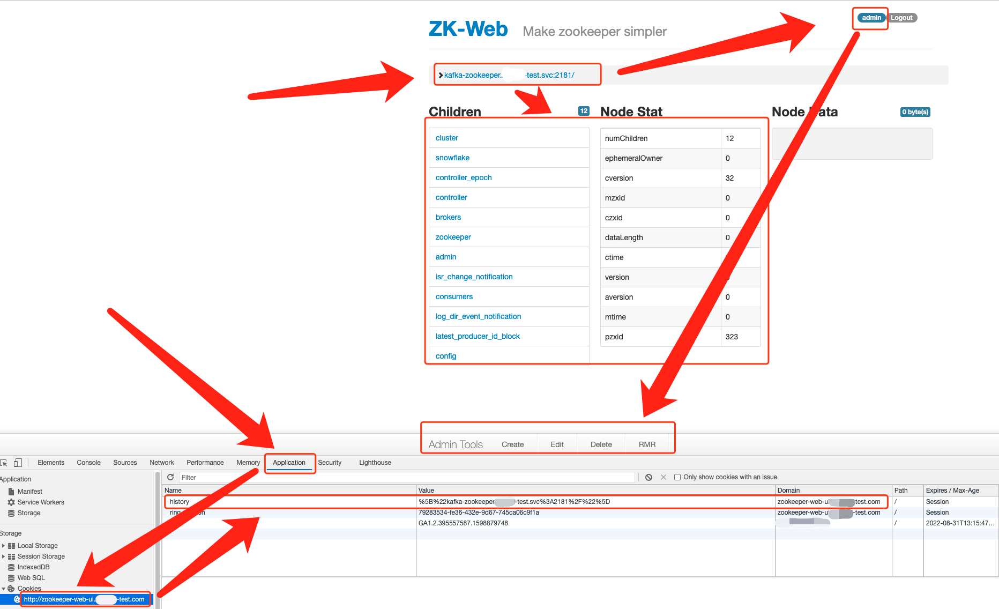

# ZK与Kafka的WebUI工具

# 一、ZK的WebUI管理工具

功能：

- 权限隔离，使用admin用户登录后方可操作zk
- 连接数据不保存在服务端，而是存在浏览器cookie中
- 可对ZK进行增删改查

GitHub地址：https://github.com/qiuxiafei/zk-web

Docker镜像地址：https://hub.docker.com/r/tobilg/zookeeper-webui

## Docker部署

```bash
docker run -d \
  -p 8080:8080 \
  -e USER=admin \
  -e PASSWORD=12356789 \
  --name zookeeper-web-ui \
  -t tobilg/zookeeper-webui
```

## k8s部署

```bash
kubectl -n tools run zookeeper-web-ui --restart='Always' --env="USER=admin" --env="PASSWORD=12356789" --image tobilg/zookeeper-webui
kubectl -n tools expose deployment zookeeper-web-ui --port=80 --target-port=8080
```



